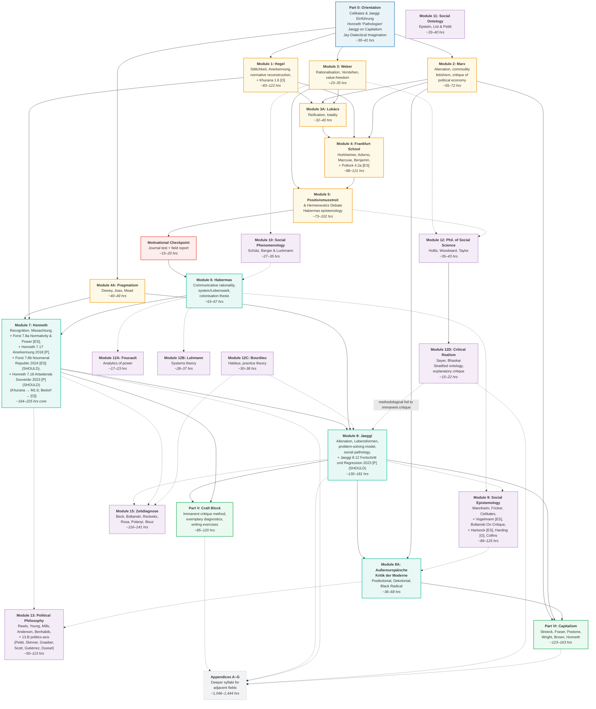

# Sozialphilosophie and Adjacent Fields: Integrated Self-Study Syllabus (Modified)

**Goal:** Deep academic expertise in Sozialphilosophie in the Frankfurt School tradition (Honneth, Jaeggi, and predecessors), reaching the research frontier, with instrumental competence in adjacent fields sufficient to understand cross-references and methodological debates. Appendices provide deeper syllabi for each adjacent field for optional further study.

**Assumed background:** PhD-level quantitative social science (economics), reading fluency in German and English, some prior exposure to Frankfurt School texts.

### Marker key

| Marker | Meaning |
|--------|---------|
| **[P]**  | Primary text — the actual philosophical contribution |
| **[ES]** | Essential secondary — practically necessary to extract the argument efficiently; skipping costs significant time on the primary |
| **[RS]** | Recommended secondary — clarifies, contextualises, or extends; skippable without major loss but repays the time |
| **[O]**  | Orientation — survey or introduction that maps the terrain before you enter it; high time-efficiency |
| **[NE]** | Non-essential — intellectually valuable but not required for the Sozialphilosophie frontier; defer unless a specific argument sends you there |
| **[MX]** | Marxist deepening (Appendix F) — Western Marxist, *neue Marx-Lektüre*, Eastern/dissident traditions; readable as a coherent mini-syllabus or at connection points |
| **[P\*] / [ES\*] / [O\*]** | On the accelerated path — structurally indispensable for the fastest route to the frontier (see Accelerated Path section) |
| **[Economist's note]** | Bridging or hazard-flagging commentary for the economist-reader |

**Accelerated-path marking:** Items that appear on the accelerated path (see the Accelerated Path section below) are marked with an asterisk: **[P\*]**, **[ES\*]**, **[O\*]**. These are the structurally indispensable texts — the fastest route to engaging with the current frontier. The accelerated path has its own reading order, which does not follow module sequence; see the Accelerated Path section for the correct sequence.

The general principle: use secondary literature heavily for pre-20th-century figures (Hegel, Marx) and for exceptionally complex systematic works (Habermas's *Theorie des kommunikativen Handelns*). For 20th- and 21st-century Sozialphilosophie (Honneth, Jaeggi, Forst, Celikates), go directly to the primary texts — the authors write clearly and secondary literature would mostly paraphrase rather than illuminate.

**How to use this document:** This syllabus is a *reference document* — a comprehensive map of the field, its genealogies, cross-references, and annotated bibliography. It is designed for strategic orientation: "Where does this text sit in the tradition?", "What should I read if I want to understand X's relationship to Y?", "I've encountered a reference to Z — is it on the syllabus and where does it connect?" It is *not* designed for week-by-week execution. If your question is "What do I read this Saturday?", consult [execution_plan_v1.md](execution_plan_v1.md) for canonical week-by-week scheduling and [bridge_document.md §4](bridge_document.md) for the Phase I/II/III hour breakdowns. The Accelerated Path section here provides one specified linearisation (the fast route to the current frontier); the intellectual dependency graph (appended at the end) shows which modules presuppose which others and supports ad hoc rerouting if you pursue a non-default path through the material.

**A note for the economist-reader:** Your training in quantitative social science is a genuine cognitive resource for this syllabus, not merely biographical context. Several places where it provides leverage and several where it will mislead are flagged with **[Economist's note]** markers throughout. The general pattern: your intuitions about equilibrium, mechanism-based explanation, formal modelling, and empirical identification will give you faster access to some debates (List & Pettit's discursive dilemma, Woodward's interventionism, Streeck's political economy) but will generate systematic misreadings in others. Three recurring hazards: (1) "rational" in Hegel and the Frankfurt tradition means *actualising freedom through participation in rational social institutions*, not individually optimising — the entire Sozialphilosophie tradition operates with a concept of rationality closer to Aristotelian practical reason than to decision theory; (2) "critique of political economy" in Marx is not heterodox economics — it is a critique of the *social forms* (commodity, value, money) through which economic relations are constituted, not of their quantitative magnitudes; (3) the Frankfurt tradition's insistence on normativity is not a failure to achieve value-freedom but a principled rejection of the value-freedom ideal — the Positivismusstreit (Module 5) is where this argument is made explicit.

**Naming convention.** Two distinct numbering systems are used and must not be confused. (1) **Programme-Phase I/II/III/IV** (Roman numerals) refer to *temporal* programme stretches anchored to programme months M1–M44+, not calendar years (Phase I = 15 months; Phase II = 12 months; Phase III = 17 months post-Path-D'; Phase IV = post-M44). Programme start M1 W1 = week of 2026-06-15; see calendar anchor in [execution_plan_v1.md](execution_plan_v1.md) for derived calendar dates. Programme-Phase lives in [bridge_document.md](bridge_document.md), [execution_plan_v1.md](execution_plan_v1.md), and [y3_critical_path.md](y3_critical_path.md). (Renamed from "Year N" / "Y N" on 2026-05-19 per audit_alignment §I + Pass-4 feasibility audit + Path D' commitment.) (2) **Syllabus-Part 0 / Parts I–VI** (this document only) are *thematic* blocks: Part 0 Orientation, Part I Historical Foundations, Part II Systematic Core, Part III Instrumental Readings from Adjacent Fields, Part IV Reaching the Frontier, Part V Craft of Sozialphilosophie, Part VI Critiquing Capitalism. Plus Appendices A–G. Syllabus-Parts tell the reader *what topic*, not *when*. (Pass-11 disambiguation 2026-05-20: the syllabus orientation block was renamed from a former "Phase"-labelled header to "Part 0: Orientation" so that the syllabus uses consistent Part-numbering — Part 0, I, II, III, IV, V, VI — and the programme-Phase identifier is reserved for the temporal stretches above.)

---

## PART 0: ORIENTATION (Weeks 1–4, ~34 hours)

**Why start here:** The original syllabus front-loads ~275 hours of historical foundations before you encounter the current debates. This phase inverts that: you acquire a map of the entire field — what Sozialphilosophie is, what "social pathology" means, where the tradition comes from and where it's going — before reading any primary historical text. Everything in Part I then has a clear motivating question attached to it.

| # | Text | Type | Est. hours | ~pp. | Notes |
|---|------|------|-----------|------|-------|
| 0.1 | Robin Celikates & Rahel Jaeggi, *Sozialphilosophie: Eine Einführung* (2017) | [O*] | 12–15 | ~250 | The most efficient entry point into the entire field. Maps questions, methods, and positions from the standpoint of the current generation. Available only in German. |
| 0.2 | Axel Honneth, "Pathologien des Sozialen: Tradition und Aktualität der Sozialphilosophie" (1994) | [P*] | 5–8 | ~25 | Programmatic essay defining what Sozialphilosophie is and distinguishing it from political philosophy, moral philosophy, and empirical sociology. Short (~25 pages). Establishes the concept of social pathology as the field's central diagnostic category. |
| 0.3 | Rahel Jaeggi, "What (if Anything) Is Wrong with Capitalism? Three Ways of Critiquing Capitalism" (in Jaeggi & Fraser, *Capitalism: A Conversation in Critical Theory*, 2018, or standalone article versions) | [P] | 5–8 | ~25 | Distinguishes functional, moral, and ethical critique of capitalism. Shows you where this tradition is going and why the historical foundations matter. |
| 0.4 | Martin Jay, *The Dialectical Imagination: A History of the Frankfurt School and the Institute of Social Research, 1923–1950* (1973), chs. 1–3 | [O] | 8–10 | ~150 | The standard Anglophone intellectual history of the early Frankfurt School. Institutional context, theoretical programme, key debates. Orients the historical reading that follows. |

**Part 0 total: ~30–41 hours**

---

## PART I: HISTORICAL FOUNDATIONS

The goal here is not mastery of Hegel or Marx for their own sake, but a working command of the conceptual resources that the Frankfurt tradition draws on. Read with the question: What problem does each thinker introduce, and how do later thinkers transform, accept, or reject the proposed solution?

### Module 1: Hegel — Freedom, Recognition, and Ethical Life

**Why this matters:** Honneth's recognition theory, Jaeggi's concept of immanent critique, and the entire Frankfurt tradition's understanding of social rationality are unintelligible without Hegel. The key ideas: freedom realised through social institutions (*Sittlichkeit*); self-consciousness as constitutively intersubjective (*Anerkennung*); immanent critique as measuring a social order against its own rational standards; and the method of "normative reconstruction" — reconstructing the rational content already implicit in existing institutions.

| # | Text | Type | Est. hours | ~pp. | Notes |
|---|------|------|-----------|------|-------|
| 1.1 | Frederick Neuhouser, *Foundations of Hegel's Social Theory: Actualizing Freedom* (2000) | [ES*] | 25–35 | ~300 | **Read first.** The best analytical reconstruction of Hegel's *Rechtsphilosophie* for non-specialists. ~300 pp. Reads Hegel as a social philosopher, not a metaphysician. Will save you enormous time on the primary text. |
| 1.2 | Hegel, *Grundlinien der Philosophie des Rechts* (1820/21): Preface; §§1–33 (the concept of the will); §§142–360 (*Sittlichkeit*: family, civil society, state) | [P] | 40–60 | ~320 | The foundational text for Sozialphilosophie. ~320 pp. in this selection. Read with Neuhouser's reconstruction in hand. The Preface contains the famous "owl of Minerva" passage and Hegel's statement on philosophy's relationship to its time. The *Sittlichkeit* section is the core: the argument that freedom is actualised through participation in rational social institutions. |
| 1.3 | Hegel, *Phänomenologie des Geistes* (1807), ch. IV.A: "Selbständigkeit und Unselbständigkeit des Selbstbewußtseins; Herrschaft und Knechtschaft" | [P] | 10–15 | ~30 | The master-slave dialectic. ~30 pages but extremely dense. Establishes the idea that self-consciousness requires recognition by another self-consciousness. You need this for Honneth. |
| 1.4 | Robert Pippin, *Hegel's Practical Philosophy: Rational Agency as Ethical Life* (2008), chs. 1–4 | [NE] | 15–20 | ~200 | More advanced reconstruction of Hegel's practical philosophy. Useful if you want a second analytical voice after Neuhouser, particularly on the concept of rational agency. *Defer unless you find Neuhouser's reading insufficient or want to engage with the "Hegel as Kantian" vs. "Hegel as social theorist" debate.* |
| 1.5 | Allen Wood, *Hegel's Ethical Thought* (1990), chs. 1–4 and 10–14 | [NE] | 15–20 | ~250 | Clear, systematic. Good on the relationship between morality (*Moralität*) and ethical life (*Sittlichkeit*). *A third analytical reconstruction of the Rechtsphilosophie. Useful reference but not needed on the main path.* |
| 1.6 | Thomas Khurana, *Das Leben der Freiheit: Form und Wirklichkeit der Autonomie* (Suhrkamp, 2017), Introduction + Part I (chs. on Hegelian life and freedom-as-self-realising-natural-form) | [O] | 8–12 | ~150 | The major contemporary German reconstruction of Hegelian freedom; reviewed in *Hegel-Studien* (Pinkard, 2019) and *Hegel Bulletin* (Corti, 2020). Khurana's central thesis: freedom can only be understood through the concept of *life* (*Leben*) — autonomy is not pure self-determination opposed to nature but a specific form of self-realising natural life. The book is principally a Hegel interpretation engaging *Phänomenologie*, *Logik*, *Naturphilosophie*, and the contemporary Hegel commentary tradition (Pippin, Pinkard, Stekeler-Weithofer). The bearing on Honneth's *Recht der Freiheit* (Module 7.5) is a forward implication, not the book's organising purpose. ~150 pp. selection from a ~550 pp. work. In German. **Forward cross-reference:** revisit at Module 7.5 to see what Khurana's life-and-freedom framework implies for Honneth's normative reconstruction of social freedom. |

**Module total: 83–142 hours (core without [NE]: 83–122 hours; including 1.6 Khurana [O]: ~8–12h added at orientation tier)**

**[Economist's note]** Hegel's *Sittlichkeit* argument — that freedom is not the absence of constraint but is actualised through rational social institutions — runs directly against the libertarian-individualist concept of freedom that implicitly structures most economic modelling. The temptation will be to translate Hegel's claims into incentive-compatibility or mechanism-design language; resist this. The argument is that the *content* of freedom is constituted by institutional participation, not that institutions are instrumental to pre-given preferences. Neuhouser (1.1) is particularly good at making this clear. A productive bridge: Hegel's account of civil society (*bürgerliche Gesellschaft*) in §§182–256 of the *Rechtsphilosophie* contains a sophisticated analysis of market dynamics, the tendency toward inequality, and the role of corporations (*Korporationen*) as mediating institutions — you will recognise structural parallels to institutionalist economics, but the normative framework is entirely different.

**Comprehension indicator:** After this module, you should be able to (a) explain why Hegel thinks abstract individual rights (*Moralität*) are insufficient for freedom and require institutional *Sittlichkeit*; (b) reconstruct the master-slave dialectic as an argument about the intersubjective constitution of self-consciousness; (c) state what "normative reconstruction" means methodologically and why it differs from both empirical description and external moral evaluation.

### Module 2: Marx — Alienation, Ideology, and the Critique of Political Economy

**Why this matters:** Marx is not merely a historical predecessor but an active reference point for Jaeggi, Fraser, and the ongoing debate about whether and how capitalism can be criticised from within. Jaeggi's alienation book is explicitly a rehabilitation of the Marxian concept. The critique of political economy — reading economic categories (commodity, value, money) as expressions of social relations — is the template for the Frankfurt tradition's approach to social analysis.

| # | Text | Type | Est. hours | ~pp. | Notes |
|---|------|------|-----------|------|-------|
| 2.1 | Marx, *Ökonomisch-philosophische Manuskripte* (1844), "Entfremdete Arbeit" | [P*] | 10–12 | ~40 | The theory of alienation in four dimensions (from product, from activity, from species-being, from other humans). ~40 pages. The direct ancestor of Jaeggi's *Entfremdung*. |
| 2.2 | Marx, *Das Kapital*, Bd. 1 (1867): ch. 1 (esp. §4: "Der Fetischcharakter der Ware und sein Geheimnis"); chs. 2–3 (exchange, money); ch. 10 ("Der Arbeitstag") | [P] | 30–40 | ~200 | The commodity-fetishism passage is one of the most influential pieces of social philosophy ever written: social relations between persons appear as relations between things. ~200 pp. in this selection. Ch. 10 shows Marx integrating normative critique with empirical-historical analysis — directly relevant to your interest in the philosophy/social-science interface. |
| 2.3 | Michael Heinrich, *Kritik der politischen Ökonomie: Eine Einführung* (2004), chs. 1–5 | [ES] | 15–20 | ~200 | The best German-language introduction to *Kapital*. ~200 pp. Avoids vulgar-Marxist simplifications; distinguishes Marx's critique from classical and neoclassical economics. Given your economics training, this will be efficient reading. |
| 2.4 | Allen Wood, *Karl Marx* (2nd ed., 2004), chs. 1–4 and 9–12 | [NE] | 15–20 | ~250 | Analytically rigorous overview of Marx's philosophy. Good on alienation, exploitation, ideology, and historical materialism as distinct but connected ideas. *Heinrich + Marx primary texts suffice for the Sozialphilosophie trajectory. Wood is better suited for pursuing Marx's philosophy as an end in itself.* |

**Module total: 55–72 hours (core without [NE]: 55–72 hours)**

**[Economist's note]** This is the module where your training is simultaneously the greatest asset and the greatest liability. You will understand the economic content of *Kapital* faster than a philosophy student — the labour theory of value, the reproduction schemes, the tendency of the rate of profit to fall are familiar territory, if only as heterodox positions. The danger is that this familiarity leads you to evaluate Marx's arguments *as economics*, which misses what the Frankfurt tradition takes from Marx entirely. What matters for Sozialphilosophie is not whether the labour theory of value is correct but what the *commodity-fetishism* passage reveals about the social-ontological structure of capitalism: social relations between persons appearing as relations between things. Heinrich (2.3) is explicitly designed to distinguish Marx's *critique* from his *economics* — pay close attention to his argument that the value-form, not labour-value as a quantitative magnitude, is the key analytical category.

**Comprehension indicator:** After this module, you should be able to (a) state the four dimensions of alienation in the 1844 Manuscripts and explain why Jaeggi rejects the essentialist anthropology but retains the diagnostic category; (b) explain what "commodity fetishism" means as a social-ontological claim (not merely a psychological error); (c) distinguish Marx's critique of capitalism-as-social-form from a critique of capitalism-as-inefficient-allocation.

*Jaeggi 0.3 (Part 0) is best read before the Marx module — it shows where this tradition is heading.*

*[MX] For the philosophical foundations of the neue Marx-Lektüre — the argument that Marx's critique targets the social forms (commodity, money, capital) rather than quantitative magnitudes — see Appendix F, items F.1 (Backhaus) and F.2 (Reichelt). Read after Heinrich (2.3).*

### Module 3: Weber — Rationalisation, Verstehen, and the Disenchantment of the World

**Why this matters:** Weber's diagnosis of modernity as a process of rationalisation that culminates in the "iron cage" (*stahlhartes Gehäuse*) is the problem statement that the entire Frankfurt School tries to answer. His methodological writings on *Verstehen*, ideal types, and value-freedom define the position Habermas and Honneth react against. You also need Weber to understand why Sozialphilosophie insists on normativity where Weberian social science demands value-neutrality.

| # | Text | Type | Est. hours | ~pp. | Notes |
|---|------|------|-----------|------|-------|
| 3.1 | Weber, "Wissenschaft als Beruf" (1917/19) | [P] | 5–8 | ~30 | Short, brilliant, programmatic. The diagnosis of disenchantment and the problem of meaning in a rationalised world. |
| 3.2 | Weber, "Die 'Objektivität' sozialwissenschaftlicher und sozialpolitischer Erkenntnis" (1904) | [P] | 10–15 | ~60 | The foundational text on value-freedom, ideal types, and the epistemological status of social science. Dense but essential for understanding both the Positivismusstreit and Habermas's critique. |
| 3.3 | Weber, *Wirtschaft und Gesellschaft* (1921/22), Part I, ch. 1 ("Soziologische Grundbegriffe") | [P] | 8–12 | ~80 | Definitions of social action, types of legitimate domination, bureaucracy. The conceptual vocabulary of Weberian sociology. |
| 3.4 | Fritz Ringer, *Max Weber: An Intellectual Biography* (2004), chs. 1–5 | [NE] | 12–15 | ~200 | Contextualises Weber in the *Methodenstreit* and the German university landscape. *Valuable but not strictly necessary. The primary Weber texts are self-standing given your social-science background.* |

**Module total: 23–35 hours (core without [NE]: 23–35 hours)**

**[Economist's note]** Weber's methodological writings — particularly the "Objektivität" essay (3.2) — define the concept of value-freedom (*Wertfreiheit*) that is the implicit epistemological foundation of mainstream economics. The Frankfurt tradition's entire project is, in one sense, a sustained argument that Weber was wrong about value-freedom — or rather, that value-freedom is itself a normatively committed position. Your instinct will be to side with Weber here; the syllabus asks you to take seriously the possibility that he is wrong, and the Positivismusstreit (Module 5) is where the argument is joined most directly. A second bridge: Weber's ideal types have a structural resemblance to stylised models in economics — both are deliberate simplifications that sacrifice realism for analytical traction — but Weber insists that ideal types are *heuristic* rather than predictive, which puts them in a different epistemic category.

**Comprehension indicator:** After this module, you should be able to (a) state Weber's distinction between *Zweckrationalität* and *Wertrationalität* and explain why the Frankfurt tradition treats the dominance of *Zweckrationalität* as a pathology; (b) explain why the "iron cage" (*stahlhartes Gehäuse*) of rationalisation is the *problem statement* the Frankfurt School tries to answer.

### Module 3A: Lukács — Reification and the Standpoint of Totality
**Why this matters:** Georg Lukács's *Geschichte und Klassenbewußtsein* (1923) is the single most important mediating text between Hegel/Marx/Weber and the Frankfurt School. Lukács transforms Marx's analysis of commodity fetishism (*Kapital* ch. 1 §4, read in Module 2) and Weber's diagnosis of rationalisation (Module 3) into a *total* diagnosis of bourgeois consciousness: the reification (*Verdinglichung*) of social relations under capitalism is not merely an economic phenomenon but pervades the entire structure of modern thought, including science, law, and philosophy. The subject-object split characteristic of modern rationality is itself an expression of the commodity form. This is the argument Horkheimer and Adorno radicalise in the *Dialektik der Aufklärung* — their thesis that Enlightenment reverts to myth is a generalisation of Lukács's reification thesis beyond the capitalist mode of production. It is also the argument Habermas thinks he can rescue by relocating rationality in communicative action rather than in consciousness. Without Lukács, the transition from Marx and Weber to the first Frankfurt School has a missing step, and the concept of *Verdinglichung* as it recurs throughout the tradition — in Honneth's *Verdinglichung* (2005), in Berger & Luckmann, in Jaeggi's critique of Honneth's psychologisation of a structural phenomenon — lacks its proper genealogy.

| # | Text | Type | Est. hours | ~pp. | Notes |
|---|------|------|-----------|------|-------|
| 3A.1 | Georg Lukács, *Geschichte und Klassenbewußtsein: Studien über marxistische Dialektik* (1923), "Die Verdinglichung und das Bewußtsein des Proletariats" | [P] | 20–25 | ~100 | The reification essay — roughly 100 pages, in three sections. Section I ("Das Phänomen der Verdinglichung") is the core: the commodity form as the universal structuring principle of bourgeois society. Section II extends this to a critique of bourgeois philosophy (Kant, the antinomies of thought). Section III develops the proletariat as a subject-object of history — the most contestable part and the one the Frankfurt School abandons, but you need to understand it to see *why* Horkheimer and Adorno become pessimistic about revolutionary agency. Dense and allusive but more systematic than Adorno. Read in German if possible; the English translation (Livingstone, MIT Press, 1971) is adequate. |
| 3A.2 | Andrew Feenberg, *The Philosophy of Praxis: Marx, Lukács, and the Frankfurt School* (2014), chs. 3–5 | [ES] | 12–15 | ~100 | The best recent reconstruction of Lukács's philosophical contribution and its transformation by the Frankfurt School. Particularly good on how Adorno both radicalises and inverts Lukács: where Lukács sees a resolution of reification through proletarian class consciousness, Adorno sees reification as inescapable within existing social conditions. Saves significant time on the primary text. An alternative secondary source is Martin Jay, *Marxism and Totality: The Adventures of a Concept from Lukács to Habermas* (1984), chs. 3–4, which traces the concept of "totality" — central to Lukács — through the entire Frankfurt tradition. |

**Module 3A total: 32–40 hours**

**Comprehension indicator:** After this module, you should be able to (a) explain how Lukács transforms Marx's commodity fetishism and Weber's rationalisation into a *total* diagnosis of bourgeois consciousness (*Verdinglichung*); (b) state why Lukács thinks the proletariat occupies a privileged epistemic position (the "identical subject-object of history") and why the Frankfurt School abandons this claim; (c) trace the line from Lukács's reification to Honneth's *Verdinglichung* (2005) and explain what changes in the translation.

*[MX] Backhaus's value-form analysis (Appendix F, item F.1) clarifies with greater analytical precision what Lukács was reaching for in the reification essay: the commodity form as a total social form structuring consciousness. Kosík's Dialektik des Konkreten (Appendix F, item F.12) develops the Lukácsian project from a phenomenological direction.*

### Module 4: The First Frankfurt School — Critical Theory as Programme

**Why this matters:** This is the direct institutional and intellectual predecessor. The key move you need to understand: combining Marx's critique of political economy with Weber's diagnosis of rationalisation, Lukács's theory of reification, and (in Adorno/Horkheimer) psychoanalytic theory to explain why emancipation failed — why Enlightenment reason dialectically produced domination. The first Frankfurt School also establishes the distinctive *method* of Sozialphilosophie: immanent critique, ideology critique, diagnosis of social pathology.

| # | Text | Type | Est. hours | ~pp. | Notes |
|---|------|------|-----------|------|-------|
| 4.1 | Max Horkheimer, "Traditionelle und kritische Theorie" (1937) | [P*] | 8–12 | ~40 | The programmatic manifesto. Defines what makes theory "critical": it is reflexive about its own social conditions and oriented toward human emancipation, rather than merely registering facts. ~40 pages. |
| 4.2 | Horkheimer & Adorno, *Dialektik der Aufklärung* (1944/47): "Begriff der Aufklärung" + Exkurs I ("Odysseus oder Mythos und Aufklärung") | [P] | 15–20 | ~80 | The central argument: instrumental reason, driven to its extreme, turns against the subject that deploys it. ~80 pp. Enlightenment reverts to myth. Difficult, allusive, deliberately anti-systematic. The Odysseus excursus is more concrete and can serve as an entry point. |
| 4.2a | Friedrich Pollock, "State Capitalism: Its Possibilities and Limitations" (*Studies in Philosophy and Social Science* 9, 1941) | [ES] | 2–3 | ~20 | The proximate Frankfurt-internal alternative to *Dialektik der Aufklärung*'s framing. Pollock's thesis: under state-capitalism (his analysis applies as much to Soviet planning as to the Nazi and New Deal regimes), the market-mediated coordination of bourgeois society is replaced by direct political-administrative coordination — but the basic pathologies (alienation, instrumentalisation, unfreedom) persist or intensify. The implication is that the critique of instrumental rationality (DdA) is *not* tied to market capitalism specifically; rationality itself, not capitalism, is the pathology. This frames an internal Frankfurt-School debate that runs through the entire tradition: is capitalism replaceable while preserving Frankfurt's normative critique (Honneth, *Die Idee des Sozialismus*, K.6), or does the diagnostic apparatus apply to any rationality-organised modernity (Adorno)? ~20 pages. Read immediately after 4.2 DdA to see the disagreement. **[Economist's note]** Pollock's analysis of state-administered capitalism is one of the earliest theoretical engagements with what economists now call "regulatory capitalism" or "state-capitalism varieties" — and it anticipates by decades the post-2008 question of whether central-bank intervention and fiscal-monetary administration are stabilising market capitalism or transforming it into something else (compare to Streeck, Part VI K.1). |
| 4.3 | Adorno, *Minima Moralia: Reflexionen aus dem beschädigten Leben* (1951): §§1–18, 29, 36, 67–68, 153 | [P] | 8–10 | ~50 | Aphoristic social philosophy: critique of damaged life under late capitalism. Shows how Sozialphilosophie can operate at the level of everyday experience. Read selectively. |
| 4.4 | Adorno, *Negative Dialektik* (1966), Introduction ("Zur Möglichkeit von Philosophie") + Part III ("Meditationen zur Metaphysik") | [P] | 15–20 | ~100 | The Introduction articulates why philosophy must proceed through "determinate negation" (*bestimmte Negation*) rather than positive construction. ~100 pp. in this selection. Part III extends this into a reflection on suffering, morality after Auschwitz, and the relationship between metaphysics and historical experience. Extremely difficult prose. Read with Freyenhagen (4.5). *Essential for the social pathologies debate: Adornian negativism is a live alternative to Jaeggi's constructive problem-solving model.* |
| 4.5 | Fabian Freyenhagen, *Adorno's Practical Philosophy: Living Less Wrongly* (2013), chs. 1–5 | [ES] | 15–20 | ~200 | The best analytic reconstruction of Adorno's practical philosophy. ~200 pp. Argues that Adorno's negativism constitutes a coherent normative position: we can identify what is wrong (suffering, domination, unfreedom) without having a positive account of what is right. Chs. 3–4 on the relationship between negative experience and normative claims are particularly important for the social pathologies debate. |
| 4.6 | Rolf Wiggershaus, *Die Frankfurter Schule* (1986), chs. on Habermas's break with Adorno (ch. 7) | [RS] | 5–8 | ~60 | Contextualises the transition from first to second generation of the Frankfurt School — why Habermas thought Adorno's position was a dead end and what he proposed instead. |
| 4.7 | Herbert Marcuse, *One-Dimensional Man: Studies in the Ideology of Advanced Industrial Society* (1964), chs. 1–6 | [P] | 15–20 | ~200 | The third major pillar of the first Frankfurt School alongside Horkheimer and Adorno. Marcuse's central concept is "repressive desublimation": advanced industrial society neutralises critique not through overt repression but by satisfying needs in a way that forecloses the imagination of alternatives. "One-dimensional thought" is thought that cannot transcend the given — the critical capacity of negation is absorbed. This is a distinct diagnostic model from Habermas's colonisation thesis and Honneth's recognition framework, and it poses a sharp question for the social pathologies debate: is a society pathological if its members are satisfied but their satisfaction is itself a product of domination? Also contains the most sustained first-generation Frankfurt School engagement with technology as an instrument of social control — relevant to the frontier debate on digital society and algorithmic governance. |
| 4.8 | Walter Benjamin, "Über den Begriff der Geschichte" (1940; the *Geschichtsphilosophische Thesen*) | [P] | 5–8 | ~15 | Eighteen short theses — roughly 15 pages — but among the most cited texts in the entire Frankfurt tradition. Benjamin's concept of "brushing history against the grain" (*die Geschichte gegen den Strich bürsten*) rejects progressive teleology: history is not a story of cumulative emancipation but a catastrophe that piles wreckage upon wreckage. The "angel of history" (Thesis IX) and the messianic interruption of historical continuity are directly relevant to Amy Allen's *The End of Progress* (Module 8.6), which draws on Benjamin against Habermas's and Jaeggi's developmental narratives. Also introduces the concept of *Jetztzeit* ("now-time") — the claim that the past can be redeemed only from the standpoint of present danger, not through historicist reconstruction. |
| 4.9 | Walter Benjamin, "Das Kunstwerk im Zeitalter seiner technischen Reproduzierbarkeit" (1935/36) | [P] | 5–8 | ~40 | The founding text for thinking about technology, mass culture, and the transformation of experience (*Erfahrung*). The withering of the "aura" of the artwork through mechanical reproduction is both a loss (of tradition, of cult value) and a potential democratisation. ~40 pages. Provides classical resources for the frontier questions about digital society that the syllabus identifies (Part IV §5) but for which it otherwise lacks historical anchorage. Read alongside Marcuse (4.7): Benjamin is cautiously hopeful about technology's emancipatory potential where Marcuse is pessimistic — the tension between them defines the first Frankfurt School's ambivalence about modernity. |

**Module total: 93–129 hours (core without [RS]: 88–121 hours; including 4.2a Pollock [ES] +2–3h)**

**[Economist's note]** The *Dialektik der Aufklärung* (4.2) will feel alien — deliberately anti-systematic, aphoristic, and resistant to the kind of propositional summary economists are trained to produce. This is not a deficiency but a method: Adorno and Horkheimer argue that the very demand for systematic, instrumentally rational argumentation is part of the pathology they are diagnosing. You need not accept this claim, but you must understand it to engage with the Adornian wing of the tradition (Freyenhagen, Menke, Allen's use of Benjamin). A productive bridge: Marcuse's *One-Dimensional Man* (4.7) is structurally closer to what you are used to — it is a thesis-driven book with identifiable empirical claims about technology, productivity, and consumer behaviour. Start with Marcuse if you want a foothold before entering the more demanding Adorno/Horkheimer texts.

**Comprehension indicator:** After this module, you should be able to (a) state what makes theory "critical" in Horkheimer's 1937 sense (and how this differs from Popperian critical rationalism); (b) explain the thesis that "Enlightenment reverts to myth" — not as a slogan but as a structural argument about instrumental reason; (c) distinguish Adorno's negativism (we can identify what is wrong without a positive theory of the good) from Habermas's later constructive turn.

*Note on Bildung: Adorno's "Theorie der Halbbildung" (1959, Appendix G item G.6.1) is a natural companion to items 4.2–4.3 — it applies the Dialektik der Aufklärung argument specifically to education and cultural formation. If the question of how social pathologies reproduce themselves through the formation of persons interests you, read it alongside or immediately after this module.*

*[MX] For the argument that Adorno's critique of identity-thinking and Marx's critique of the commodity form are structurally homologous, see Appendix F, item F.2 (Reichelt). Read after 4.4–4.5. For Gramsci's concept of hegemony as a complementary account to Marcuse's one-dimensional thought — Gramsci provides the institutional mechanism, Marcuse the experiential-psychological diagnosis — see Appendix F, items F.3–F.4.*

### Module 4A: Pragmatism — Inquiry, Problem-Solving, and Democratic Life
**Why this matters:** Jaeggi's *Kritik von Lebensformen* — the most important systematic contribution in recent Sozialphilosophie — is built on a Deweyan architecture. Her claim that forms of life are rationally evaluable by whether they successfully process the problems they generate is an adaptation of Dewey's experimentalist epistemology and social philosophy. Without reading Dewey, you will *recognise* this structure in Jaeggi but not *understand* its philosophical motivation, its strengths, or its vulnerabilities (which is precisely where Amy Allen's critique bites: is problem-solving inherently progressive?). Hans Joas's *Die Kreativität des Handelns* is the key bridging text between pragmatism and German social theory — it reconstructs what Habermas and Honneth take from Mead and what they miss, and it motivates Jaeggi's departures from both.

| # | Text | Type | Est. hours | ~pp. | Notes |
|---|------|------|-----------|------|-------|
| 4A.1 | John Dewey, *The Public and Its Problems* (1927) | [P*] | 12–15 | ~200 | Dewey's social-political philosophy. Publics are constituted through the indirect consequences of action. Democracy is not a set of institutions but a "mode of associated living." The concept of social inquiry as problem-solving — where problems are not theoretical puzzles but practical breakdowns in the conduct of life — is the direct ancestor of Jaeggi's framework. ~200 pages, clearly written. |
| 4A.2 | Hans Joas, *Die Kreativität des Handelns* (1992), chs. 1–5 | [P] | 18–22 | ~200 | The most important work connecting pragmatism to German social theory. Argues that both rational-choice theory and the Habermasian communicative-action model underestimate the creative, situation-responsive dimension of action. Chs. 3–4 on Mead are essential background for Honneth's *Kampf um Anerkennung*. Ch. 5 provides the theoretical basis for Jaeggi's claim that forms of life are experimental responses to problems. |
| 4A.3 | George Herbert Mead, *Mind, Self, and Society* (1934), Part III ("The Self") | [P] | 10–12 | ~100 | **[Moved from former Module 14.]** Mead's theory of how the self arises through social interaction — the "I" and "me" distinction, the "generalised other." Honneth draws extensively on Mead in *Kampf um Anerkennung*, and Joas (4A.2) provides the theoretical framework for understanding Mead's contribution. Reading Mead here, alongside Joas's reconstruction, means you arrive at Honneth (Module 7) with the social-psychological foundations already in hand. |
| 4A.4 | Dewey, *Logic: The Theory of Inquiry* (1938), chs. 1–6 ("The Pattern of Inquiry") | [RS] | 12–15 | ~150 | The epistemological foundation: inquiry as the transformation of an indeterminate situation into a determinate one through experimental intervention. Jaeggi's "problem-solving" model maps directly onto this. Demanding but rewarding for full depth of the pragmatist substructure. |
| 4A.5 | Roberto Frega, *Pragmatism and the Wide View of Democracy* (2019), chs. 1–4 | [RS] | 12–15 | ~150 | The most systematic recent attempt to develop a pragmatist social philosophy. Draws on Dewey, Honneth, and the Frankfurt tradition. Useful bridge text. |

**Module 4A total: 40–49 hours (core: 4A.1 + 4A.2 + 4A.3); 65–79 hours (with [RS])**

**[Economist's note]** Dewey's *The Public and Its Problems* (4A.1) will be one of the more immediately accessible texts on the syllabus for an economist. Dewey's concept of "inquiry" has structural similarities to adaptive learning models: agents encounter indeterminate situations, form hypotheses, test them through intervention, and update. Jaeggi's problem-solving model (Module 8) maps directly onto this. The key difference — and the point where your economic intuitions need recalibration — is that for Dewey (and Jaeggi), the "problems" are not given exogenously but are constituted by the form of life itself, and "solutions" transform the problem-space rather than optimising within it. This is closer to Kuhnian paradigm shifts than to Bayesian updating.

**Comprehension indicator:** After this module, you should be able to (a) explain Dewey's concept of "publics" as constituted by the indirect consequences of action (and why this differs from a social-choice-theoretic aggregation of preferences); (b) state Joas's critique of both rational-choice and Habermasian action models and what his "creativity of action" adds; (c) identify the specific Deweyan architecture in Jaeggi's *Kritik von Lebensformen* when you reach it.

### Module 5: The Positivismusstreit, the Hermeneutics Debate, and Habermas's Epistemological Turn
**Why this matters:** This module covers the two major methodological confrontations that shaped Habermas's position and, through him, the entire later Frankfurt tradition. The *Positivismusstreit* is the explicit confrontation between Critical Theory and positivist philosophy of science — the debate about whether social science can and should be value-free. The *Habermas–Gadamer debate* is the confrontation between Critical Theory and philosophical hermeneutics — the question of whether understanding (*Verstehen*) is inherently tradition-bound (Gadamer) or can be critically transcended through the analysis of ideology (Habermas). Together, these debates define the epistemological space in which Sozialphilosophie operates: against positivism (social inquiry is not value-free), but also against a purely hermeneutic self-understanding (understanding tradition is not enough — critique must be able to go *beyond* what participants already understand). Habermas's *Erkenntnis und Interesse* is the epistemological foundation for the claim that critical social theory constitutes a legitimate, distinctive form of knowledge.

| # | Text | Type | Est. hours | ~pp. | Notes |
|---|------|------|-----------|------|-------|
| 5.1 | Thomas McCarthy, *The Critical Theory of Jürgen Habermas* (1978), chs. 1–3 | [ES*] | 15–20 | ~150 | **Read before the primary texts.** Still the clearest English-language reconstruction of Habermas's early theoretical programme, including the theory of knowledge-constitutive interests. |
| 5.2 | Habermas, *Erkenntnis und Interesse* (1968), chs. 1–3 + Nachwort (1973 appendix) | [P] | 25–35 | ~200 | Three knowledge-constitutive interests: technical (empirical-analytic sciences), practical/hermeneutic (historical-hermeneutic sciences), emancipatory (critical sciences). The appendix contains important self-corrections. |
| 5.3 | Adorno, "Zur Logik der Sozialwissenschaften" (in Adorno et al., *Der Positivismusstreit in der deutschen Soziologie*, 1969); Habermas's contribution to the same volume | [P] | 10–15 | ~40 | The debate texts themselves. Adorno argues that social science cannot be value-free because its object — society — is itself constituted by contradictions that demand normative engagement. Habermas takes a more conciliatory but still critical line. |
| 5.4 | Hans-Georg Gadamer, *Wahrheit und Methode: Grundzüge einer philosophischen Hermeneutik* (1960), Part II, chs. 1–2 (especially the sections on the "hermeneutic circle," *Vorurteil*, and *Wirkungsgeschichte*) | [RS] | 15–20 | ~150 | The foundational text of twentieth-century philosophical hermeneutics. Gadamer argues that all understanding is shaped by historically transmitted prejudgements (*Vorurteile*), and that this is not a deficiency but a condition of understanding. The concept of *Wirkungsgeschichte* (effective history) — that every act of understanding is itself shaped by the historical effects of what it tries to understand — poses a direct challenge to the Frankfurt tradition's claim that ideology critique can achieve a standpoint outside tradition. Habermas's response: Gadamer's position is correct about the situatedness of understanding but wrong to deny that systematic distortions of communication can be identified and criticised. This debate is the genealogical background for the methodological dispute between Jaeggi's immanent critique (which accepts situatedness but claims it can still be transformative) and more Gadamerian positions. |
| 5.5 | Habermas, *Zur Logik der Sozialwissenschaften* (1967, expanded 1970), selections: the sections on Gadamer and on the hermeneutic claim to universality; or the shorter text "Der Universalitätsanspruch der Hermeneutik" (1970, in Habermas, *Zur Logik der Sozialwissenschaften*, Suhrkamp) | [P] | 8–12 | ~60 | Habermas's direct response to Gadamer. Argues that hermeneutic understanding reaches its limit when faced with systematically distorted communication — situations where participants' self-understandings are themselves products of power. The hermeneutic circle must be supplemented by explanatory social theory (psychoanalysis, ideology critique) that can identify distortions invisible to participants. This is the epistemological argument that grounds the entire critical-theory enterprise of diagnosing social pathology against the grain of participants' experience. |

**Module total: 73–102 hours**

**[Economist's note]** This is the module most directly relevant to your methodological self-understanding as a social scientist. The *Positivismusstreit* is, at bottom, a debate about whether what you do as an economist — build models, test hypotheses, maintain methodological separation between positive and normative analysis — constitutes the only legitimate form of social knowledge, or whether there is a distinct form of *critical* knowledge that is irreducible to empirical-analytic science. You will feel the pull of the positivist side strongly. The Frankfurt position is not that empirical science is wrong but that it is *incomplete*: it cannot, on its own terms, identify the normative distortions built into the social structures it studies, because its method requires treating those structures as given. Habermas's three knowledge-constitutive interests (technical, practical, emancipatory) in *Erkenntnis und Interesse* (5.2) is the argument you need to engage with most seriously.

**Comprehension indicator:** After this module, you should be able to (a) state Habermas's three knowledge-constitutive interests and the corresponding forms of science; (b) explain why Adorno thinks value-freedom in social science is impossible (not merely undesirable); (c) state Gadamer's concept of *Wirkungsgeschichte* and explain why Habermas thinks hermeneutic understanding must be supplemented by explanatory social theory.

**PART I TOTAL: ~380–505 hours (core without [NE]: ~340–455 hours). Second-revision net: +8–12h (Khurana 1.6 [O] in Module 1) + 2–3h (Pollock 4.2a [ES] in Module 4) ≈ +10–15h.**

---

## MOTIVATIONAL CHECKPOINT: FIELD TEST (2 weeks, ~15–20 hours)

**When to do this:** After completing Module 5 (Positivismusstreit / hermeneutics) and before beginning Module 6 (Habermas's TKH). You have now completed the historical foundations and are about to enter the most demanding stretch of the syllabus. This two-week pause serves three purposes: (1) it demonstrates that the apparatus you've built actually works; (2) it reconnects you to the *diagnostic* motivation that drew you to the field; (3) it produces a concrete output that feels like progress rather than input-accumulation.

**Week 1: Journal test (~8–10 hours).** Read 2–3 recent articles from the journals listed in Part IV. Pick one from *WestEnd* or *Deutsche Zeitschrift für Philosophie* and one from *Constellations* or *Critical Horizons*. Choose articles whose titles suggest social-pathology diagnoses or immanent critiques of contemporary phenomena — not pure exegesis. The goal is not to understand every reference but to discover *how much you can already follow*. You should find that you can track the main argumentative moves, recognise the positions being invoked, and identify where you're missing something — typically Habermas, whom you're about to read. This is the motivational payoff: concrete evidence that 400+ hours of work have produced real competence.

**Week 2: Field report (~8–10 hours).** Write a 1,500–2,000 word diagnostic exercise on a phenomenon from your professional world — the ECB's communication practices, DSGE modelling conventions, the institutional logic of central bank independence, or how "financial stability" functions as a normative category in policy discourse. Structure: (a) identify the practice and its self-understanding — what norms does it implicitly invoke? (b) identify a tension or failure on the practice's own terms — this is the immanent-critique move; (c) attempt a structural explanation — why is this failure systematic rather than accidental? (d) note where your apparatus runs out — what concepts do you need that you don't yet have? Part (d) is the most important: it generates *motivated reading questions* for the systematic core. If you discover you need a theory of how systemic imperatives colonise communicative practices, you've just motivated Habermas's TKH from your own experience.

**This checkpoint does not add to the core hour count** — it replaces two weeks of reading with two weeks of application. File the field report alongside your Practice A reconstructions; return to it after completing Part II.

---

## PART II: THE SYSTEMATIC CORE OF SOZIALPHILOSOPHIE

### Module 6: Habermas — Communicative Rationality and the Colonisation of the Lifeworld
**Why this matters:** Habermas is the pivot between the first Frankfurt School and the current generation. His central move: shifting the normative foundation of critical theory from the philosophy of consciousness (*Bewusstseinsphilosophie*) to a theory of communicative action (*kommunikatives Handeln*). Normativity is grounded not in a pre-social human essence (Marx) or in the self-reflection of reason (Adorno) but in the pragmatic presuppositions of linguistic understanding — whenever we communicate, we implicitly raise and recognise validity claims (truth, rightness, sincerity) whose redemption presupposes rational discourse. The "colonisation of the Lebenswelt" thesis — that systemic media (money, administrative power) distort communicatively structured domains of life — is the mature Frankfurt School diagnosis of modernity's pathology.

Understanding Habermas is essential because Honneth's recognition theory is explicitly a *correction* of Habermas (recognition, not communication, is the more fundamental normative category), and Jaeggi's work can be read as an attempt to overcome limitations in *both* Habermas and Honneth.

**Revision note:** The original module assigned 120–155 hours. This version compresses to ~65–82 hours on the core path by using McCarthy and Outhwaite for the architecture, reading the essential TKH chapters closely, and treating the reconstructive middle sections as reference material.

| # | Text | Type | Est. hours | ~pp. | Notes |
|---|------|------|-----------|------|-------|
| 6.1 | William Outhwaite, *Habermas: A Critical Introduction* (2nd ed., 2009), chs. 3–6 | [ES] | 10–12 | ~120 | Efficient overview of the theory of communicative action, discourse ethics, and the system/Lebenswelt distinction. Read before tackling the primary text. |
| 6.2 | Thomas McCarthy, *The Critical Theory of Jürgen Habermas* (1978), chs. 4–5 | [ES] | 8–10 | ~80 | Chs. 1–3 already assigned in Module 5. Here, chs. 4–5 specifically for the theory of communicative competence and its relationship to social theory. Gives you the analytical scaffolding for TKH. |
| 6.3 | Habermas, *Theorie des kommunikativen Handelns* (1981), Bd. 1, ch. I ("Zugang zur Rationalitätsproblematik") | [P] | 15–20 | ~80 | **Core primary.** The concept of communicative rationality; the distinction between strategic and communicative action; validity claims (truth, rightness, sincerity). ~80 pages. The philosophical foundation of the entire project. |
| 6.4 | Habermas, *Theorie des kommunikativen Handelns* (1981), Bd. 1, chs. II–III (Weber reconstruction, Frankfurt School reconstruction) | [RS] | 15–20 | ~200 | Habermas's reconstructions of Weber and the first Frankfurt School — important for understanding Habermas's self-positioning but substantially covered by McCarthy and Outhwaite. **Recommended approach:** read selectively. Ch. II, §§3–4 (the iron cage as selective rationalisation) and Ch. III, §§2–3 (the critique of Adorno/Horkheimer) are the essential passages. Skip the detailed Weber exegesis unless needed later. |
| 6.5 | Habermas, *Theorie des kommunikativen Handelns* (1981), Bd. 2, ch. VI ("Zweite Zwischenbetrachtung: System und Lebenswelt") + ch. VIII (colonisation thesis) | [P] | 20–25 | ~150 | **Core primary.** The system/Lebenswelt distinction and the colonisation thesis. Ch. VI argues that modern societies must be understood simultaneously as Lebenswelt (communicatively structured) and as system (functionally integrated via money and power). Ch. VIII: pathology arises when systemic imperatives colonise the Lebenswelt. ~150 pages of selective reading. |
| 6.6 | Habermas, *Faktizität und Geltung* (1992), chs. 1–4 | [NE] | 20–25 | ~200 | Habermas's discourse theory of law and democracy. Important for democratic theory but not essential for the Honneth/Jaeggi trajectory. *Return if your interests develop toward the relationship between Sozialphilosophie and democratic theory.* |

**Module total: 53–67 hours (core [P] + [ES]); 88–112 hours (with [RS] and [NE])**

**[Economist's note]** Habermas's system/Lebenswelt distinction (6.5) will have immediate resonance for an economist: the "system" side (money, administrative power, functional integration) describes approximately what economists model, while the "Lebenswelt" side (communicative action, normative consensus, social integration) describes what economists typically treat as exogenous or ignore. The colonisation thesis — that systemic media *distort* communicatively structured domains — is the philosophical articulation of a concern you may recognise in debates about the financialisation of healthcare, education, or family life. The productive friction: Habermas treats money and power as inherently non-normative "steering media," whereas an economist might argue that market prices *communicate* information (Hayek) and that monetary exchange can be *normatively appropriate* in many domains. This is precisely the disagreement Honneth's *Das Recht der Freiheit* (Module 7) tries to address with its normative reconstruction of the market.

**Comprehension indicator:** After this module, you should be able to (a) state the distinction between strategic and communicative action and explain why Habermas thinks communicative action is normatively more fundamental; (b) explain the colonisation thesis — how systemic imperatives distort the Lebenswelt — with a concrete example; (c) state why Honneth thinks Habermas's framework is too abstract and needs to be grounded in pre-theoretical experiences of recognition.

*[MX] Márkus's Language and Production (Appendix F, item F.11) is the most philosophically rigorous challenge to Habermas's paradigm shift from production to communication. Márkus argues — from within the Marxist tradition, as a student of Lukács — that Habermas's dichotomy between instrumental and communicative action misrepresents Marx's concept of production, which already contains a communicative and expressive dimension. Read after TKH Bd. 1 ch. I (6.3).*

### Module 7: Honneth — Recognition as the Normative Grammar of Social Life

**Why this matters:** Honneth's fundamental claim is that Habermas located normativity at too abstract a level (the presuppositions of discourse). The more basic normative structure of social life is **recognition** (*Anerkennung*): humans develop intact self-relations (self-confidence, self-respect, self-esteem) only through being recognised by others in three spheres — love (intimate relations), rights (legal equality), and solidarity (social esteem for one's distinctive contributions). Social pathologies are forms of systematic *Missachtung* (disrespect, denial of recognition). This provides the normative criterion for critical social philosophy without requiring the demanding rationalist apparatus of discourse ethics.

| # | Text | Type | Est. hours | ~pp. | Notes |
|---|------|------|-----------|------|-------|
| 7.1 | Honneth, *Kampf um Anerkennung: Zur moralischen Grammatik sozialer Konflikte* (1992) | [P*] | 35–45 | ~250 | The founding text of the recognition paradigm. Reconstructs the concept of recognition from Hegel's Jena writings and George Herbert Mead's social psychology. Develops the three spheres of recognition and the corresponding forms of disrespect. ~250 pages. |
| 7.2 | Axel Honneth, "Anerkennung als Ideologie" (*WestEnd: Neue Zeitschrift für Sozialforschung* 1, 2004; English: "Recognition as Ideology," in van den Brink & Owen, eds., *Recognition and Power*, 2007) | [P] | 3–5 | ~30 | Addresses a fundamental objection to recognition theory: can recognition itself be ideological? If a society systematically praises workers for their "flexibility" and "entrepreneurial spirit," is this genuine recognition or ideological co-optation? Honneth develops criteria for distinguishing genuine from ideological recognition — the recognised quality must (a) not be merely rhetorical, (b) be materially realised in institutional arrangements, and (c) represent a genuine increase in the autonomy of those recognised. ~30 pages. Directly relevant to the social pathologies debate: it determines whether the critical theorist can trust agents' own experience of being recognised. Not covered by any monograph on the syllabus. |
| 7.3 | Nancy Fraser, "From Redistribution to Recognition? Dilemmas of Justice in a 'Post-Socialist' Age" (*New Left Review* 212, 1995) | [P] | 3–5 | ~25 | The original article that launched the redistribution-recognition debate — sharper and more provocative than the later book (7.4). Fraser's analytic distinction between "affirmative" and "transformative" remedies (for both redistribution and recognition) is clearer here than anywhere in the book-length exchange. ~25 pages. Read immediately before 7.4 as preparation: the book-length debate presupposes familiarity with this framework. |
| 7.4 | Nancy Fraser & Axel Honneth, *Umverteilung oder Anerkennung? Eine politisch-philosophische Kontroverse* (2003) | [P*] | 25–35 | ~300 | The defining debate. ~300 pp. Fraser argues that recognition theory cannot adequately capture injustices of material distribution; Honneth argues that redistribution concerns can be subsumed under the recognition paradigm. The debate remains unresolved; most scholars now adopt some form of pluralism. |
| 7.5 | Honneth, *Das Recht der Freiheit: Grundriß einer demokratischen Sittlichkeit* (2011): methodological introduction ("Verfahren der normativen Rekonstruktion") + Part B ("Die Möglichkeit der Freiheit"), ch. on "Persönliche Beziehungen" + Part C ("Die Wirklichkeit der Freiheit"), ch. on "Der Markt" | [P] | 25–35 | ~150 | **[REVISED: compressed from full text.]** Honneth's mature systematic work. The methodological introduction is the most important section — it articulates the method of *normative Rekonstruktion* as distinct from both Rawlsian constructivism and external moral critique. The chapter on personal relationships develops Honneth's account of how freedom is realised in intimate relations (connecting to the "love" sphere from *Kampf um Anerkennung*). The chapter on the market provides a normative reconstruction of market exchange that is directly relevant to the capitalism-critique debate and to the Craft Block (C2.1). *The remaining chapters — on democratic *Sittlichkeit*, the welfare state, and political public sphere — are important for the full argument but can be deferred until Part VI (capitalism supplement) or returned to when your interests in democratic theory develop. The full text is ~400 pages; this selection is ~150 pages.* |
| 7.6 | Honneth, *Verdinglichung: Eine anerkennungstheoretische Studie* (2005) | [NE] | 5–8 | ~80 | Short (~80 pages). Reconstructs reification (*Verdinglichung*, from Lukács) in recognition-theoretic terms. *Widely criticised (by Jaeggi among others) for psychologising a structural phenomenon. Read only if Verdinglichung becomes important to your work.* |
| 7.7 | Rainer Forst, *Das Recht auf Rechtfertigung: Elemente einer konstruktivistischen Theorie der Gerechtigkeit* (2007), chs. 1–4 | [P] | 15–20 | ~150 | The major alternative within the current Frankfurt School generation. ~150 pp. in this selection. Forst argues the basic normative concept is not recognition but **justification** (*Rechtfertigung*): every person has a right not to be subjected to norms that cannot be adequately justified to them. More Kantian than Honneth's Hegelian approach. |
| 7.8 | Rainer Forst, "Noumenal Power" (*Journal of Political Philosophy* 23(2), 2015) | [P] | 3–5 | ~25 | Forst argues that power is fundamentally the capacity to influence the "space of reasons" — to determine which justifications count and which are excluded. This is his alternative to both Foucauldian analytics of power (Module 12A) and Habermasian communicative power: power operates not through brute force or systemic colonisation but through the control of justificatory structures. ~25 pages. Directly relevant to how social pathologies are maintained and to the normativity-of-critique debate (Part IV §1). Read after 7.7 to see Forst's framework in action beyond the monograph's more abstract treatment. |
| 7.8a | Rainer Forst, *Normativität und Macht: Zur Analyse sozialer Rechtfertigungsordnungen* (Suhrkamp, 2015; English: *Normativity and Power: Analyzing Master Concepts of Critical Theory*, Oxford UP, 2017), Part I + chs. on democratic legitimacy and justification orders | [ES] | 12–15 | ~180 | Forst's most systematic statement of the justification-order framework beyond the "Noumenal Power" article (7.8). Develops the analysis of how *Rechtfertigungsordnungen* (orders of justification) are constituted, contested, and transformed. Three concepts do the central work: the *right to justification* as the basic moral claim; *justification orders* as the institutional ensembles that fix what counts as a valid reason in a given social domain; and *noumenal power* as the capacity to shape justification orders. Read after 7.7 + 7.8 for the systematic deployment of the framework. ~180 pp. selection from ~280 pp. work. Available in German (Suhrkamp) and English (Oxford UP). |
| 7.8b | Rainer Forst, *The Noumenal Republic: Critical Constructivism After Kant* (Polity, 2024), Introduction + Parts I–II | [ES] | 15–20 | ~200 | Forst's current statement, extending the justification-order framework into the terrain of historical progress, solidarity, and luck egalitarianism — precisely where Allen 8.6 and Jaeggi *Fortschritt und Regression* (8.12) are pulling the contemporary debate. The "noumenal" framing connects directly to the Kantian constructivist line in 7.7 *Recht auf Rechtfertigung* and to 7.8 "Noumenal Power"; the *Republic* applies the framework to democratic legitimacy beyond what 7.8a (2015/17) achieved. ~200 pp. selection. Available in English. **Phase III-relevance:** the most recent Forst, supersedes 7.8a as "the current Forst" for any 2027 submission engaging the justification-order framework. **Default: SHOULD per y3_critical_path (COULD if Phase III stays purely on recognition/Honneth track); conditional MUST if Phase III commits to power/justification/democratic-legitimacy terrain.** Read after 7.7 + 7.8 + 7.8a. |
| 7.9 | Jessica Benjamin, *The Bonds of Love: Psychoanalysis, Feminism, and the Problem of Domination* (1988), chs. 1–3 | [RS] | 8–10 | ~100 | **[Moved from former Module 14.]** The object-relations tradition (Winnicott) as appropriated for a theory of recognition and domination. Benjamin develops a psychoanalytic account of how domination is reproduced through failures of mutual recognition in intimate relations — directly influencing Honneth's treatment of the "love" sphere in *Kampf um Anerkennung*. Read after 7.1 to deepen the psychoanalytic dimension of recognition theory. |
| 7.10 | Nancy Fraser, "Rethinking the Public Sphere: A Contribution to the Critique of Actually Existing Democracy" (*Social Text* 25/26, 1990) | [P] | 3–5 | ~30 | Fraser's immanent critique of Habermas's *Strukturwandel der Öffentlichkeit*: the bourgeois public sphere presupposes equality among participants, but actually existing public spheres are structured by social inequality, gender exclusion, and the bracketing of status differentials. Fraser develops the concepts of "subaltern counterpublics" and challenges the assumption that a single, unified public sphere is normatively desirable. ~30 pages. Structurally paradigmatic for how the Frankfurt tradition does immanent critique — demonstrates the method on a canonical Frankfurt-School concept. Read after 7.4 (Fraser-Honneth debate) to see the full range of Fraser's critical apparatus. |
| 7.11 | Emmanuel Renault, *Souffrances sociales: Philosophie, psychologie et politique* (2008; German selections in *Leiden an der Gesellschaft*, in *WestEnd* and Suhrkamp) | [P] | 12–15 | ~200 | The key text on the phenomenology of social suffering. Renault argues that social suffering is not merely a motivation for critique (Honneth's view) but a distinct category of social-philosophical analysis requiring its own phenomenological-empirical apparatus. The experience of injustice cannot be fully captured by the recognition framework because suffering is often pre-reflective, inarticulate, and resistant to the language of rights and respect. Connects Honneth's recognition theory to empirical research on work, health, and institutional violence. Read after 7.1 and 7.5 — sharpens the question of whether Honneth's framework can capture the *experiential* dimension of social pathology. ~200 pp. Available in German (recommended). |
| 7.12 | Amy Allen & Eduardo Mendieta, eds., *From Alienation to Forms of Life: The Critical Theory of Rahel Jaeggi* (Penn State UP, 2018), selected essays + Jaeggi's responses | [RS] | 12–18 | ~150 | The only collected volume containing Jaeggi's direct responses to her critics, including Amy Allen's challenge from *The End of Progress*. ~300 pp.; read selectively (~150 pp.): Allen's contribution, essays on forms-of-life critique, and Jaeggi's responses. Without this, the Jaeggi–Allen debate (8.2 + 8.6) remains lopsided — you have Allen's critique but not Jaeggi's considered reply. |
| 7.13 | Heikki Ikäheimo & Arto Laitinen, eds., *Recognition and Social Ontology* (Brill, 2011), Introduction + chs. on recognition and normativity | [RS] | 8–12 | ~150 | Develops the recognition-theoretic framework in a more ontological direction than Honneth. Ikäheimo's account of recognition as "inclusion in personhood" sharpens the question of what recognition *is*. ~150 pp. selectively. Read after 7.1 and alongside 7.4. |
| 7.14 | Federica Gregoratto, selected essays on recognition, affect, and critique (various journals, 2015–2022) | [RS] | 5–8 | ~60 | Develops the affective and embodied dimensions of recognition that Honneth underspecifies. Connects recognition theory to the phenomenological tradition (Renault, 7.11) and to the child-development question (Appendix G). ~60 pp. across 2–3 articles. |
| 7.16 | Thomas Bedorf, *Verkennende Anerkennung: Über Identität und Politik* (Suhrkamp, 2010), chs. 1–3 | [O] | 8–12 | ~120 | **[O]-tier rationale: a necessary objection to recognition theory, but does not generate productive philosophical material the way Renault (7.11) does — orientation-tier rather than active-practice.** Contemporary critic of recognition theory from a phenomenological-Levinasian direction. Bedorf argues that recognition is *always already* misrecognition (*Verkennen*): there is no recognition that captures the other in their full alterity, only recognition that subsumes the other under categories the recogniser already possesses. This is a sharper version of Allen's worry (8.6) — the problem is not that *some* recognition is ideological (Honneth 7.2) but that recognition *as such* is constitutively distortive. Read after 7.1 and 7.2; comparable in role to Renault (7.11) but from a different theoretical resource. ~120 pp. selection. In German. |
| 7.17 | Axel Honneth, *Anerkennung: Eine europäische Ideengeschichte* (Suhrkamp, 2018), selected chapters (Introduction + chs. on Hegel-Hobbes-Rousseau traditions + concluding systematic chapter) | [P] | 25–35 | ~250 | **This is "current Honneth" — what contemporary German *Sozialphilosophie* engages when it engages "the late Honneth."** Honneth's major recent intellectual history of the recognition concept. Traces three distinct European traditions: the *French* (Rousseau-Sartre-Althusser) of recognition as self-loss; the *British* (Hobbes-Hume-Mill) of recognition as mutual self-assertion; the *German* (Fichte-Hegel-Marx-Honneth) of recognition as constitutive of self-actualisation. The Hegel chapter is the most extensive contemporary reading by Honneth himself of the Hegelian source of his own framework — directly engages Khurana's 1.6 reading from a different angle. The concluding systematic chapter is the most recent positive statement of Honneth's recognition framework, post-*Recht der Freiheit*. ~370 pp. total; this selection ~250 pp. In German (preferred). Read after 7.1 and 7.5 for the fullest contemporary context. |
| 7.18 | Axel Honneth, *Der arbeitende Souverän: Eine normative Theorie der Arbeit* (Suhrkamp, 2023; English: *The Working Sovereign*, Polity, 2024), Einleitung + Teil II ("Arbeit als Voraussetzung demokratischer Willensbildung") + Schluss | [P] | 25–30 | ~250 | **Honneth's most recent major statement; the central post-2018 text on labour, recognition, and democratic preconditions.** Extends the normative-reconstruction method (developed for love/rights/solidarity in 7.1 and for the market in 7.5) to the world of work specifically — the textual ancestor is the market chapter the Craft Block re-reads as C2.1. Three arguments do the central work: (i) productive participation in work is a *constitutive precondition* of democratic willing, not merely an instrumental support for it; (ii) the concept of "social work" must include unwaged reproductive and care labour (convergence with K.2a Bhattacharya / F.16 Federici social-reproduction terrain); (iii) the contemporary erosion of *qualifying* work (precarisation, platformisation, dequalification) is a *democratic* pathology, not only an economic one. ~400 pp. total; this selection ~250 pp. In German (preferred). **Phase III-relevance:** the natural docking point for the ECB-economist Phase III piece within Module 7 — connects directly to K.1 Streeck, K.2 Fraser, K.6 Honneth *Idee des Sozialismus*. Read after 7.5 and 7.17. **Default: SHOULD per y3_critical_path; conditional MUST if Phase III commits to work/recognition/democratic-Sittlichkeit terrain.** |

**Module total: 201–270 hours all-in (core [P] without [NE]: 193–260 hours); scheduled subset (Path D' execution plan baseline): ~130 hours.**

Decomposition: the *all-in* total sums every item listed in the Module 7 table including conditional-MUST candidates (7.17 Full conditional completion + 7.18 + 7.8b). The *scheduled subset* per execution plan Path D' Option 3 is Module 7 ~130h (3 mandatory Full reconstructions + 2 Light methodological summaries + 7.17 partial Phase II Light + Forst 7.8a Light + 7.8b Light; Bedorf 7.16 + Renault 7.11 deferred to Part IV).

Item-level hour additions across the three revisions: –25–35h (Khurana 7.15 removed in second revision → relocated to 1.6 [O] in Module 1); +12–15h (Forst 7.8a [ES] added second revision); +25–35h (Honneth 7.17 [P] added second revision); +25–30h (Honneth 7.18 *Der arbeitende Souverän* [P] added third revision 2026-05-19); +15–20h (Forst 7.8b *The Noumenal Republic* [ES] added third revision 2026-05-19). 7.18 and 7.8b are SHOULD-by-default per [y3_critical_path.md](y3_critical_path.md); conditional-MUST per §4 if Phase III topic commits to work/recognition/democratic-Sittlichkeit (7.18) or power/justification/democratic-legitimacy (7.8b).

*[Cross-reference to 1.6 Khurana]: Readers who completed Khurana 1.6 *Das Leben der Freiheit* in Module 1 should revisit Khurana's reconstruction of Hegelian freedom-as-life alongside Honneth 7.5 *Das Recht der Freiheit* and Honneth 7.17 *Anerkennung: Eine europäische Ideengeschichte*. The three texts triangulate the contemporary German conversation on Hegelian freedom: Khurana from Hegel directly, Honneth 7.5 from normative reconstruction, Honneth 7.17 from intellectual history.*

**[Economist's note]** Module 7 is where your professional identity most directly converts into Phase III publication terrain. Three specific leverage points: (a) **7.5 *Recht der Freiheit*** market chapter is the methodological specimen the Craft Block re-reads as C2.1 — dissect its argumentative architecture with an economist's eye; the audit-grade question is whether normative reconstruction survives contact with how markets actually work. (b) **7.18 *Der arbeitende Souverän* (2023)** is the natural docking point for an ECB-economist Phase III piece within Module 7; conditional-MUST per [y3_critical_path.md §4](y3_critical_path.md) if Phase III commits to work/recognition/democratic-Sittlichkeit terrain. (c) **The methodological-gap triangle 7.5 ↔ 8.10 Jütten ↔ 8.11 Neuhouser** tests whether Honneth's normative reconstruction of market exchange can be defended against the empirical economics of how markets actually function. Read 8.10 + 8.11 in Module 8 specifically as the methodological-pressure-test of the Module 7 reading. Three hazards to flag: (i) "rational" in Honneth's account is Hegelian-actualisation-of-freedom, not optimisation; (ii) the Fraser–Honneth disagreement (7.3 + 7.4) is *not* about whether economic factors matter but about whether they reduce to recognition-categories — keep the disagreement at the right level of abstraction; (iii) Forst's right-to-justification (7.7) is a *Kantian-constructivist* alternative to Honneth's *Hegelian-reconstructivist* method, and the choice between them is downstream of how much weight you give to historical institutions vs. transcendentally-derived norms.

**Comprehension indicator:** After this module, you should be able to (a) state Honneth's three spheres of recognition (love, rights, solidarity), the corresponding self-relations (self-confidence, self-respect, self-esteem), and the corresponding forms of *Missachtung*; (b) explain the Fraser-Honneth debate — why Fraser thinks recognition cannot subsume redistribution, and why Honneth thinks it can; (c) articulate Honneth's method of "normative reconstruction" (*normative Rekonstruktion*) in *Das Recht der Freiheit* and identify at least one point where it is vulnerable to the objection that it merely rationalises existing institutions; (d) explain why Forst thinks justification rather than recognition is the more fundamental normative concept.

*Honneth 0.2 (Part 0) is essential preliminary for this module.*

*[MX] Agnes Heller's theory of radical needs (Appendix F, items F.9–F.10) develops a normative criterion for social critique that parallels and in some cases anticipates Honneth's recognition theory: needs generated by capitalism that capitalism cannot satisfy provide the basis for immanent critique. Heller was Lukács's most philosophically ambitious student, and her work represents the road not taken — what Frankfurt-style critical theory might look like if developed through Lukács and the Budapest School rather than through Habermas.*

### Module 8: Jaeggi — Alienation, Forms of Life, and Immanent Critique

**Why this matters:** Jaeggi represents the current cutting edge. Her innovations: (a) rehabilitating the concept of alienation without relying on a fixed human essence; (b) developing a framework for the rational critique of forms of life (*Lebensformen*) that avoids both liberal neutrality ("forms of life are beyond rational evaluation") and perfectionism ("there is one correct way to live"); (c) a **problem-solving** account of social rationality with structural analogies to pragmatist epistemology — forms of life are rational to the extent they successfully process the problems they generate, and pathological when they systematically fail to do so or block their own learning processes.

**Cross-reference:** Read Module 4A (especially 4A.1 and 4A.2) before or alongside *Kritik von Lebensformen*. Jaeggi's chs. 8–10 are substantially more transparent once you have Dewey's *The Public and Its Problems* and Joas's action theory in hand.

| # | Text | Type | Est. hours | ~pp. | Notes |
|---|------|------|-----------|------|-------|
| 8.1 | Jaeggi, *Entfremdung: Zur Aktualität eines sozialphilosophischen Problems* (2005; English: *Alienation*, 2014) | [P*] | 20–25 | ~200 | Rehabilitates alienation as a "relation of relationlessness" (*Beziehung der Beziehungslosigkeit*) — not a deviation from a fixed human nature but a deficient mode of relating to oneself, one's activities, and the social world. ~200 pages. *Marker [P*] aligns with accelerated-path items 4a and 10a (preview + completion).* |
| 8.2 | Jaeggi, *Kritik von Lebensformen* (2014; English: *Critique of Forms of Life*, 2018) — full text, with special attention to chs. 1–3 (what are forms of life?), 8–10 (the problem-solving model) | [P*] | 50–60 | ~350 | The major systematic work. Forms of life are "ensembles of social practices" (*Bündel sozialer Praktiken*) that address shared problems; they can be rationally evaluated by whether they solve those problems or generate irresolvable contradictions. ~350 pages. |
| 8.3 | Christopher Zurn, "Social Pathologies as Second-Order Disorders" (in Danielle Petherbridge, ed., *Axel Honneth: Critical Essays*, 2011; a version also in Zurn, *Axel Honneth: A Critical Theory of the Social*, 2015, ch. 6) | [P] | 5–8 | ~30 | Arguably the single most important analytical contribution to the concept of social pathology. Zurn distinguishes first-order social problems (injustice, inequality, suffering) from second-order pathologies: systematic blockages of the social learning processes through which first-order problems could in principle be identified and addressed. A society is pathological not merely when something goes wrong, but when it structurally prevents itself from recognising that something has gone wrong. This framework is presupposed by much of Jaeggi's work and explicitly discussed in the recent literature, but it is not developed at this level of analytical precision in any monograph on the syllabus. ~30 pages. Essential for anyone targeting the social pathologies debate. |
| 8.4 | Arto Laitinen & Arvi Särkelä, "Four Conceptions of Social Pathology" (*European Journal of Social Theory* 22(1), 2019) | [P] | 3–5 | ~20 | The most systematic available typology of social pathology. Distinguishes four models: (1) the organic/functionalist model (society as organism with diseases), (2) the constitutive-norms model (deviation from norms internal to a practice — essentially Jaeggi), (3) the second-order-disorders model (Zurn, 8.3), and (4) the paradox model (a social arrangement undermines its own conditions of possibility — Honneth's late work). ~20 pages. Extremely useful for positioning yourself within the debate: it clarifies what different thinkers *mean* when they call something "pathological." Read alongside or immediately after Zurn. |
| 8.5 | Jaeggi & Fraser, *Capitalism: A Conversation in Critical Theory* (2018) | [P*] | 15–20 | ~200 | Jaeggi applies her framework to capitalism specifically. Fraser provides a complementary "expanded" conception of capitalism. Accessible and argumentatively sharp. |
| 8.6 | Amy Allen, *The End of Progress: Decolonizing the Normative Foundations of Critical Theory* (2016), chs. 1–3 and 6 | [P] | 15–20 | ~150 | The most important critique of Jaeggi (and Habermas). Argues that the problem-solving model implicitly relies on a progressive philosophy of history which is both empirically questionable and Eurocentric. |
| 8.7 | Christoph Menke, *Kritik der Rechte* (2015; English: *Critique of Rights*, 2020), Introduction and Part I | [NE] | 12–15 | ~120 | A Hegelian-Adornian critique of the *form* of subjective rights. *Original but a departure from the mainstream social pathologies debate. Represents the Adornian line within the current generation.* |
| 8.8 | Titus Stahl, *Immanente Kritik: Elemente einer Theorie sozialer Praktiken* (2013), chs. 1–4 | [RS] | 12–15 | ~200 | Bridges analytic social ontology and Frankfurt-style critique. Develops an account of immanent critique grounded in a theory of social practices. ~200 pp. Important for the philosophical foundations of critical methodology. *Also serves as a core text in the Craft Block (Part V).* |
| 8.9 | Hartmut Rosa, *Resonanz: Eine Soziologie der Weltbeziehung* (2016; English: *Resonance: A Sociology of Our Relationship to the World*, 2019), Introduction + Part I (chs. 1–3) + Part IV (chs. 12–13) | [P] | 15–20 | ~200 | Rosa's positive counterpart to the acceleration diagnosis (Module 15.5). *Resonanz* — a responsive, transformative, non-instrumental relation to world, others, and self — is proposed as the normative criterion for social criticism. A social arrangement is pathological to the extent that it systematically blocks resonance experiences. ~200 pp. in this selection (full text ~800 pp.). **⚠ This is a direct competitor to Honneth's recognition-theoretic account and Jaeggi's problem-solving model as a diagnostic category for social pathology.** The question is whether "resonance" captures something neither "recognition" nor "problem-solving" can — or whether it dissolves their precision. Read alongside or immediately after Jaeggi (8.2) and Laitinen & Särkelä (8.4), asking: does Rosa's framework constitute a fifth conception of social pathology beyond their typology? See also Rosa's *Beschleunigung* (Module 15.5) for the empirical-diagnostic application of the acceleration thesis. |
| 8.10 | Timo Jütten, "Is the Market a Sphere of Social Freedom?" (*Critical Horizons* 16(2), 2015) | [RS] | 3–5 | ~25 | Directly evaluates Honneth's reconstruction of the market in *Das Recht der Freiheit* against economic reality. ~25 pp. The sharpest available test of whether normative reconstruction survives contact with empirical social science. Directly relevant to your professional knowledge. Read after 7.5. |
| 8.11 | Frederick Neuhouser, "Honneth's Theory of Social Freedom: Systematic Potential and Methodological Difficulties" (in Danielle Petherbridge, ed., *Axel Honneth: Critical Essays*, Brill, 2011) | [RS] | 5–8 | ~30 | Raises the question of how normative reconstruction relates to empirical social science — the methodological gap your economics background makes you particularly sensitive to. ~30 pp. Read after 7.5. |
| 8.12 | Rahel Jaeggi, *Fortschritt und Regression* (Suhrkamp, 2023), full text | [P] | 22–28 | ~252 | **Jaeggi's first major monograph since 2014's *Kritik von Lebensformen*; awarded the Philosophischer Buchpreis 2024.** Directly extends the problem-solving model (8.2) into a theory of *regression* — what does it mean for a form of life to fail at problem-solving in a way that *un-does* learning achievements rather than merely missing them? Functions as Jaeggi's monograph-length response to Allen 8.6 *End of Progress*: rather than abandoning a progress-concept (Allen's move), Jaeggi rehabilitates progress as a *learning-process* concept independent of teleological philosophy of history. Methodologically self-conscious in a way the 2014 book is not — Part I addresses the "is Jaeggi smuggling in a substantive theory of the good?" objection that the *Inquiry* 2023 article (cited in [audit_completeness_2026_05b.md](audit_completeness_2026_05b.md) A.3) also targets. ~252 pp. In German. **Phase III-relevance:** the most recent Jaeggi; a paper engaging her framework without this text reads as engaging 2014-Jaeggi rather than current Jaeggi. **Default: SHOULD per y3_critical_path; conditional MUST if Phase III commits to immanent critique / problem-solving / progress-and-regression terrain.** Read after 8.2 and 8.6. |

**Module total: 130–181 hours (core without [NE]: 130–181 hours). Third-revision addition (audit-driven, 2026-05-19): +22–28h Jaeggi 8.12 *Fortschritt und Regression* [P]. SHOULD-by-default per [y3_critical_path.md](y3_critical_path.md); not scheduled unless conditional-MUST trigger fires.**

**[Economist's note]** Jaeggi's problem-solving model will feel like the most natural entry point in the entire syllabus: forms of life are evaluated by whether they process the problems they generate, and pathological when they systematically fail. This has a structural resemblance to adaptive efficiency or institutional fitness arguments in institutional economics (North, Acemoglu). Two hazards: (1) Jaeggi's "problems" are not exogenous shocks but *contradictions internal to the form of life itself* — the closest economic analogue is an endogenous crisis model, not an impulse-response framework; (2) Jaeggi explicitly rejects the idea that there is a stable welfare criterion against which solutions can be measured — the criterion is transformed by the solution, which is why she calls it "problem-solving" rather than "optimisation." Jütten's article (8.10) on whether the market is a sphere of social freedom, and Neuhouser's (8.11) on the gap between normative reconstruction and empirical social science, are the two texts in this module that most directly engage your professional competence — read them with the question: could an economist show that Honneth's normative reconstruction of the market fails to survive contact with how markets actually work?

**Comprehension indicator:** After this module, you should be able to (a) explain Jaeggi's concept of alienation as a "relation of relationlessness" (*Beziehung der Beziehungslosigkeit*) and why it does not require a fixed human essence; (b) reconstruct the problem-solving model: what it means for a form of life to "solve" or "fail to solve" its problems, and how this generates a non-relativist but non-perfectionist criterion of evaluation; (c) state Zurn's distinction between first-order social problems and second-order pathologies; (d) articulate Allen's critique — that the problem-solving model implicitly presupposes a progressive philosophy of history — and identify where it bites.

*[MX] Three Appendix F connections to this module: (1) If forms of life can be pathological without their inhabitants recognising the pathology, what mechanism stabilises this non-recognition? Gramsci's concept of hegemony (F.3–F.4) fills a gap in Jaeggi's framework. (2) For a third definition of capitalism — through social property relations rather than through functional logic (Jaeggi) or institutional boundaries (Fraser) — see Brenner (F.6). (3) Heller's theory of "radical needs" (F.9) provides a Marxist-humanist alternative to Jaeggi's problem-solving model as a criterion for diagnosing social pathology.*

### Module 8A: Außereuropäische Kritik der Moderne — Postkolonial, Dekolonial, Black Radical
**Why this matters:** The Frankfurt tradition's project of *immanent critique* presupposes a "we" whose immanence is taken as the standpoint of evaluation. Three contemporary traditions challenge that presupposition at distinct levels of severity:

- **Postcolonial** critique (Said, Spivak, Chakrabarty) argues that European critical theory's universalism is structured by specific exclusions — colonial, racial, geopolitical — that must be made visible and corrected. The tradition is *salvageable* but only when explicitly provincialised.
- **Decolonial** thought (Quijano, Mignolo, Dussel) argues more frontally: *coloniality* is not a contingent failing of modernity but constitutive of it. European critical theory cannot redeem itself by including more voices — it must be displaced, not extended. The call is for "epistemic disobedience" rather than methodological refinement.
- **Black radical** tradition (Robinson, Wilderson, Hartman, Mbembe) operates at the structural level: racial capitalism (Robinson) and anti-Black ontology (Wilderson) are not pathologies *within* modernity but constitutive of its form. Wilderson's Afropessimism poses the sharpest test: if anti-Blackness is ontological rather than relational, no recognition-based remedy can address it.

Allen's *End of Progress* (8.6) opens this challenge within Frankfurt-school circles but draws primarily on Chakrabarty. Fraser's *Cannibal Capitalism* (Part VI K.2) explicitly engages racial capitalism. Neither alone is sufficient: the full force of the challenge requires reading these traditions in their own voice. This module is treated as Part II "Systematic Core" rather than Part III "Instrumental Readings" because the challenge is type-(b) external — not a resource for doing Sozialphilosophie better, but a contest over whether the Frankfurt project's normative ambitions can be sustained at all.

**Internal structure:** Sub-section A (postkolonial + dekolonial) and Sub-section B (Black radical) can be read sequentially or in parallel. Robinson (8A.6) has Quijano (8A.4) as soft prerequisite for the racial-capitalism framing; otherwise the sequencing is flexible.

| # | Text | Type | Est. hours | ~pp. | Notes |
|---|------|------|-----------|------|-------|
| 8A.1 | Edward Said, *Orientalism* (1978), Introduction | [P] | 4–6 | ~30 | **[P]-tier rationale: the *Orientalism* introduction is the clearest single text in Module 8A; [P] status sharpens the module's framing at marginal hour cost.** The founding text of postcolonial critique. The "Orient" as a discursive construction of European knowledge production. Brief but decisive: Said's argument that the Frankfurt-tradition's Eurocentric philosophical horizon is *structured*, not contingent, can be grasped from the introduction alone. ~30 pp. |
| 8A.2 | Dipesh Chakrabarty, *Provincializing Europe: Postcolonial Thought and Historical Difference* (Princeton UP, 2000), Introduction + ch. 1 ("Postcoloniality and the Artifice of History") | [P] | 8–12 | ~80 | The most Frankfurt-engaged postcolonial work. Chakrabarty argues that European political thought (including critical theory) is *both* indispensable and inadequate for thinking through non-European modernities. The task is not to abandon European categories but to provincialise them — to use them with awareness of their European-historical specificity. Directly cited by Allen 8.6 as a key source for *The End of Progress*. Read after 8.6 to see the source argument in full. ~80 pp. selection. |
| 8A.3 | Gayatri Chakravorty Spivak, "Can the Subaltern Speak?" (1988; revised in *A Critique of Postcolonial Reason*, 1999) | [ES] | 4–6 | ~40 | The canonical postcolonial intervention. The "subaltern" cannot speak within the categories of Western political theory because those categories are constituted by the same colonial-epistemic structure that produces subalternity. Read as the sharpest available challenge to Habermas's discourse-ethical optimism (Module 6): the precondition of communicative competence (recognised speaker status) is already racially and colonially distributed. ~40 pp. |
| 8A.4 | Aníbal Quijano, "Coloniality of Power, Eurocentrism, and Latin America" (*Nepantla* 1(3), 2000; widely reprinted) | [P] | 4–6 | ~30 | The canonical statement of decolonial thought. *Coloniality* — the racial-epistemic-economic structure inaugurated by 1492 — is the dark side of modernity, *constitutive* of it rather than a contingent stain. Eurocentrism is the resulting episteme. The category "coloniality of power" is to decolonial thought what "ideology" is to Frankfurt critique: the master concept the whole framework turns on. ~30 pp. |
| 8A.5 | Walter Mignolo, *The Darker Side of Western Modernity: Global Futures, Decolonial Options* (Duke UP, 2011), Introduction + chs. 1–2 | [ES] | 6–8 | ~80 | The most sustained philosophical development of Quijano's framework. Mignolo argues for "epistemic disobedience" against European critical theory's universalism. Read as the sharpest contrast case to Habermas's universal pragmatics and Honneth's recognition theory: both are diagnosed by Mignolo as Eurocentric self-descriptions mistaking themselves for the standpoint of the whole. ~80 pp. selection. |
| 8A.6 | Cedric Robinson, *Black Marxism: The Making of the Black Radical Tradition* (1983; rev. ed. UNC Press, 2000), Foreword (by Robin D.G. Kelley) + ch. 1 ("Racial Capitalism: The Nonobjective Character of Capitalist Development") + ch. 11 ("The Theory of the Black Radical Tradition") | [P] | 10–14 | ~120 | The foundational text of the *racial capitalism* thesis: European capitalism was racial *from its origins*, not subsequently racialised. Capitalism did not emerge in a pre-racial Europe and then encounter racial difference in colonial expansion — racial differentiation within Europe (Slav, Irish, Jewish) preceded and shaped capitalist relations of production. Directly engaged by Fraser in *Cannibal Capitalism* (K.2). ~120 pp. selection. **Connects to:** Module 2 (Marx — Robinson reads Marx's account of primitive accumulation as already presupposing racial differentiation); Part VI K.2 (Fraser's expanded capitalism). |
| 8A.7 | Frank Wilderson III, *Afropessimism* (Liveright, 2020), selections (Introduction + chs. 1–2) | [O] | 5–8 | ~120 | The most frontal contemporary challenge to recognition-based critical theory. Wilderson argues that anti-Blackness is *ontological*, not relational: the Black is not a subject who is *misrecognised* but a position structured by the impossibility of being a subject in the first place. If Wilderson is right, the entire Honneth–Jaeggi line — that recognition pathologies can in principle be addressed through institutional reform — is misconceived at the deepest level. The challenge is severe and controversial; read with sympathetic-but-rigorous attention. ~120 pp. selection. |
| 8A.8 | Achille Mbembe, *Critique de la raison nègre* (Paris: La Découverte, 2013; English: *Critique of Black Reason*, Duke UP, 2017), Introduction + chs. 1, 6 | [O] | 5–8 | ~100 | More accommodating to European critical theory than Wilderson, but still decisively external. Mbembe traces the figure of "the Negro" (*le nègre*) as a category of European philosophical thought and the contemporary "becoming-Black of the world" — the generalisation of conditions historically reserved for racialised others. Read alongside Robinson; provides the philosophical-historical infrastructure Wilderson presupposes but does not develop. ~100 pp. selection. |

**Module 8A total: 46–68 hours (core [P]+[ES]: 36–52 hours; with [O] full: 46–68 hours)**

**The question this module answers for the Sozialphilosophie student:** Can the Frankfurt tradition's project of immanent critique be sustained when its presupposed "we" is shown to be racially and colonially structured — not contingently, but constitutively? Three traditions answer at increasing levels of severity. After this module you should be able to (a) state the difference between postcolonial and decolonial critique and explain why decolonials reject European theory's salvageability; (b) reconstruct Robinson's racial-capitalism thesis and identify where it bites against the Frankfurt-line Marx reading (Module 2, Module 3A); (c) articulate Wilderson's ontological claim and evaluate whether it can be addressed within a recognition-theoretic framework or requires its abandonment.

**[Economist's note]** Robinson's racial-capitalism thesis (8A.6) is the most economically substantive item in this module. The claim that capitalism was racial *from its origins* is not a moralised gloss on standard economic history; it is a *structural-historical* argument with empirical content — that the early modern Atlantic system's labour regimes, primitive accumulation, and forms of dispossession cannot be analytically separated from racial differentiation. This is the bridge between the Brenner (F.6) social-property-relations definition of capitalism and Fraser's expanded conception (K.2). For the economist reading: the testable disagreement is whether racial differentiation is causally upstream of capitalist development (Robinson), downstream (the Brenner "core" Marxist line), or constituted by it in non-decomposable form (Fraser-Bhattacharya).

*[Cross-reference to existing entries:] Allen 8.6 draws on Chakrabarty (8A.2) as its key non-Western source; reading 8A.2 makes Allen's argument fully visible. Fraser's *Cannibal Capitalism* (K.2) draws explicitly on Robinson (8A.6); reading 8A.6 makes Fraser's "racialised expropriation" category fully visible. Collins (9.10) sits at the intersection of social epistemology and Black radical thought and serves as a methodological bridge between Module 9 and this module.*

**PART II TOTAL: ~430–586 hours all-in** (sum of module totals: M6 53–67 + M7 201–270 + M8 130–181 + M8A 46–68). **Scheduled subset per Path D' Option 3: ~484h** = ~427h reading + practice across M16–M27 + M8A bridge ~57h M27–M29 (see [bridge_document.md §4](bridge_document.md) Phase II for canonical figures + Path D' deferral list). The ~75–100h delta between all-in and scheduled is the conditional-MUST overhang (7.17 Full completion + 7.18 + 7.8b + 8.12) plus the Path D' Phase IV deferrals (Bedorf 7.16, Renault 7.11). Third-revision additions (audit-driven, 2026-05-19) explicitly in Module-table form: +25–30h Honneth 7.18 + 15–20h Forst 7.8b (Module 7) + 22–28h Jaeggi 8.12 (Module 8) = ~+62–78h; all SHOULD-by-default per [y3_critical_path.md](y3_critical_path.md); conditional-MUST per §4 fired at M30 R5 if Phase III commits to relevant terrain.

---

## PART III: INSTRUMENTAL READINGS FROM ADJACENT FIELDS

These readings are selected for their direct relevance to doing Sozialphilosophie well. Each module is designed to give you enough command of the adjacent field to understand cross-references, evaluate methodological claims, and draw on its resources productively — without requiring you to become a specialist in the field itself.

### Module 9: Social Epistemology — Knowledge, Power, and the Grounds of Critique

**Why this matters for Sozialphilosophie:** The critical-theory tradition claims that social arrangements can be diagnosed as pathological. But this claim raises epistemological questions: Who has epistemic access to social pathology? Can subjects' own self-understandings be trusted, or might they be ideologically distorted? Does the critical theorist have privileged epistemic access, and if so, on what basis?

| # | Text | Type | Est. hours | ~pp. | Notes |
|---|------|------|-----------|------|-------|
| 9.1 | Karl Mannheim, *Ideologie und Utopie* (1929), Part I ("Ideologie und Utopie") | [P] | 12–15 | ~100 | The founding text of *Wissenssoziologie*. All thought is socially situated (*Seinsverbundenheit des Denkens*). Raises the problem Habermas, Honneth, and Celikates all grapple with: if knowledge is socially conditioned, how can critique claim to be more than the expression of a particular social position? |
| 9.2 | Miranda Fricker, *Epistemic Injustice: Power and the Ethics of Knowing* (2007) | [P*] | 15–20 | ~180 | Two forms of epistemic injustice: *testimonial* and *hermeneutical*. The hermeneutical injustice concept is directly usable in Sozialphilosophie — it describes a mechanism by which social pathology can be rendered invisible to those who suffer from it. |
| 9.3 | Robin Celikates, *Kritik als soziale Praxis: Gesellschaftliche Selbstverständigung und kritische Theorie* (2009) | [P*] | 20–25 | ~250 | **The key bridging text.** ~250 pp. Argues that critical theory must take seriously agents' own critical capacities ("lay normativity") rather than assuming a gap between false consciousness and correct theory. Directly addresses the relationship between social philosophy and empirical social science. |
| 9.4 | Jaeggi, "Was ist Ideologiekritik?" (in Jaeggi & Wesche, eds., *Was ist Kritik?*, 2009) | [P] | 5–8 | ~30 | Jaeggi's account of ideology critique — how it is possible to identify beliefs as ideological without claiming a "view from nowhere." |
| 9.5 | Tommie Shelby, "Ideology, Racism, and Critical Social Theory" (*Philosophical Forum*, 2003) | [P] | 3–5 | ~25 | Frankfurt-School-inspired account of racial ideology. Applies the concept of ideology critique to racial domination, asking: how do racialised social structures produce beliefs that stabilise themselves? Demonstrates that the Frankfurt tradition's diagnostic apparatus — ideology, pathology, systematically distorted self-understanding — applies to racial domination, not only to class or capitalist social forms. ~25 pages. Read alongside 9.4 (Jaeggi on ideology critique) — Shelby provides a concrete test case for the abstract framework. |
| 9.6 | Frieder Vogelmann, *Die Wirksamkeit des Wissens: Eine politische Epistemologie* (Suhrkamp, 2022), Introduction + Parts II and conclusion (selection) | [ES] | 12–15 | ~180 | **[ES] on reception-discipline grounds; candidate for [P] promotion after ~18+ months further reception accumulates.** Reviewed in *European Journal of Philosophy* (Schidel, 2024). Develops a political epistemology that takes both the *truth* and the *effectiveness* of knowledge seriously — refusing both Habermasian discourse ethics (which prioritises truth over effectiveness) and Foucauldian power-knowledge analytics (which dissolves truth into effectiveness). Vogelmann argues that critique requires both: knowledge that is true *and* socially effective in transforming the conditions it diagnoses. The most active current German engagement with the methodology of critique. Read after 9.3 (Celikates) and alongside 9.4 (Jaeggi) — Vogelmann positions his project against both. Selection skips the extended Celikates–Jaeggi engagement chapters since they cover material the reader already knows from direct reading; ~180 pp. selection from ~250 pp. work. In German. |
| 9.7 | Luc Boltanski, *De la critique: Précis de sociologie de l'émancipation* (Gallimard, 2009; English: *On Critique: A Sociology of Emancipation*, Polity, 2011), chs. 1–4 | [ES] | 12–15 | ~180 | **Cross-reference: also in Appendix A.3.2 and 12C.4.** Methodological alternative to ideology-critique-as-unmasking. Boltanski distinguishes "critical sociology" (the theorist unmasks distortion behind agents' self-understandings — Bourdieu, Frankfurt School) from "sociology of critique" (theorising the critical competences agents already deploy). The shift moves the question from "what is the theorist's standpoint?" to "what is the actor's critical competence, and what social conditions make it possible?" Direct counterpoint to Celikates (9.3) — both take agents' critical capacities seriously, but Boltanski more sociologically and Celikates more philosophically. ~180 pp. selection. |
| 9.8 | Nancy Hartsock, "The Feminist Standpoint: Developing the Ground for a Specifically Feminist Historical Materialism" (1983; reprinted in Sandra Harding, ed., *The Feminist Standpoint Theory Reader*, 2004) | [ES] | 3–5 | ~30 | The canonical statement of standpoint epistemology. Hartsock argues — extending Lukács's *Geschichte und Klassenbewußtsein* — that the social position of oppressed groups generates an epistemically privileged standpoint on the totality of social relations, because the oppressed must understand both their own life-world and that of their oppressors to survive. Connects directly to 9.2 (Fricker on epistemic injustice) and to the question of whether critical theory's epistemic standpoint can be specified without recourse to standpoint claims. ~30 pp. |
| 9.9 | Sandra Harding, *Whose Science? Whose Knowledge? Thinking from Women's Lives* (Cornell UP, 1991), chs. 1–3 (introduction + standpoint thesis) | [O] | 6–8 | ~80 | **[O]-tier rationale: Hartsock (9.8) provides the canonical statement and Collins (9.10) extends it; Harding's "strong objectivity" is valuable orientation but not required reading for the standpoint epistemology core.** The most sustained refinement of the standpoint thesis. Harding's concept of "strong objectivity" — that explicit attention to the social conditions of knowledge production *increases* rather than compromises objectivity — directly engages the Frankfurt tradition's worry about how critical theory's social situatedness affects its claims to validity. Read after 9.8; ~80 pp. orientation selection. **Note:** Also Appendix C.2.2 [P] for readers pursuing analytic-feminist methodology in depth. |
| 9.10 | Patricia Hill Collins, *Black Feminist Thought: Knowledge, Consciousness, and the Politics of Empowerment* (1990; rev. ed. Routledge, 2000), Introduction + chs. 1, 5, 11 | [ES] | 10–12 | ~150 | Black feminist standpoint epistemology — the most influential development of standpoint thinking beyond Hartsock and Harding. Collins's concept of the "matrix of domination" (race, class, gender, sexuality as intersecting axes) provides analytic tools for the kind of differential epistemic positioning that Fricker (9.2) and Hartsock (9.8) gesture at but do not systematise. Also serves as a bridge to the Außereuropäische Kritik der Moderne module (8A) — Collins's work sits at the intersection of social epistemology, Black radical tradition, and critical theory. ~150 pp. selection. |

**Module total: 97–133 hours (core [P]+[ES]: 89–125 hours; second-revision net: Vogelmann demoted [P]→[ES] –6–7h, Harding demoted [ES]→[O] –6–7h)**

**The question this module answers for the Sozialphilosophie student:** If critical theory diagnoses social pathologies that participants may not recognise as pathologies, what epistemological warrant does the theorist have for overriding participants' self-understandings — and what happens to the critical project if no such warrant exists? This is the *epistemic authority* problem, and it is the most fundamental challenge to the Frankfurt tradition's coherence. Celikates (9.3) offers the most developed answer within the tradition: take seriously agents' own critical capacities rather than assuming a gap between false consciousness and correct theory.

**Comprehension indicator:** After this module, you should be able to (a) state Fricker's distinction between testimonial and hermeneutical injustice and explain why hermeneutical injustice is directly usable as a mechanism for rendering social pathology invisible; (b) explain Celikates's concept of "lay normativity" and how it resolves the tension between respecting agents' self-understandings and diagnosing ideology; (c) articulate the difference between Mannheim's *Wissenssoziologie* (all thought is socially situated) and the Frankfurt tradition's ideology critique (some social situatedness is distorting) — and explain why this difference matters for the epistemological status of critical theory itself.

*[MX] Althusser's ISA essay (Appendix F, item F.5) is the sharpest formulation of the problem Jaeggi's ideology-critique essay (9.4) tries to solve: if ideology constitutes subjects rather than distorting pre-existing consciousness, where does the standpoint for critique come from? Celikates's concept of "lay normativity" (9.3) is implicitly a response to the Althusserian challenge.*

### Module 10: Social Phenomenology — The Structures of the Everyday Social World

**Why this matters for Sozialphilosophie:** Habermas's concept of the *Lebenswelt* comes from Husserl via Schütz. Honneth's concept of pre-theoretical experiences of disrespect presupposes a phenomenological account of how social reality is experienced prior to theoretical reflection. Jaeggi's argument that forms of life are not chosen but "inhabited" — they constitute the background against which choices are made — also rests on phenomenological insights.

| # | Text | Type | Est. hours | ~pp. | Notes |
|---|------|------|-----------|------|-------|
| 10.1 | Alfred Schütz, *Der sinnhafte Aufbau der sozialen Welt* (1932), chs. 1–3 | [P] | 15–20 | ~150 | The foundational text of social phenomenology. Provides a phenomenological reconstruction of Weber's concept of *Verstehen*. Key concepts: typification, stocks of knowledge, relevance structures. |
| 10.2 | Berger & Luckmann, *The Social Construction of Reality: A Treatise in the Sociology of Knowledge* (1966) | [P] | 12–15 | ~200 | The most influential work combining Schützian phenomenology with institutional theory. The concept of *Verdinglichung* (reification) as a pathological extreme of objectification connects directly to Honneth and Jaeggi. |
| 10.3 | Husserl, *Die Krisis der europäischen Wissenschaften und die transzendentale Phänomenologie* (1936), §§28–55 (the Lebenswelt sections) | [NE] | 12–15 | ~100 | Husserl's concept of the *Lebenswelt*. This is the direct source for Habermas's appropriation. *The Lebenswelt concept can be acquired from Schütz (10.1) and Berger/Luckmann (10.2) more efficiently. Husserl is the source, but for Sozialphilosophie purposes the Schützian appropriation suffices.* |

**Module total: 27–35 hours (core without [NE]: 27–35 hours)**

**The question this module answers for the Sozialphilosophie student:** When Habermas, Honneth, and Jaeggi talk about the "Lebenswelt," "pre-theoretical experience," and forms of life as "inhabited," what philosophical account of everyday social experience are they drawing on? This module provides the conceptual infrastructure — typification, stocks of knowledge, the social construction of reality — that makes those claims precise rather than metaphorical.

**Comprehension indicator:** After this module, you should be able to (a) explain Schütz's phenomenological reconstruction of *Verstehen* and how it differs from Weber's methodological use of the concept; (b) state what Berger and Luckmann mean by "the social construction of reality" (and why this is not the same as the claim that reality is subjective); (c) explain how *Verdinglichung* in Berger and Luckmann relates to the same concept in Lukács and Honneth.

*[MX] Kosík's Dialektik des Konkreten (Appendix F, item F.12) provides a Marxist counterpart to the Schützian project: a phenomenological account of how the "world of pseudoconcreteness" (everyday reified experience) conceals the real structure of social relations. Where Schütz describes the lifeworld's typification structures neutrally, Kosík asks how those structures can be ideologically distorted — a question closer to the Frankfurt tradition's concerns.*

### Module 11: Social Ontology — What Is the Social World Made Of?

**Why this matters for Sozialphilosophie:** Sozialphilosophie presupposes an account of what social entities are (institutions, practices, norms, relations of recognition). The analytic social ontology literature provides rigorous accounts that can sharpen or challenge the assumptions built into the Frankfurt tradition.

| # | Text | Type | Est. hours | ~pp. | Notes |
|---|------|------|-----------|------|-------|
| 11.1 | Brian Epstein, *The Ant Trap: Rebuilding the Foundations of the Social Sciences* (2015) | [P] | 18–22 | ~200 | Argues that even sophisticated individualism gets the *grounding* of social facts wrong. Uses formal tools (from metaphysics of grounding) that will be accessible given your quantitative background. |
| 11.2 | Christian List & Philip Pettit, *Group Agency: The Possibility, Design, and Status of Corporate Agents* (2011), chs. 1–4 | [P] | 15–18 | ~150 | Groups can be agents in a robust sense. The "discursive dilemma" (a social-choice-theoretic argument) shows that group-level attitudes need not reduce to any aggregation of individual attitudes. |
| 11.3 | John Searle, *The Construction of Social Reality* (1995), chs. 1–4 | [NE] | 10–12 | ~100 | Institutional facts constituted by collective intentionality and status functions. *Influential but widely criticised for voluntarism. The essentials can be picked up from Epstein's engagement with Searle.* |

**Module total: 33–40 hours (core without [NE]: 33–40 hours)**

**The question this module answers for the Sozialphilosophie student:** When Jaeggi says forms of life are "ensembles of social practices," or when Honneth talks about "relations of recognition," what *kind of thing* are practices and relations? Do they reduce to individual mental states, or are they irreducibly social? The answer matters because the Frankfurt tradition's diagnostic claims — "this institution is pathological," "this practice fails on its own terms" — presuppose that social entities have properties (norms, contradictions, pathologies) that are not simply aggregations of individual properties.

**[Economist's note]** This is the module where your training provides both the sharpest leverage and the most interesting friction. List & Pettit's "discursive dilemma" (11.2) is a social-choice-theoretic argument — an impossibility result structurally analogous to Arrow's theorem — showing that group attitudes need not reduce to any aggregation of individual attitudes. You can engage with this at an expert level. Epstein's *The Ant Trap* (11.1) uses formal tools from the metaphysics of grounding that will feel familiar in their precision. The deeper challenge: standard economic methodology assumes methodological individualism (macro-level phenomena are explained by micro-level individual behaviour). Both Epstein and List & Pettit argue that this assumption is, under certain conditions, *formally incorrect* — not merely inconvenient but logically untenable. Take this argument seriously.

**Comprehension indicator:** After this module, you should be able to (a) state Epstein's argument for why even sophisticated individualism gets the grounding of social facts wrong; (b) explain the discursive dilemma and its implications for methodological individualism; (c) identify which ontological assumptions the Frankfurt tradition's concept of "social pathology" presupposes.

### Module 12: Philosophy of Social Science — Explanation, Causation, and the Place of Values

**Why this matters for Sozialphilosophie:** Sozialphilosophie makes claims about social reality that must somehow relate to what empirical research discovers. Understanding the philosophy of social science helps you think about how normative-diagnostic claims relate to causal-explanatory claims.

| # | Text | Type | Est. hours | ~pp. | Notes |
|---|------|------|-----------|------|-------|
| 12.1 | Martin Hollis, *The Philosophy of Social Science: An Introduction* (1994) | [O] | 12–15 | ~200 | The best single-volume textbook. Organised around two axes: explanation vs. understanding, and individualism vs. holism. |
| 12.2 | James Woodward, *Making Things Happen: A Theory of Causal Explanation* (2003), chs. 1–3 | [P] | 15–18 | ~150 | The interventionist account of causation. Connects to the potential-outcomes framework and the "credibility revolution" in economics. |
| 12.3 | Charles Taylor, "Interpretation and the Sciences of Man" (1971, in *Review of Metaphysics*; reprinted in *Philosophy and the Human Sciences*, 1985) | [P*] | 8–10 | ~40 | The key hermeneutic argument against atomist social science. One of the most provocative things an economist can read in philosophy. |
| 12.4 | Peter Winch, *The Idea of a Social Science and Its Relation to Philosophy* (1958), chs. 1–3 | [NE] | 10–12 | ~120 | **[Revised from [P].]** The radical Wittgensteinian argument that social science is logically different from natural science: understanding a social practice is grasping the rules that constitute it, not identifying causal regularities. *Historically important for the *Erklären*/*Verstehen* debate, but the position is remote from the Frankfurt tradition's actual methodological practice — Critical Theory does not reject causal explanation but insists that explanation must be combined with normative-diagnostic interpretation. Taylor (12.3) covers the hermeneutic case more efficiently and with closer connection to the tradition. Winch remains valuable if you want full depth on the analytic philosophy of social science debate, particularly the question of whether rule-following is a causal or a constitutive relation.* |
| 12.5 | Nancy Cartwright, *Hunting Causes and Using Them: Approaches in Philosophy and Economics* (2007), chs. 1–3 | [NE] | 10–12 | ~100 | Argues against a uniform model of causation. *Valuable for philosophy of economics specifically but tangential to the Sozialphilosophie core.* |

**Module total: 35–43 hours (core without [NE]: 35–43 hours)**

**The question this module answers for the Sozialphilosophie student:** How do the Frankfurt tradition's normative-diagnostic claims ("this social arrangement is pathological") relate to the kind of causal-explanatory claims that empirical social science produces? Can pathology-diagnosis be *combined with* causal explanation, or does it require a fundamentally different kind of knowledge?

**[Economist's note]** This is your home territory — but seen from a different angle. Woodward's interventionism (12.2) will feel familiar (it is the philosophical underpinning of the potential-outcomes framework). Taylor's "Interpretation and the Sciences of Man" (12.3) is described in the syllabus as "one of the most provocative things an economist can read in philosophy" — and it is. Taylor argues that the interpretive dimension of social phenomena (the meanings agents attach to their actions) is not eliminable through better measurement or more sophisticated econometrics, because meaning is *constitutive* of the phenomena, not merely accompanying them. The implication: DSGE models that treat expectations as variables within a formal system may be systematically missing something about what expectations *are*. You need not accept Taylor's argument, but understanding it will sharpen your sense of what the Frankfurt tradition means by insisting on *Verstehen* alongside *Erklären*.

**Comprehension indicator:** After this module, you should be able to (a) state the interventionist account of causation and explain how it relates to the credibility revolution in economics; (b) reconstruct Taylor's argument that social phenomena are "constituted" by meanings in a way that natural phenomena are not; (c) articulate the position the Frankfurt tradition occupies in the Erklären/Verstehen debate — neither pure interpretation nor pure causal explanation but their integration.

### Module 12A: Foucault and the Analytics of Power
**Why this matters:** Foucault's analytics of power is a standing challenge to the Frankfurt tradition. Habermas distinguishes legitimate communicative power from illegitimate systemic colonisation; Honneth distinguishes recognition from misrecognition. Foucault denies that power can be neatly separated into legitimate and illegitimate forms — power is productive, not merely repressive, and it operates through the constitution of subjects, not against pre-given subjects. This challenge shapes: Forst's concept of "noumenal power"; Allen's *The End of Progress* (which draws on Foucault's genealogy as an alternative to Frankfurt-style developmental narratives); and the broader debate about whether critical theory needs a genealogical or a reconstructive method.

| # | Text | Type | Est. hours | ~pp. | Notes |
|---|------|------|-----------|------|-------|
| 12A.1 | Foucault, *Surveiller et punir: Naissance de la prison* (1975), Part I ("Supplice") + Part III ("Discipline"), especially ch. 3 ("Le panoptisme") | [P] | 12–15 | ~150 | The genealogy of disciplinary power. Power produces subjects, knowledge, and norms. Read asking: what does this imply for the Frankfurt tradition's assumption that normativity can be distinguished from power? |
| 12A.2 | Foucault, *"Il faut défendre la société"* (Cours au Collège de France, 1975–76; published 1997), Lecture of 14 January 1976 | [P] | 5–8 | ~25 | Foucault's most concentrated statement of his analytics of power. ~25 pages. The direct target of Habermas's critique in *Der philosophische Diskurs der Moderne*. |
| 12A.3 | Habermas, *Der philosophische Diskurs der Moderne* (1985), Lectures IX–X (on Foucault) | [RS] | 10–12 | ~100 | Habermas's critique: Foucault's genealogy undermines its own normative basis. The classic Frankfurt-vs-Foucault confrontation. Read critically — many scholars think Habermas's reading is too reductive. |
| 12A.4 | Amy Allen, "Power, Subjectivity, and Agency: Between Arendt and Foucault" (*International Journal of Philosophical Studies*, 2002) | [RS] | 3–5 | ~25 | Short synthesis of Foucauldian and Frankfurt-school approaches to power. Argues they can be combined. |

**Module 12A total: 17–23 hours (core); 30–40 hours (with [RS])**

**The question this module answers for the Sozialphilosophie student:** Can the Frankfurt tradition's distinction between legitimate normativity and illegitimate power survive Foucault's argument that power is *constitutive* of subjects and norms, not merely a distortion of them? If Foucault is right, the concepts of "recognition" and "communicative rationality" are themselves effects of power rather than standpoints from which power can be evaluated.

*[MX] Foucault's concept of subject-constitution through power descends from Althusser's theory of interpellation (Appendix F, item F.5). Reading the ISA essay before Surveiller et punir (12A.1) makes the genealogy visible.*

### Module 12B: Luhmann and Systems Theory — The Rival Paradigm
**Why this matters for Sozialphilosophie:** Niklas Luhmann's systems theory is the most powerful alternative to the Frankfurt tradition within German social theory. The Habermas–Luhmann debate (early 1970s) is one of the two defining methodological confrontations of postwar German sociology (the other being the *Positivismusstreit*). Habermas's *Theorie des kommunikativen Handelns* is partly written *against* Luhmann: Habermas insists that social integration must be grounded in communicative action and the normativity of the Lebenswelt, precisely because Luhmann argues that modern functionally differentiated societies operate through self-referential systems (economy, law, politics, science) that are normatively "blind" — they process information according to their own binary codes (payment/non-payment, legal/illegal, etc.) without reference to a shared lifeworld of intersubjective meaning. If Luhmann is right, the Frankfurt tradition's attempt to ground social critique in communicative rationality or recognition is, at best, a self-description of one functional system (science or politics) mistaking itself for the standpoint of the whole. You need not become a systems theorist, but you need enough command to understand why the Frankfurt tradition takes the shape it does — much of it is a sustained response to the systems-theoretic challenge.

| # | Text | Type | Est. hours | ~pp. | Notes |
|---|------|------|-----------|------|-------|
| 12B.1 | Detlef Horster, *Niklas Luhmann* (2005) | [O] | 8–10 | ~150 | A compact, reliable introduction to Luhmann's social systems theory. Covers autopoiesis, functional differentiation, binary codes, and the relationship between system and environment. Given Luhmann's notoriously self-referential prose, an orientation text is strongly recommended before the primary. |
| 12B.2 | Niklas Luhmann, *Soziale Systeme: Grundriß einer allgemeinen Theorie* (1984), chs. 1–2 | [P] | 12–15 | ~100 | The foundational statement. Ch. 1 defines the concept of system as the difference between system and environment (not as a collection of parts). Ch. 2 introduces the concept of meaning (*Sinn*) as the medium of social system operations. Dense and abstract but precisely argued — more systematic than Adorno, less accessible than Habermas. |
| 12B.3 | Habermas & Luhmann, *Theorie der Gesellschaft oder Sozialtechnologie: Was leistet die Systemforschung?* (1971), Habermas's contributions | [P] | 8–12 | ~80 | **The debate itself.** Habermas argues that systems theory cannot account for the normative dimension of social life — it cannot distinguish legitimate from illegitimate social orders because it treats normativity as merely a functional mechanism for reducing complexity. Luhmann responds that normativity *is* a functional mechanism and that the demand for something more is a residue of "old European" humanism. Read Habermas's contributions for the Frankfurt-tradition position; Luhmann's responses clarify the challenge. |

**Module 12B total: 28–37 hours**

**The question this module answers for the Sozialphilosophie student:** Is the Frankfurt tradition's insistence on normativity — that social critique requires a normative standpoint — a deep philosophical insight or a pre-modern residue? Luhmann provides the strongest version of the argument that modern societies are functionally differentiated systems operating without normative integration, and that the demand for normative foundations is itself just one system's self-description.

**[Economist's note]** Luhmann's systems theory will feel surprisingly familiar in some respects. The idea that the economic system operates through a binary code (payment/non-payment) and is autopoietically closed — reproducing itself through its own operations without normative guidance from "society as a whole" — describes approximately how general-equilibrium theory models the economy. Luhmann radicalises this: *all* social systems (law, politics, science, education) operate this way. The productive friction for an economist: if Luhmann is right about functional differentiation, then the Frankfurt tradition's demand that economic processes be evaluated against the norms of the Lebenswelt (Habermas) or against standards of social freedom (Honneth) commits a category error — it applies the logic of one system to another.

### Module 12C: Bourdieu — Practice, Habitus, and Symbolic Domination
**Why this matters for Sozialphilosophie:** Pierre Bourdieu's practice theory — the concepts of *habitus*, *field* (*champ*), and *symbolic capital* — constitutes a standing challenge to the Frankfurt tradition's emphasis on discursive rationality and conscious recognition. Where Habermas locates normativity in the explicit validity claims of communicative action and Honneth in the experience of (dis)respect, Bourdieu shows that social domination operates largely through *embodied dispositions* — pre-reflective, incorporated schemes of perception and action that reproduce class hierarchies without passing through anyone's explicit consciousness. This raises sharp questions for Sozialphilosophie: if domination is reproduced through habitus rather than ideology, is ideology critique sufficient? If agents' practical sense (*sens pratique*) is structured by the very power relations it would need to transcend, what does "emancipation" mean? Jaeggi's concept of *Lebensformen* as "inhabited" rather than chosen is structurally close to Bourdieu's account of habitus, and Celikates (*Kritik als soziale Praxis*, Module 9.3) explicitly engages with the question of whether Bourdieu's sociology of domination is compatible with a theory of "lay normativity."

| # | Text | Type | Est. hours | ~pp. | Notes |
|---|------|------|-----------|------|-------|
| 12C.1 | Pierre Bourdieu, *Le sens pratique* (1980; German: *Sozialer Sinn*; English: *The Logic of Practice*, 1990), Book I | [P] | 15–18 | ~150 | The most concentrated statement of Bourdieu's practice theory. The concept of habitus as "structured and structuring structures" (*structures structurées et structurantes*): dispositions acquired through socialisation that generate perceptions, appreciations, and actions adapted to the social conditions of their production — without being the product of conscious rule-following. Book I develops the theory; Book II applies it ethnographically. For the Sozialphilosophie trajectory, Book I suffices. |
| 12C.2 | Pierre Bourdieu, *La distinction: Critique sociale du jugement* (1979; German: *Die feinen Unterschiede*), Introduction + Part I ("A Social Critique of the Judgement of Taste") | [P] | 12–15 | ~120 | The theory of cultural capital and distinction. Taste — seemingly the most individual, "free" dimension of life — is shown to be a mechanism of social classification and domination. Important for the Zeitdiagnose material (Module 15) — Reckwitz's *Gesellschaft der Singularitäten* and Illouz's work on emotional capitalism are both in Bourdieu's wake — and for the question of what counts as a "social pathology": is a society pathological if its members experience their class-structured preferences as free choices? |
| 12C.3 | Andreas Reckwitz, "Toward a Theory of Social Practices: A Development in Culturalist Theorizing" (*European Journal of Social Theory* 5(2), 2002) | [RS] | 3–5 | ~25 | The most cited single article in the practice-theory literature. Synthesises Bourdieu, Giddens, Latour, Butler, Schatzki, and the late Wittgenstein into a unified framework: practices as routinised bodily-mental activities structured by implicit knowledge (*praktisches Wissen*). Since Jaeggi's *Lebensformen* are defined as "ensembles of social practices" (*Bündel sozialer Praktiken*), the theory of what a practice *is* matters — Reckwitz provides it more systematically than Jaeggi herself does. ~25 pages. Read after Bourdieu (12C.1–12C.2) and before or alongside Jaeggi's *Kritik von Lebensformen* (Module 8.2). |

**Module 12C total: 30–38 hours**

**The question this module answers for the Sozialphilosophie student:** If social domination operates through *embodied dispositions* (habitus) rather than through explicit beliefs or conscious ideology, is the Frankfurt tradition's emphasis on discursive rationality, communicative action, and explicit recognition sufficient? Can there be social pathology that operates entirely below the threshold of conscious experience and discursive articulation?

**Note:** Boltanski was Bourdieu's student and later broke with him. The following text represents the most important non-Frankfurt alternative framework for evaluating social practices:

| # | Text | Type | Est. hours | ~pp. | Notes |
|---|------|------|-----------|------|-------|
| 12C.4 | Luc Boltanski & Laurent Thévenot, *De la justification: Les économies de la grandeur* (1991; English: *On Justification: Economies of Worth*, 2006), Introduction + chs. 1–3 | [RS] | 15–20 | ~150 | Social actors evaluate and justify actions by appealing to multiple, incommensurable "orders of worth" (*cités*) — civic, market, industrial, domestic, inspired, fame-based. ~150 pp. in this selection. Raises a sharp challenge to critical theory: if actors *already* possess and deploy normative vocabularies, what does the critical theorist's standpoint add? **Connects to:** Module 9 (Celikates's "lay normativity" in 9.3 is implicitly a response to this challenge); Module 8 (Jaeggi's immanent critique — if social actors already criticise their own practices, is the philosopher's standpoint redundant?). Boltanski's later *De la critique* (2009; English: *On Critique*, 2011) directly confronts Frankfurt-School critical theory but can be deferred. |

*[MX] Bourdieu's habitus, Gramsci's hegemony, and Althusser's interpellation are three complementary accounts of how domination reproduces itself without conscious coercion. See Appendix F, items F.3–F.5.*

### Module 12D: Critical Realism — Stratified Ontology and Explanatory Critique
**Why this matters for Sozialphilosophie:** Critical realism (Bhaskar, Sayer) is the explicit methodological foil to the Frankfurt tradition's reconstructive-immanent approach. Where Frankfurt critique starts from the norms internal to social practice and asks whether the practice lives up to them, critical realism starts from a stratified *ontology* of social mechanisms (real / actual / empirical levels) and asks what generative structures explain observable patterns of harm. The two methodologies are not strictly incompatible — Sayer in particular has argued they can complement each other — but they emphasise different aspects of social explanation: critical realism foregrounds depth-explanatory adequacy, immanent critique foregrounds normative grounding from within. The module's purpose is *not* to convert the reader to critical realism but to sharpen what immanent critique commits to by making its methodological alternative explicit. The friction is most productive for readers with empirical-scientific training (philosophy of science familiar) reading the Frankfurt tradition for the first time.

| # | Text | Type | Est. hours | ~pp. | Notes |
|---|------|------|-----------|------|-------|
| 12D.1 | Andrew Sayer, *Method in Social Science: A Realist Approach* (Routledge, 2nd ed. 1992), chs. 1–4 | [O] | 5–7 | ~120 | The most accessible entry to critical realism. Sayer develops the stratified-ontology framework (real mechanisms, actual events, empirical observations) and the distinction between intensive and extensive research design. The methodological alternative to both positivist regularity-finding and interpretivist meaning-reconstruction. Read first for orientation. ~120 pp. selection. |
| 12D.2 | Andrew Sayer, *Why Things Matter to People: Social Science, Values and Ethical Life* (Cambridge UP, 2011), chs. 1–4 | [O] | 5–7 | ~150 | Sayer's most explicit attempt to link critical realism to normative-evaluative concerns. Argues that social science cannot be value-free because the entities it studies (practices, institutions, suffering, well-being) are themselves constituted in part by what *matters* to participants. The methodological closest analogue, in critical-realist idiom, to the Frankfurt tradition's insistence on the entanglement of facts and values (cf. 12.3 Taylor). Read after 12D.1. ~150 pp. selection. |
| 12D.3 | Roy Bhaskar, *The Possibility of Naturalism: A Philosophical Critique of the Contemporary Human Sciences* (Routledge, 3rd ed. 1998), chs. 1–3 | [O] | 5–8 | ~100 | The foundational text. Bhaskar argues that the social sciences *can* be sciences (against interpretivist holdouts) but that social mechanisms differ from natural mechanisms in being concept-dependent, activity-dependent, and only relatively enduring. Denser than Sayer; recommended only after the Sayer texts have established the framework. ~100 pp. selection. |

**Module 12D total: 15–22 hours (all [O])**

**The question this module answers for the Sozialphilosophie student:** What does the Frankfurt tradition's method of immanent / normative reconstruction commit to *methodologically*, when set against an explicit, well-developed alternative that starts from social ontology rather than from social norms? After this module you should be able to (a) state the stratified-ontology framework (real / actual / empirical) and identify where it would commit critical theory to ontological claims it currently leaves implicit; (b) reconstruct Sayer's argument that social science is *necessarily* value-laden and compare it to Taylor (12.3); (c) articulate what critical realism *cannot* easily do that immanent critique can — particularly, ground normative evaluation without recourse to a stipulated theory of well-being.

**[Economist's note]** Critical realism is methodologically the closest position in philosophy of social science to the way empirically-trained economists think about social explanation: identify the underlying mechanisms (deep-structural, causal-generative), distinguish them from the observable regularities they produce, and explain the latter in terms of the former. The mainstream of economics has shifted in this direction since the credibility revolution (potential outcomes, identification of mechanisms via natural experiments). Critical realism gives this stance an explicit philosophical articulation. The productive friction: critical realism's mechanism-talk *can* be made compatible with immanent critique (Sayer does this in 12D.2), but at the cost of importing normative commitments the mechanism-ontology cannot itself ground. If you find Sayer's account compelling and Honneth's *Recht der Freiheit* normative reconstruction frustrating, this is the diagnosis of the disagreement — not a moral failing of one side or the other.

### Module 13: Political Philosophy — The Rawlsian Background and Its Critics

**Why this matters for Sozialphilosophie:** Sozialphilosophie defines itself partly against Rawlsian political philosophy, and you need to understand the target to appreciate the critique. The key disagreements: (a) Rawls restricts justice to the "basic structure" and treats forms of life as beyond the scope of justice (Jaeggi directly challenges this); (b) Rawlsian theory is "ideal theory," whereas Sozialphilosophie starts from actual pathology and suffering; (c) Rawls separates the right from the good, whereas the Frankfurt tradition holds that this separation is itself a substantive and contestable commitment.

| # | Text | Type | Est. hours | ~pp. | Notes |
|---|------|------|-----------|------|-------|
| 13.1 | Samuel Freeman, *Rawls* (Routledge, 2007), chs. 1–3 | [O] | 8–10 | ~100 | The best compact secondary treatment of Rawls's theory of justice: the original position, the two principles, the role of reflective equilibrium. Efficient for understanding the Rawlsian framework that Sozialphilosophie defines itself against, without the investment of reading the primary text. |
| 13.2 | John Rawls, *A Theory of Justice* (1971, rev. ed. 1999), chs. 1–3 | [NE] | 20–25 | ~200 | **[Revised from [P].]** The single most influential work in Anglophone political philosophy. The full primary text remains valuable if you want to engage directly with Rawls's methodology (constructivism, the original position, reflective equilibrium) rather than through secondary reconstruction. *However, the Frankfurt tradition's engagement with Rawls is typically mediated — through Young, through Honneth's contrast between normative reconstruction and constructivism, through Forst's semi-Rawlsian approach. Freeman (13.1) + Young (13.3) suffice for the Sozialphilosophie trajectory.* |
| 13.3 | Iris Marion Young, *Justice and the Politics of Difference* (1990), chs. 1–3 | [P] | 12–15 | ~100 | The most influential critique of Rawlsian distributive justice from a position close to Sozialphilosophie. Justice is not only about distribution but about institutional conditions of **domination** and **oppression**. |
| 13.4 | Amartya Sen, *Development as Freedom* (1999), chs. 1–4 | [RS] | 10–12 | ~120 | The capability approach as an alternative framework. Connects directly to your economics background. |
| 13.5 | Elizabeth Anderson, "What Is the Point of Equality?" (*Ethics*, 1999) | [P] | 5–8 | ~30 | Rejects luck egalitarianism and argues for "democratic equality": the point of equality is to end social relations of oppression and domination. Structurally close to Young and to Honneth's recognition-theoretic approach, but arrived at from within the analytic tradition. |
| 13.6 | Charles Mills, *The Racial Contract* (1997) | [P] | 10–12 | ~130 | Systematic critique of the social-contract tradition. ~130 pp., clearly written. Mills's concept of "epistemologies of ignorance" — systematic patterns of not-knowing that sustain racial domination — connects directly to Fricker's hermeneutical injustice (Module 9.2) and to the social pathologies debate: is racial domination a *social pathology* in Zurn's second-order sense (a systematic blockage of learning processes), or something the framework cannot capture? Read alongside Young (13.3) — parallel critiques of liberal political philosophy from different angles. |
| 13.7 | Seyla Benhabib, *Situating the Self: Gender, Community and Postmodernism in Contemporary Ethics* (1992), chs. 1–5 | [P] | 15–18 | ~180 | Benhabib — a student of Habermas — argues that discourse ethics requires supplementation by a concept of the "concrete other": attention to particular needs, identities, and life-histories. An internal critique of Habermas that anticipates aspects of Honneth's recognition turn. Chapters on the communitarian-liberal debate and on Arendt are also directly relevant. |

#### 13.B: Alternative Diagnoses of Unfreedom — Republican, Anarchist, Liberation-Theological
**Why this sub-section:** Module 13's main entries (13.1–13.7) cover Rawls plus immanent liberal-egalitarian, recognition-theoretic, and discourse-ethical critics. They do not cover three further traditions of political philosophy that have their own *positive* diagnoses of unfreedom and political community — diagnoses sharper than Rawls's and orthogonal to the Frankfurt tradition's. The sub-section is [O] / [NE] throughout: a politics-axis tour for orientation, not core reading. Subset-able by interest. If your Phase III contribution touches questions of domination, the state-form, or political theology, promote selectively.

| # | Text | Type | Est. hours | ~pp. | Notes |
|---|------|------|-----------|------|-------|
| 13.8 | Philip Pettit, *Republicanism: A Theory of Freedom and Government* (Oxford UP, 1997), chs. 1–3 | [ES] | 10–12 | ~120 | Republican (Pettit-Skinner) tradition's central thesis: the relevant kind of unfreedom is *domination* — being subject to another's arbitrary power, regardless of whether that power is currently exercised. The republican concept of freedom-as-non-domination is sharper than both Berlin's negative liberty (freedom-as-non-interference) and the Honneth-Forst recognition/justification line. Read with the question: does the Frankfurt tradition's diagnostic apparatus capture domination as well as the republican apparatus does, or does it conflate domination with misrecognition? ~120 pp. selection. **Cross-reference:** Forst's *Das Recht auf Rechtfertigung* (7.7) and List & Pettit *Group Agency* (11.2) — the present text gives the republican framework on its own terms rather than via Pettit's later applications. |
| 13.9 | Quentin Skinner, *Liberty before Liberalism* (Cambridge UP, 1998) | [NE] | 4–6 | ~120 | **[NE]-tier rationale: Pettit (13.8) carries the republican philosophical payload; Skinner is historical reconstruction relevant only if pursuing republican political theory as an end in itself.** The historical-philosophical companion to 13.8. Skinner reconstructs the early-modern English republican tradition (Harrington, Sidney, Milton) that the canonical liberal narrative (Hobbes → Locke → Mill) has obscured. The republican-historical case for non-domination as the original political concept of freedom. Short, accessible, philosophically lean. ~120 pp. |
| 13.10 | David Graeber, *Debt: The First 5,000 Years* (Melville House, 2011), selections (Introduction + chs. 5, 8, 11) | [O] | 8–12 | ~200 | Anarchist-anthropological challenge to standard political-economic narratives. Money emerges from debt, debt from violence, and the moral language of obligation is parasitic on the violence of debt-enforcement. Sharpens the question of what role the state plays in supposedly "voluntary" market relations — a state-form critique that the Frankfurt tradition's institutional-reformism (Honneth, Forst) does not pose. Empirically rich; philosophically uneven; productive friction with K.1 (Streeck) and K.6 (Honneth, *Idee des Sozialismus*). ~200 pp. selection. |
| 13.11 | James C. Scott, *Seeing Like a State: How Certain Schemes to Improve the Human Condition Have Failed* (Yale UP, 1998), Introduction + chs. 1, 9–10 | [O] | 6–8 | ~150 | The most influential anarchist-anthropological critique of state legibility and high-modernist planning. The concept of *mētis* (practical, situated knowledge) against the state's drive to make society legible-to-itself. Useful counterpoint to Habermas's confidence in deliberative-rational planning and to Honneth's institutionalism. ~150 pp. selection. |
| 13.12 | Gustavo Gutiérrez, *Teología de la liberación: Perspectivas* (1971; English: *A Theology of Liberation: History, Politics, and Salvation*, 1973; rev. ed. 1988), Introduction + ch. 11 ("Christian Brotherhood and Class Struggle") | [O] | 4–6 | ~50 | The foundational text of Latin American liberation theology. The "preferential option for the poor" as both theological commitment and methodological starting point: critique begins from the standpoint of the dispossessed rather than from the universalisability of moral principles. Read as the religious-philosophical counterpart to Honneth's recognition theory and Forst's right-to-justification: both develop a normative critique of structural injustice, but liberation theology insists that the standpoint is *historically situated* in the poor rather than transcendentally derived. ~50 pp. selection. |
| 13.13 | Enrique Dussel, *Filosofía de la liberación* (1977; English: *Philosophy of Liberation*, Orbis, 1985; widely available), selections (Introduction + chs. 2, 5) | [O] | 4–6 | ~80 | The bridge between liberation theology and decolonial thought. Dussel — Argentinian-Mexican, a participant in both traditions — develops a "philosophy from the underside" (*filosofía desde la exterioridad*): philosophy from the standpoint of those excluded by European modernity rather than from within it. **Cross-reference:** Module 8A.4 (Quijano) — Dussel sits at the intersection of the decolonial framework introduced in 8A and the politics-axis covered here. Read after 8A.4 for the fullest theoretical context. ~80 pp. selection. |

**Module total: 50–63 hours core [P] + [O] (13.1, 13.3, 13.5, 13.6, 13.7); 86–113 hours with new sub-section 13.8–13.13 [O]; 116–148 hours with [RS] (13.4) and [NE] (13.2)**

**The question this module answers for the Sozialphilosophie student:** What exactly is Sozialphilosophie rejecting when it defines itself against Rawlsian political philosophy? You need enough command of the Rawlsian framework to evaluate whether the Frankfurt tradition's objections (Rawls ignores forms of life, Rawls separates the right from the good, Rawls operates in ideal theory) actually hit their target — or whether they mischaracterise a more sophisticated position.

**⚠ [Revision flag — Rawlsian counterweight]:** The current framing treats Rawls almost exclusively as a target for Frankfurt-style critique (through Young, Anderson, Mills, and the general contrast with normative reconstruction). This risks producing a one-sided understanding. A reader who completes this module can explain why the Frankfurt tradition objects to Rawls but cannot defend Rawls against those objections. **Consider adding:** Samuel Scheffler, "The Division of Moral Labor: Egalitarian Liberalism as Moral Pluralism" (*Proceedings of the Aristotelian Society*, 2005), ~25 pp. — a sophisticated response from within the liberal-egalitarian tradition that argues Rawls's restriction of justice to the "basic structure" is defensible, not a deficiency. Alternatively, G.A. Cohen, *Rescuing Justice and Equality* (2008), chs. 1–4 — a rigorous critique of Rawls from the *other* direction (Rawls's principles are insufficiently egalitarian), which would give the reader a three-way debate rather than a two-way one. **No text has been added pending your decision.**

**Comprehension indicator:** After this module, you should be able to (a) state Rawls's two principles of justice and explain why Sozialphilosophie objects to the restriction of justice to the "basic structure"; (b) reconstruct Young's argument that justice is about domination and oppression, not only distribution; (c) explain Mills's concept of "epistemologies of ignorance" and evaluate whether it is a form of social pathology in Zurn's sense.

### Module 14: Philosophical Anthropology — Deferred References
**Note on dissolution:** This module's core readings have been redistributed. Mead (*Mind, Self, and Society*, Part III) is now in Module 4A.3, where it sits alongside Joas's reconstruction and prepares the ground for Honneth. Jessica Benjamin (*The Bonds of Love*, chs. 1–3) is now Module 7.9 [RS] (post-second-revision renumbering; was 7.6 in the first dissolution note), read alongside Honneth's recognition theory. The remaining texts — Plessner and Gehlen — are important for the history of German philosophical anthropology but not directly mobilised in current Sozialphilosophie debates. They are retained below as [NE] references.

| # | Text | Type | Est. hours | ~pp. | Notes |
|---|------|------|-----------|------|-------|
| 14.1 | Helmuth Plessner, *Die Stufen des Organischen und der Mensch* (1928), Introduction + chs. 7–8; or Joachim Fischer, *Philosophische Anthropologie: Eine Denkrichtung des 20. Jahrhunderts* (2008), chs. 1–5 as substitute | [NE] | 15–20 | ~150 | Plessner's concept of "eccentric positionality" (*exzentrische Positionalität*). Fischer's overview suffices and is recommended over Plessner for reference purposes. |
| 14.2 | Arnold Gehlen, *Der Mensch: Seine Natur und seine Stellung in der Welt* (1940, revised editions), chs. 1–5 | [NE] | 12–15 | ~180 | Humans as "deficient beings" (*Mängelwesen*) who compensate through institutions (*Entlastung*). Gehlen's conservative institutionalism is the foil for the Frankfurt School. Core concepts can be acquired from Joas (Module 4A.2) or Habermas's discussions. |

**Module total: 0 hours on core path (27–35 hours if [NE] pursued)**

**Note:** Plessner and Gehlen also appear in Appendix G (Socialisation, Child Development, and the Intergenerational Reproduction of Social Pathologies), where they are contextualised within the broader question of how social conditions shape human development. If pursuing Appendix G, read them there. The original Module 14 framing remains valid if pursuing philosophical anthropology as an independent interest.

### Module 15: Soziologische Zeitdiagnose — Instrumental Readings

**Why this matters for Sozialphilosophie:** Zeitdiagnosen provide the empirical-diagnostic material that Sozialphilosophie evaluates and critiques. Jaeggi's question — does this form of life solve the problems it generates? — requires concrete accounts of what "this form of life" actually looks like.

**How to use this module:** Module 15 is a menu, not a sequence. Each reading below connects to specific debates in the core programme. Use the "Connects to" notes to identify which items are most relevant to questions that emerged during your work on Parts I–III. If a Zeitdiagnose connects to a debate you've already entered (e.g., Reckwitz connects to the *Lebensform* debate in Module 8; Illouz connects to whether intimate life constitutes an independent recognition-sphere in Module 7; Streeck [Part VI K.1] connects to the capitalism-critique debate), prioritise it. If it opens a new domain (digital governance, ecological crisis), defer unless the topic grips you independently.

| # | Text | Type | Est. hours | ~pp. | Notes |
|---|------|------|-----------|------|-------|
| 15.1 | Uwe Schimank & Ute Volkmann, eds., *Soziologische Gegenwartsdiagnosen* (various editions) | [O] | 10–12 | ~200 | The standard survey of major Zeitdiagnosen. Covers Beck, Bauman, Sennett, Rosa, Reckwitz, and others. Read early for orientation. |
| 15.2 | Ulrich Beck, *Risikogesellschaft: Auf dem Weg in eine andere Moderne* (1986), Parts I–II | [P] | 18–22 | ~200 | The most influential German Zeitdiagnose. The concept of "reflexive modernisation" is important for the Sozialphilosophie debate about whether modernity can critique itself. |
| 15.3 | Luc Boltanski & Ève Chiapello, *Le nouvel esprit du capitalisme* (1999; German: *Der neue Geist des Kapitalismus*), Part I + the theoretical chapters | [P] | 25–30 | ~250 | How capitalism absorbs and co-opts critique. The distinction between "artistic critique" and "social critique" is widely used. |
| 15.4 | Andreas Reckwitz, *Die Gesellschaft der Singularitäten: Über die Strukturwandel der Moderne* (2017), Parts I–II | [P] | 18–22 | ~200 | Late modernity structured by a logic of singularisation. Generates a new class structure. Read asking: what normative criteria does Reckwitz implicitly rely on? |
| 15.5 | Hartmut Rosa, *Beschleunigung: Die Veränderung der Zeitstrukturen in der Moderne* (2005), Parts I–II | [P] | 18–22 | ~250 | Social acceleration as modernity's temporal pathology. Three forms of acceleration. ~250 pp. in this selection. Read both as Zeitdiagnose and as preparation for Rosa's later *Resonanz* (Module 8.9). **⚠ Cross-reference to Module 8:** Rosa's acceleration/resonance framework is a *direct competitor* to Honneth's recognition and Jaeggi's problem-solving model as a diagnostic category for social pathology. The theoretical framework (*Resonanz*) is in Module 8.9; the empirical-diagnostic application (*Beschleunigung*) is here. |
| 15.6 | Karl Polanyi, *The Great Transformation: The Political and Economic Origins of Our Time* (1944), Parts I–II | [P] | 15–18 | ~200 | The foundational historical-institutional critique of market society. Two key concepts: **embeddedness** and the **double movement**. Fraser's "boundary struggles" and Jaeggi's capitalism-as-Lebensform thesis are directly indebted to Polanyi. As an economist, the distinction between capitalism-in-general and the self-regulating market matters for the current debate about modes of critique. |
| 15.7 | Eva Illouz, *Cold Intimacies: The Making of Emotional Capitalism* (2007) | [P] | 12–15 | ~120 | **[NEW, moved from Appendix A]** How capitalism reshapes emotional life and how therapeutic culture transforms the self. Demonstrates concretely what Jaeggi's "forms of life" thesis looks like when applied to a specific domain. Read alongside *Kritik von Lebensformen*. |

**Module total: 116–141 hours**

**The question this module answers for the Sozialphilosophie student:** What does the contemporary social world actually look like, as described by sociologists who combine empirical sensitivity with diagnostic ambition? Jaeggi's question — "does this form of life solve the problems it generates?" — is empty without concrete accounts of the form of life in question. This module provides the empirical-diagnostic raw material.

**[Economist's note]** Polanyi's *The Great Transformation* (15.6) will be especially productive reading. The concept of "embeddedness" — that markets are not natural self-regulating systems but are always institutionally embedded and politically constituted — challenges the implicit assumption of much economic modelling that markets are the default condition and regulation is an intervention. Streeck's *Gekaufte Zeit* (Part VI, K.1) extends this analysis directly to post-2008 fiscal and monetary policy — terrain you navigate professionally. Read these two together.

**PART III TOTAL: ~468–622 hours (core without [NE]: ~438–587 hours). Second-revision net to Module 9: Vogelmann demoted [P]→[ES] (–6–7h), Harding demoted [ES]→[O] (–6–7h), net ~–12–14h. Module 13: Skinner [O]→[NE] (no all-in change, –4–6h from core-without-[NE]). Net Part III ~–12–14h vs. first-revision state.**

---

## PART IV: REACHING THE FRONTIER

Once you have completed Parts I–III (or a substantial portion), you are equipped to engage with the current research frontier. This section identifies where the live debates are and how to track them.

### Current live debates in Sozialphilosophie

**1. The normativity of critique:** What grounds the critical theorist's normative claims? Three competing answers are actively debated:
- *Immanent critique* (Jaeggi): norms are internal to social practices and forms of life; critique measures practices against their own implicit standards. **Current monograph: Jaeggi, *Fortschritt und Regression* (Suhrkamp 2023)** — see [Module 8.12](sozialphilosophie_syllabus_v5.md).
- *Justification* (Forst): the right to justification is a moral-philosophical foundation that does not depend on contingent social norms. **Current monograph: Forst, *The Noumenal Republic* (Polity 2024)** — see [Module 7.8b](sozialphilosophie_syllabus_v5.md).
- *Negativism* (Adorno via Freyenhagen): critique is grounded in determinate experiences of suffering and injustice, without requiring a positive account of the good.

Earlier key texts: Rahel Jaeggi, "Rethinking Ideology" (in *New Waves in Political Philosophy*, 2009); Rainer Forst, "Noumenal Power" (*Journal of Political Philosophy*, 2015).

**2. Critical theory, capitalism, and work:** The return of "capitalism" as a category in social philosophy — not merely "inequality" or "injustice" but capitalism as a *social form* with a distinctive logic. Jaeggi, Fraser, and Streeck (an economic sociologist: *Gekaufte Zeit*, 2013) are the key voices. **Honneth, *Der arbeitende Souverän* (Suhrkamp 2023; English *The Working Sovereign*, Polity 2024)** has expanded this debate into recognition + labour + democratic preconditions terrain — see [Module 7.18](sozialphilosophie_syllabus_v5.md). The question: can critical theory produce a *systematic* critique of capitalism (as Marx attempted), or only piecemeal diagnoses of particular pathologies?

**3. Critical theory and decoloniality:** Can the Frankfurt tradition — rooted in Hegel, German idealism, and European modernity — address global injustice without Eurocentric bias? Allen's *The End of Progress* (2016) opened this debate within Frankfurt-school circles. Module 8A (postkolonial / dekolonial / Black radical) extends the engagement. **Current monograph: Honneth, *Anerkennung: Eine europäische Ideengeschichte* (Suhrkamp 2018)** — see [Module 7.17](sozialphilosophie_syllabus_v5.md) — engages this terrain via intellectual history of the recognition concept. See also Nikita Dhawan, *Decolonizing Enlightenment: Transnational Justice, Human Rights and Democracy in a Postcolonial World* (2014).

**4. Democracy, authoritarianism, and democratic regression:** How should Sozialphilosophie respond to the current crisis of liberal democracy? See Wendy Brown, *In the Ruins of Neoliberalism: The Rise of Antidemocratic Politics in the West* (2019); also Honneth's late work on democratic Sittlichkeit in *Das Recht der Freiheit* (Module 7.5) and the labour-democracy terrain of *Der arbeitende Souverän* (Module 7.18).

**5. Digital society and algorithmic governance:** An emerging frontier. How do digital platforms, algorithmic decision-making, and data-driven governance reshape relations of recognition, autonomy, and social pathology? Armin Nassehi's *Muster* (2019) provides a Luhmannian angle; critical-theory approaches are still being developed. Watch *WestEnd* and *Deutsche Zeitschrift für Philosophie*.

### Journals (ranked by relevance to Sozialphilosophie)

| Journal | Language | Focus | Relevance |
|---------|----------|-------|-----------|
| *Deutsche Zeitschrift für Philosophie* | German | General philosophy with strong Sozialphilosophie presence | Core |
| *Zeitschrift für kritische Sozialtheorie und Philosophie* | German | Dedicated to critical social theory and Sozialphilosophie | Core |
| *WestEnd: Neue Zeitschrift für Sozialforschung* | German | Journal of the Institut für Sozialforschung; diagnostic, essayistic | Core |
| *Constellations* | English | Critical and democratic theory | Core (Anglophone) |
| *Philosophy & Social Criticism* | English | Critical theory, social philosophy | High |
| *Critical Horizons* | English | Recognition theory, critical theory | High |
| *European Journal of Philosophy* | English | General, publishes Sozialphilosophie | Medium-high |
| *European Journal of Political Theory* | English | Overlap with political philosophy | Medium |
| *Philosophy of the Social Sciences* | English | Philosophy of social science | Adjacent |
| *Journal of Economic Methodology* | English | Philosophy of economics | Adjacent |
| *European Journal of Sociology* | English/French | Social theory | Adjacent |

### Book series

- Suhrkamp, *Theorie* — the canonical German-language venue
- Columbia University Press, *New Directions in Critical Theory* (ed. Amy Allen)
- Campus Verlag, *Frankfurter Beiträge zur Soziologie und Sozialphilosophie*
- Suhrkamp, *stw* (suhrkamp taschenbuch wissenschaft) — where paperback editions of major works appear

---

## PART V: THE CRAFT OF SOZIALPHILOSOPHIE
Read **alongside** the systematic core (Part II) and return to when beginning to write. Several texts below are also assigned elsewhere in the syllabus; the point of collecting them here is to re-read them specifically for *method and form* rather than content.

### Module C1: What Is Immanent Critique and How Does One Do It?

| # | Text | Type | Est. hours | ~pp. | Notes |
|---|------|------|-----------|------|-------|
| C1.1 | Titus Stahl, *Immanente Kritik: Elemente einer Theorie sozialer Praktiken* (2013), chs. 1–4 | [P] | 12–15 | ~200 | Also in Module 8 (8.8). **Re-reading purpose:** First encounter (Module 8) focuses on *what* immanent critique is and how it functions within Jaeggi's framework. This re-reading focuses on *how to do it*: what are the method's epistemic presuppositions? What ontological commitments does it require? Where does the boundary between immanent and external critique become unstable? |
| C1.2 | Robin Celikates, "From Critical Social Theory to a Social Theory of Critique: On the Critique of Ideology after the Pragmatic Turn" (*Constellations*, 2006) | [P] | 3–5 | ~20 | A shorter, sharper statement of the methodological problem: how do you connect normative-philosophical claims (about what is pathological) with empirical-sociological claims (about what is actually happening)? |
| C1.3 | Jaeggi, *Kritik von Lebensformen* (2014), chs. 1–3 (the methodological chapters) | [P] | 15–18 | ~120 | Also in Module 8 (8.2). Re-read specifically for *form*: how does Jaeggi construct the argument? What counts as evidence? Where does she draw on empirical material and where on philosophical reconstruction? |
| C1.4 | Honneth, "Pathologien des Sozialen" (1994) | [P] | 5–8 | ~25 | Also in Part 0 (0.2). Re-read as a methodological template. Note the structure: (a) identifies the central diagnostic category; (b) traces its genealogy; (c) articulates what makes pathology-diagnosis different from moral judgment; (d) proposes a criterion. |

### Module C2: Exemplary Diagnostics — How Others Do It

Read *not for content but for craft*: how does the author construct a social-pathology diagnosis? What is the argumentative structure? Where does philosophical argument end and empirical claim begin?

| # | Text | Type | Est. hours | ~pp. | Notes |
|---|------|------|-----------|------|-------|
| C2.1 | Honneth, *Das Recht der Freiheit* (2011), Part C ("Die Wirklichkeit der Freiheit"), ch. on "Der Markt" (~60 pages) | [P] | 8–10 | ~60 | Also a section within 7.5. **Re-reading purpose:** First encounter (Module 7) focuses on what Honneth claims about social freedom in market exchange. This re-reading treats the chapter as a *specimen*: dissect the argumentative architecture of normative reconstruction. Ask: how convincing is this as a diagnostic exercise? Where could an economist strengthen or challenge it? What empirical claims are smuggled in as philosophical premises? |
| C2.2 | Rosa, *Beschleunigung* (2005), Part III ("Pathologische Beschleunigung?") | [P] | 5–8 | ~50 | An additional section beyond Module 15. Rosa's diagnostic move from description (acceleration is happening) to diagnosis (acceleration is pathological). What does "pathological" mean here — dysfunctional, unjust, alienating? |
| C2.3 | Jaeggi & Fraser, *Capitalism: A Conversation in Critical Theory* (2018), chs. 1–3 | [P] | 10–12 | ~120 | Also in Module 8 (8.5). Re-read for the disagreement about *method*: Jaeggi's immanent, problem-solving critique vs. Fraser's "expanded" conception. Where do the methods lead to different conclusions? |

### Module C3: Practical Writing Exercises

Do these after completing the accelerated path or Part II.

| # | Exercise | Est. hours | Notes |
|---|------|-----------|-------|
| C3.1 | **Reconstruct an existing argument.** Take one diagnostic chapter from Honneth or Jaeggi and write a 2,000-word reconstruction: (a) what is the phenomenon? (b) what are the implicit norms? (c) how does the critique show deviation from those norms? (d) what empirical claims are presupposed? | 8–12 | The social-philosophy analogue of replicating an econometric exercise. Makes the argumentative skeleton explicit. |
| C3.2 | **Attempt an immanent critique.** Choose a social phenomenon you know well (e.g., central bank communication, academic publishing, the job market for economists) and write 3,000 words: (a) identify the practice's own implicit norms; (b) show where it systematically fails to live up to them; (c) identify the structural (not individual) sources of failure. | 12–18 | The hardest exercise. You will discover where your philosophical apparatus is insufficient and where your empirical knowledge gives you an advantage. |
| C3.3 | **Write a critical review.** Choose a recent article from *DZfPh*, *Constellations*, or *Critical Horizons* and write 1,500 words: (a) identify thesis, method, and normative criterion; (b) evaluate internal consistency; (c) identify one point where you could intervene constructively. | 6–10 | Develops the competence of positioning yourself within a debate. Forces the distinction between understanding and evaluation. |

**Craft Block total: ~85–120 hours** (including re-reading time for texts already assigned elsewhere)

---

## PART VI: CRITIQUING CAPITALISM — SUPPLEMENTARY READINGS
The core syllabus covers: Marx (*Kapital* ch. 1, *Ökonomisch-philosophische Manuskripte*); Jaeggi (three texts including *Capitalism: A Conversation*); Fraser (in dialogue with Jaeggi and Honneth); Boltanski & Chiapello; Polanyi (Module 15.6). The following texts fill remaining gaps in the capitalism-critique debate.

### K.0: Orientation
Three complementary overviews of capitalism as an object of critique — history, institutions, philosophical reception. Read selectively before the Part VI primaries (K.1–K.13); skip entirely if the institutional and historical terrain is already familiar from professional work.

| # | Text | Type | Est. hours | ~pp. | Notes |
|---|------|------|-----------|------|-------|
| K.0.1 | Jürgen Kocka, *Geschichte des Kapitalismus* (C.H. Beck Wissen, 7th ed. 2024) | [O] | 3–4 | ~144 | German, very short, recent. The most economical orientation: a leading social historian's compressed history of capitalism from the European Middle Ages to financialised globalisation. Field-neutral (history, not critique). Read first if the *historical* spine is unclear. |
| K.0.2 | Geoffrey Ingham, *Capitalism* (Polity Key Concepts, 2008; with postscript on the financial crisis 2011) | [O] | 8–10 | ~280 | English, substantial. The standard sociological-institutional overview: Smith/Marx/Weber/Schumpeter/Keynes as classical sources, then chapter-by-chapter on market, money, enterprise, capital and financial markets, the state. Field-neutral but takes the heterodox/institutional questions seriously. Read after Kocka if a fuller institutional map is wanted; the natural prelude to K.1 (Streeck) and K.6b (Aglietta). |
| K.0.3 | Christoph Henning, *Philosophie nach Marx: 100 Jahre Marxrezeption und die normative Sozialphilosophie der Gegenwart in der Kritik* (transcript, 2005; English: *Philosophy after Marx*, Brill, 2014) | [O] | 10–14 | ~600 (selections) | German/English. The map of the philosophical reception of Marx that produced the current normative Sozialphilosophie — including a sharp critique of Honneth, Habermas, and Rawlsian appropriations. Frankfurt-adjacent and polemical. Read selectively as orientation to what the Frankfurt-tradition critique-of-capitalism debate looks like *as a reception history*; companion to Kołakowski (F.13) but contemporary-philosophy focused rather than 20th-c.-Marxism focused. Cross-listed with F.0.2. |

**Recommendation:** K.0.2 (Ingham) alone is sufficient for institutional orientation; pair with K.0.1 for historical depth. K.0.3 belongs equally well in Appendix F and is the philosophical-reception complement.

### A. Systematic Critiques of Capitalism

| # | Text | Type | Est. hours | ~pp. | Notes |
|---|------|------|-----------|------|-------|
| K.1 | Wolfgang Streeck, *Gekaufte Zeit: Die vertagte Krise des demokratischen Kapitalismus* (2013) | [P] | 12–15 | ~250 | The most influential recent economic-sociological critique. Argues the post-war class compromise has broken down; capitalism's crises are now managed through time-buying mechanisms (inflation, public debt, private debt, central bank intervention). Directly relevant to your professional knowledge. Read asking: what concept of pathology is Streeck operating with? |
| K.2 | Nancy Fraser, *Cannibal Capitalism: How Our System Is Devouring Democracy, Care, and the Planet — and What We Can Do About It* (2022) | [P] | 10–12 | ~200 | Fraser's most recent statement. Capitalism as an "institutionalised social order" that depends on — and systematically undermines — four essential "background conditions": care/social reproduction, nature, political governance, and racialised expropriation. |
| K.2a | Tithi Bhattacharya, "Introduction: Mapping Social Reproduction Theory" in Bhattacharya, ed., *Social Reproduction Theory: Remapping Class, Recentering Oppression* (2017) | [RS] | 3–5 | ~30 | The theoretical foundations that Fraser's *Cannibal Capitalism* draws on. Social reproduction theory argues that capitalism structurally depends on — and degrades — unwaged reproductive labour (care, domestic work, biological reproduction). Provides more analytical precision than Fraser about *why* the care/reproduction "background condition" counts as a social pathology: the systematic devaluation of reproductive labour is not a contingent failure but a structural feature of the commodity-form's dependence on non-commodified inputs. ~30 pages. Read alongside or before K.2. |
| K.3 | Moishe Postone, *Time, Labor, and Social Domination: A Reinterpretation of Marx's Critical Theory* (1993), chs. 1–5 | [P] | 25–30 | ~200 | The most philosophically ambitious reinterpretation of Marx since the Frankfurt School. Marx's critique is not about exploitation (unfair distribution of surplus) but about the *form* of social mediation constituted by labour in capitalism: "abstract labour" as historically specific impersonal domination. Challenges distributive approaches and aligns with Jaeggi's interest in criticising capitalism as a *form*. Demanding but essential for serious engagement with the critique-of-capitalism debate. |
| K.4 | Erik Olin Wright, *Envisioning Real Utopias* (2010), chs. 1–4 | [P] | 12–15 | ~150 | Systematic framework for evaluating alternatives to capitalism. Three transformation strategies: ruptural, interstitial, symbiotic. Connects to Jaeggi's problem-solving framework: if a form of life is pathological, what alternative arrangements might better process its problems? |
| K.5 | Wendy Brown, *Undoing the Demos: Neoliberalism's Stealth Revolution* (2015) | [P] | 12–15 | ~200 | Foucauldian analysis of neoliberalism as a rationality that extends market metrics to every sphere of life. Structurally similar to Habermas's colonisation thesis but uses Foucauldian rather than Habermasian apparatus. |
| K.6 | Axel Honneth, *Die Idee des Sozialismus: Versuch einer Aktualisierung* (2015) | [P] | 8–10 | ~180 | Honneth's attempt to rehabilitate socialism — not as state ownership but as extension of social freedom (*soziale Freiheit*) from the political to the economic sphere. Short (~180 pages). Read asking: is Honneth's "social freedom" a sufficient normative criterion, or does it miss something Postone, Fraser, or Streeck capture? |
| K.6a | Eva von Redecker, selected academic articles on property and revolution (e.g., "Refeudalisierung neu Denken" *Leviathan*, 2018; "Ownership's Shadow: Neoauthoritarianism as Defense of Phantom Possession" *Critical Times*, 2020); accessible companion: *Revolution für das Leben: Philosophie der neuen Protestformen* (S. Fischer, 2020) | [ES] | 8–12 | ~120 | Doctorate under Geuss and Jaeggi (HU Berlin); ten years on Jaeggi's chair. The frontier-relevant concept is *Phantombesitz* (phantom property): historically grounded "disposition to control where there is no institutionally secured claim to domination." Develops the property-theoretical bridge between Marx (alienation of the producer from the means of production), Jaeggi (capitalism as form of life with characteristic property relations), and Fraser (capitalism's cannibalisation of background conditions through enclosure/expropriation). The academic articles are the [ES] core; *Revolution für das Leben* (S. Fischer trade press) is the accessible companion that synthesises the concept for general readers. **Promote to [P] if your Phase III piece commits to property, protest, or Anthropocene critique themes.** ~120 pp. selection. **Cross-reference:** Module 8.5 (Jaeggi & Fraser); K.2 (Fraser *Cannibal Capitalism*); F.14 operaismo (Federici's primitive-accumulation analysis). |
| K.6b | Michel Aglietta, *Régulation et crises du capitalisme* (1976; English: *A Theory of Capitalist Regulation: The US Experience*, NLB/Verso, 1979), Introduction + ch. 1 | [O] | 8–12 | ~120 | The foundational text of the Régulation school. Capitalism as a historically-specific *regime of accumulation* coupled to a *mode of regulation* — the institutional ensemble (wage relation, monetary form, competition forms, state-economy nexus, international position) that stabilises a given accumulation regime over a historical period. Provides a *macroeconomic* critique of capitalism that bridges Marxist value-form analysis and institutional economics — the natural register for an economist reading the Frankfurt tradition's social-form critique. Read alongside K.1 (Streeck) and 15.6 (Polanyi); the three form a Phase II cluster on the political-economic infrastructure of capitalism critique. ~120 pp. selection. **[Execution-plan note]** Forms part of Phase II Context Layer #6 (Régulation school) when scheduled. |
| K.6c | Frédéric Lordon, *Capitalisme, désir et servitude: Marx et Spinoza* (La fabrique, 2010; English: *Willing Slaves of Capital: Spinoza and Marx on Desire*, Verso, 2014), chs. 1–4 | [O] | 6–8 | ~100 | Affective-Spinozist extension of the Régulation school. Lordon develops a "structuralism of affects" that asks how capitalism *recruits desire*: workers are not merely materially compelled but affectively oriented toward the conditions that exploit them. Connects to Bourdieu (12C) on dispositions and to Boltanski-Chiapello (15.3) on the affective transformation of capitalism's *Geist*. Read after K.6b for the affective complement to Aglietta's institutional analysis. ~100 pp. selection. **[Execution-plan note]** Forms part of Phase II Context Layer #6 (Régulation school) when scheduled. |

**[Economist's note on K.6b–K.6c]** The Régulation school is the closest neighbour of macroeconomics within the Marxist tradition. Aglietta and Lordon engage with empirical macroeconomic phenomena (wage-labour relations, monetary regimes, accumulation crises) that an ECB economist navigates professionally, while retaining the Frankfurt-tradition concern with capitalism as a *social form*. This is the natural bridge if your Phase III contribution draws on your economist identity to engage the Fraser-Streeck-Polanyi triangle. The productive friction: where the Frankfurt social-form critique treats capitalism as a coherent unity to be evaluated against immanent norms, the Régulation school treats it as a sequence of historically distinct stabilisations whose immanent logic *varies* — the post-war Fordist regime is not the post-1980 financialised regime, and the normative-diagnostic apparatus appropriate to one may not transfer to the other. Read with the question: does the Frankfurt tradition's diagnostic vocabulary (alienation, reification, recognition pathology) sit at the right level of generality, or does it conflate distinct accumulation regimes that warrant distinct critiques?

### B. Institutional and Sociological Background

| # | Text | Type | Est. hours | ~pp. | Notes |
|---|------|------|-----------|------|-------|
| K.7 | Peter Hall & David Soskice, *Varieties of Capitalism: The Institutional Foundations of Comparative Advantage* (2001), Introduction | [O] | 5–8 | ~70 | The LME/CME distinction. If capitalism comes in "varieties," are the pathologies variety-specific or structural? Jaeggi addresses this in *Capitalism: A Conversation*. Worth rereading with normative questions in mind. |
| K.8 | Jens Beckert, *Imaginierte Zukunft: Fiktionale Erwartungen und die Dynamik des Kapitalismus* (2018) | [P] | 15–18 | ~300 | Capitalist dynamics driven by "fictional expectations" — narratives about the future that are constitutively uncertain but guide investment and institutional design. Connects to Jaeggi's problem-solving model: if expectations are fictional, what does it mean for a form of life to "solve" its problems? |

### C. Global and Decolonial Perspectives

| # | Text | Type | Est. hours | ~pp. | Notes |
|---|------|------|-----------|------|-------|
| K.9 | Jason Hickel, *Less Is More: How Degrowth Will Save the World* (2020), chs. 1–5 | [RS] | 8–10 | ~150 | The degrowth argument: capitalism's growth imperative is structurally incompatible with ecological sustainability. Philosophically thin but empirically rich. |
| K.10 | Kōjin Karatani, *The Structure of World History: From Modes of Production to Modes of Exchange* (2010; English 2014), Introduction + Part I | [RS] | 12–15 | ~150 | Radically heterodox reinterpretation of Marx: the fundamental category is *exchange*, not production. ~150 pp. Challenges Eurocentric framing. |
| K.12 | Immanuel Wallerstein, *The Modern World-System*, vol. 1: *Capitalist Agriculture and the Origins of the European World-Economy in the Sixteenth Century* (Academic Press, 1974), Introduction + chs. 1–2 | [O] | 5–8 | ~120 | The foundational text of world-systems theory. Capitalism is not a national mode of production but a *world-system* with a core-periphery-semiperiphery division of labour from its origins. Super-optional / parallel-discipline marker: world-systems analysis is a sociologically rich research tradition with its own methodological commitments, distinct from Frankfurt-style critique. Include for DAG completeness and for connection to 8A.6 (Robinson on racial capitalism, which Wallerstein influenced) and K.6b (Aglietta on the international dimension of accumulation). ~120 pp. selection. |
| K.13 | Giovanni Arrighi, *The Long Twentieth Century: Money, Power, and the Origins of Our Times* (Verso, 1994; new ed. 2010), Introduction + ch. 1 | [O] | 6–10 | ~100 | The most economically substantive world-systems account. Arrighi argues that successive cycles of capital accumulation (Genoese-Iberian, Dutch, British, US) have a common structure — "material expansion" followed by "financial expansion" then crisis — that can be traced across the longue durée. Useful for an economist reading the world-systems tradition: Arrighi's framework is more quantitatively engaged than Wallerstein's and connects to Streeck's *Gekaufte Zeit* (K.1) and to current debates about financialisation. ~100 pp. selection. Super-optional. |

**[Note on K.12–K.13]** World-systems theory is included here for DAG completeness and as a parallel-discipline reference. It is not a primary input for Frankfurt-tradition Sozialphilosophie. Include in scheduled reading *only* if Phase III contribution engages global political-economy themes that the standard syllabus does not cover (financialisation, core-periphery relations, the longue-durée structure of capital accumulation).

### D. Digital Capitalism

| # | Text | Type | Est. hours | ~pp. | Notes |
|---|------|------|-----------|------|-------|
| K.11 | Philipp Staab, *Digitaler Kapitalismus: Markt und Herrschaft in der Ökonomie der Unknappheit* (2019) | [RS] | 12–15 | ~280 | Digital platform capitalism as a new form of market domination — "proprietary markets" (*proprietäre Märkte*) where platform owners control market infrastructure itself. ~280 pp. In German. **Connects to:** Part IV §5 (digital society); Module 8 (Jaeggi's problem-solving model applied to digital capitalism); Honneth's market reconstruction in 7.5 (does normative reconstruction apply to platform markets?). Defer unless digital capitalism becomes a focus. |

**Part VI total: ~165–223 hours. Essential items: K.1 (Streeck), K.3 (Postone), K.6 (Honneth) — ~45–55 hours. Phase II Context Layer #6 (Régulation school, K.6b–K.6c): ~14–20 hours.**

*[MX] Backhaus and Reichelt (Appendix F, items F.1–F.2) are Postone's direct German-language predecessors. The neue Marx-Lektüre's value-form analysis provides the philosophical framework that Postone's historical argument presupposes.*

---

## APPENDIX A: DEEPER SYLLABUS — SOZIOLOGISCHE ZEITDIAGNOSE / GEGENWARTSTHEORIE

For those who want expert-level command of the Zeitdiagnose genre — not just familiarity with major interventions but the ability to evaluate, compare, and potentially produce diagnostic work.

**Estimated additional hours beyond the instrumental readings in Module 15: ~180–250 hours**

### A.0: Orientation
The Zeitdiagnose genre is German-dominated; the standard overview of the genre as such is in German. Joas & Knöbl (A.1.1) covers general social theory but not specifically the diagnostic tradition. Read A.0.1 before the [P] entries in A.1–A.3.

| # | Text | Type | Est. hours | ~pp. | Notes |
|---|------|------|-----------|------|-------|
| A.0.1 | Uwe Schimank & Ute Volkmann (eds.), *Soziologische Gegenwartsdiagnosen I: Eine Bestandsaufnahme* (2nd ed., VS Verlag, 2007) | [O] | 8–12 | ~250 | German, the canonical mapping of the genre. Presents major Zeitdiagnose-positions (Beck, Habermas, Luhmann, Münch from Germany; Baudrillard, Bourdieu, Latour from France; Giddens, Bauman from UK; Coleman, Etzioni, Sennett from US) in their central theses, without comparative evaluation. Field-internal. Read first to know who is on the map before reading A.1–A.3. |
| A.0.2 | Ute Volkmann & Uwe Schimank (eds.), *Soziologische Gegenwartsdiagnosen II: Vergleichende Sekundäranalysen* (VS Verlag, 2002) | [O] | 8–12 | ~250 | German, comparative-analytical companion to A.0.1. Themed comparisons across the diagnostic positions. Use only if A.0.1 raised comparative questions worth pursuing systematically. |

**Recommendation:** A.0.1 alone is sufficient as orientation; A.0.2 is optional follow-up. No English equivalent does this job with comparable currency.

### A.1: Classical Social Theory Foundations

| # | Text | Type | Est. hours | ~pp. | Notes |
|---|------|------|-----------|------|-------|
| A.1.1 | Hans Joas & Wolfgang Knöbl, *Sozialtheorie: Zwanzig einführende Vorlesungen* (2004), selected chapters | [O] | 20–25 | ~200 | The best German-language survey of social theory from Parsons to the present. Read the chapters on Parsons, Luhmann, Bourdieu, and Foucault. |
| A.1.2 | Durkheim, *De la division du travail social* (1893), Preface to 2nd ed. + Book III | [P] | 10–12 | ~80 | The concept of anomie as a pathology of the division of labour. |
| A.1.3 | Simmel, *Philosophie des Geldes* (1900), final chapter ("Der Stil des Lebens") | [P] | 10–12 | ~60 | The original diagnosis of modernity through the effects of the money economy on culture and subjectivity. |
| A.1.4 | Bourdieu, *La distinction: Critique sociale du jugement* (1979), Introduction + Part I | [P] | 20–25 | ~150 | **Also assigned in Module 12C.2; the entry is retained here for Zeitdiagnose canon context. If you have completed Module 12C, you have read this material.** The theory of cultural capital, habitus, and distinction. Foundational for understanding Reckwitz, Illouz, and cultural-sociological Zeitdiagnose. |
| A.1.5 | Luhmann, *Soziale Systeme: Grundriß einer allgemeinen Theorie* (1984), chs. 1–4; or Detlef Horster, *Niklas Luhmann* (2005) as substitute | [P] or [O] | 15–20 | ~150 | **Luhmann chs. 1–2 and Horster are assigned in Module 12B; this entry extends coverage to chs. 3–4 for those pursuing deeper engagement with systems theory.** The systems-theoretic alternative to the Frankfurt tradition. |

### A.2: The Zeitdiagnose Canon (Beyond Module 15)

| # | Text | Type | Est. hours | ~pp. | Notes |
|---|------|------|-----------|------|-------|
| A.2.1 | Daniel Bell, *The Coming of Post-Industrial Society* (1973), chs. 1–3 | [P] | 12–15 | ~120 | The template for structural Zeitdiagnose. |
| A.2.2 | Foucault, *Surveiller et punir* (1975), Parts I–II | [P] | 15–18 | ~150 | The genealogy of disciplinary power. *Parts I and III.3 are assigned in Module 12A. Read Parts I–II here for the full diagnostic arc if desired; otherwise Module 12A is sufficient.* |
| A.2.3 | Zygmunt Bauman, *Liquid Modernity* (2000), chs. 1–3 | [P] | 10–12 | ~200 | The dissolution of stable modern structures. |
| A.2.4 | Richard Sennett, *The Corrosion of Character: The Personal Consequences of Work in the New Capitalism* (1998) | [P] | 10–12 | ~200 | The effects of flexible capitalism on personal identity and narrative coherence. |
| A.2.5 | Byung-Chul Han, *Müdigkeitsgesellschaft* (2010) | [P] | 3–5 | ~120 | Very short (~70 pages). The "achievement society" thesis. Philosophically thin but widely discussed. Treat as provocation. |
| A.2.6 | Armin Nassehi, *Muster: Theorie der digitalen Gesellschaft* (2019), Parts I–II | [P] | 12–15 | ~150 | Luhmannian Zeitdiagnose of digitality. |
| A.2.7 | Hartmut Rosa, *Resonanz: Eine Soziologie der Weltbeziehung* (2016), Parts I and IV | [P] | 18–22 | ~200 | Rosa's normative proposal: resonance as the criterion of the good life. The positive complement to the acceleration diagnosis. |

### A.3: Meta-Reflections on the Genre

| # | Text | Type | Est. hours | ~pp. | Notes |
|---|------|------|-----------|------|-------|
| A.3.1 | Gerhard Schulze, *Die Erlebnisgesellschaft: Kultursoziologie der Gegenwart* (1992), Introduction + chs. 1–3 | [P] | 12–15 | ~150 | Both a Zeitdiagnose and a methodologically self-reflective account. |
| A.3.2 | Luc Boltanski, *De la critique: Précis de sociologie de l'émancipation* (2009), chs. 1–4 | [P] | 15–18 | ~150 | Meta-sociological reflection on critique and the critical capacities of ordinary actors. Important counterpoint to Celikates. |

**Appendix A total (additional beyond Module 15): ~170–240 hours**

---

## APPENDIX B: DEEPER SYLLABUS — PHILOSOPHY OF SOCIAL SCIENCE

For those who want expert-level competence — able to publish in *Philosophy of the Social Sciences* or *Journal of Economic Methodology*.

**Estimated additional hours beyond Module 12: ~180–240 hours**

### B.0: Orientation
Little (B.1.4) is a single-author treatment of explanation modes — useful as primary literature but not a field map. The three entries below provide ascending levels of orientation: SEP entry → single-author textbook → reference handbook.

| # | Text | Type | Est. hours | ~pp. | Notes |
|---|------|------|-----------|------|-------|
| B.0.1 | Lee McIntyre & Alex Rosenberg (eds.), *The Routledge Companion to Philosophy of Social Science* (Routledge, 2017) | [O] | 12–18 | ~500 (selections) | English, the most current comprehensive handbook (37 chapters, four parts: historical-philosophical context, concepts, debates, individual sciences). Field-neutral, analytic-mainstream tilt. Read introduction + chapters relevant to the question being prepared for (e.g., causation, mechanisms, models, individualism). Replaces — for orientation — Little (B.1.4) as the natural first map, while leaving Little as a [P] read on explanation modes. |
| B.0.2 | Daniel Little, "Philosophy of Social Science" *Stanford Encyclopedia of Philosophy* (current edition) | [O] | 2–4 | ~50 | English, lightweight, free. SEP-length survey, by the same author as B.1.4. Read first if just orienting; pair with B.0.1 chapters as needed. |
| B.0.3 | Alexander Rosenberg, *Philosophy of Social Science* (Routledge, 5th ed., 2016) | [O] | 10–14 | ~280 | English, single-author textbook — the standard undergraduate/graduate introduction. Covers the human sciences (economics, anthropology, sociology, political science, psychology, history) and their philosophical foundations. Field-internal, analytic-mainstream; Rosenberg himself is a naturalist whose framing is opinionated but recognisable as the orthodox map. The natural complement to B.0.1 (which Rosenberg co-edited): the *Companion* gives plural contemporary positions, the *textbook* gives the single coherent narrative. |

**Recommendation:** B.0.2 (SEP, 2–4h) is the right first-read; B.0.3 (Rosenberg textbook) gives the single coherent narrative; B.0.1 (Companion) is the substantive reference handbook. Pick one or sequence them light → narrative → reference.

### B.1: Explanation and Mechanisms

| # | Text | Type | Est. hours | ~pp. | Notes |
|---|------|------|-----------|------|-------|
| B.1.1 | Carl Hempel, "The Function of General Laws in History" (1942) + chs. 10–12 of *Aspects of Scientific Explanation* (1965) | [P] | 10–12 | ~80 | The covering-law model. The position everyone reacts against. |
| B.1.2 | Jon Elster, *Nuts and Bolts for the Social Sciences* (1989) | [P] | 10–12 | ~130 | Social explanation via mechanisms. Lean, sharp, readable. |
| B.1.3 | Peter Hedström & Richard Swedberg, eds., *Social Mechanisms: An Analytical Approach to Social Theory* (1998), introduction + selected chs. | [P] | 12–15 | ~150 | The edited volume that defined "analytical sociology." |
| B.1.4 | Daniel Little, *Varieties of Social Explanation* (1991) | [O] | 12–15 | ~200 | Surveys causal, functional, structural, and interpretive modes. |
| B.1.5 | Georg Henrik von Wright, *Explanation and Understanding* (1971) | [P] | 12–15 | ~180 | The most analytically rigorous treatment of the Erklären/Verstehen dichotomy. |

### B.2: Causation in Social Science

| # | Text | Type | Est. hours | ~pp. | Notes |
|---|------|------|-----------|------|-------|
| B.2.1 | Woodward, *Making Things Happen* (2003), chs. 4–7 | [P] | 15–18 | ~150 | The full interventionist account (beyond chs. 1–3 in Module 12). |
| B.2.2 | Daniel Hausman, *The Inexact and Separate Science of Economics* (1992) | [P] | 18–22 | ~250 | The definitive philosophy of economics from a philosopher who takes economics seriously. |
| B.2.3 | Julian Reiss, *Causation, Evidence, and Inference* (2015), chs. 1–6 | [P] | 15–18 | ~200 | Philosophical analysis applied to economics and social science. |
| B.2.4 | Nancy Cartwright, *The Dappled World* (1999), chs. 1–4 | [RS] | 10–12 | ~100 | Against "the unity of science." Implications for economic modelling. |

### B.3: Values, Objectivity, and the Politics of Science

| # | Text | Type | Est. hours | ~pp. | Notes |
|---|------|------|-----------|------|-------|
| B.3.1 | Hilary Putnam, *The Collapse of the Fact/Value Dichotomy and Other Essays* (2002) | [P] | 8–10 | ~100 | Compact argument that the fact/value distinction is untenable. |
| B.3.2 | Heather Douglas, *Science, Policy, and the Value-Free Ideal* (2009), chs. 1–5 | [P] | 12–15 | ~200 | Values inevitably enter science at multiple points. |
| B.3.3 | Philip Kitcher, *Science, Truth, and Democracy* (2001), chs. 6–10 | [RS] | 10–12 | ~150 | Science as a democratically governed social practice. |

### B.4: Models, Idealisation, and Representation

| # | Text | Type | Est. hours | ~pp. | Notes |
|---|------|------|-----------|------|-------|
| B.4.1 | Mary Morgan, *The World in the Model* (2012), selected chapters | [P] | 15–18 | ~200 | Historically informed philosophy of economic modelling. |
| B.4.2 | Uskali Mäki, ed., *The Methodology of Positive Economics* (2009), introduction + selected essays | [P] | 10–12 | ~200 | The Friedman "as if" debate revisited. |
| B.4.3 | Robert Sugden, "Credible Worlds, Capacities and Mechanisms" (*Erkenntnis*, 2009) | [P] | 3–5 | ~100 | On models and understanding through "credible counterfactual worlds." |

**Appendix B total: ~180–240 hours**

---

## APPENDIX C: DEEPER SYLLABUS — SOCIAL EPISTEMOLOGY

For those who want expert-level competence — able to engage with *Episteme*, *Social Epistemology*, or relevant sections of *Philosophy of the Social Sciences*.

**Estimated additional hours beyond Module 9: ~150–200 hours**

### C.0: Orientation
C.1.4 (Goldman & Blanchard SEP entry) already provides lightweight orientation. The handbook below is the substantive complement covering both the analytic strand (C.1) and the critical/standpoint/ideology-critique strands (C.2–C.3).

| # | Text | Type | Est. hours | ~pp. | Notes |
|---|------|------|-----------|------|-------|
| C.0.1 | Miranda Fricker, Peter J. Graham, David Henderson & Nikolaj J. L. L. Pedersen (eds.), *The Routledge Handbook of Social Epistemology* (Routledge, 2019) | [O] | 12–18 | ~500 (selections) | English. 46 chapters in 8 parts. The most current comprehensive overview. Includes both analytic social epistemology (testimony, peer disagreement, collective epistemology) and the standpoint/feminist/ideology-critique strands that C.2–C.3 develops. Field-internal. Read the introduction + chapters keyed to whichever sub-section of Appendix C is being entered. Complements the existing C.1.4 SEP entry; that one is the 3-hour first read, this one is the substantial map. |

**Recommendation:** C.1.4 (SEP) + C.0.1 (handbook, selectively) together give a complete orientation; nothing else is needed.

### C.1: Analytic Social Epistemology

| # | Text | Type | Est. hours | ~pp. | Notes |
|---|------|------|-----------|------|-------|
| C.1.1 | Alvin Goldman, *Knowledge in a Social World* (1999), chs. 1–5 | [P] | 18–22 | ~200 | The founding text of analytic social epistemology. |
| C.1.2 | C.A.J. Coady, *Testimony: A Philosophical Study* (1992), chs. 1–5 | [P] | 12–15 | ~150 | Can testimony be a fundamental source of knowledge? |
| C.1.3 | Jennifer Lackey, ed., *Essays in Collective Epistemology* (2014), introduction + selected essays | [P] | 10–12 | ~200 | Can groups know things none of their members individually know? |
| C.1.4 | Goldman & Blanchard, "Social Epistemology" (*Stanford Encyclopedia of Philosophy*, current edition) | [O] | 3–5 | ~150 | Survey of the field. |

### C.2: Critical / Continental Social Epistemology

| # | Text | Type | Est. hours | ~pp. | Notes |
|---|------|------|-----------|------|-------|
| C.2.1 | Mannheim, *Ideologie und Utopie* (1929), complete | [P] | 15–20 | ~150 | The full text beyond Part I (Module 9). |
| C.2.2 | Sandra Harding, *Whose Science? Whose Knowledge?* (1991), chs. 1–5 | [P] | 12–15 | ~30 | Standpoint epistemology. |
| C.2.3 | José Medina, *The Epistemology of Resistance* (2013), chs. 1–4 | [P] | 12–15 | ~200 | Extends and corrects Fricker. |
| C.2.4 | Habermas, *Erkenntnis und Interesse* (1968), remaining chapters | [P] | 20–25 | ~200 | The full argument beyond Module 5. |

### C.3: Ideology Critique as Social Epistemology

| # | Text | Type | Est. hours | ~pp. | Notes |
|---|------|------|-----------|------|-------|
| C.3.1 | Sally Haslanger, *Resisting Reality* (2012), selected essays | [P] | 12–15 | ~200 | Analytic feminist philosophy bridging social ontology and ideology critique. |
| C.3.2 | Tommie Shelby, "Ideology, Racism, and Critical Social Theory" (*Philosophical Forum*, 2003) | [P] | 3–5 | ~180 | Frankfurt-School-inspired account of racial ideology. |
| C.3.3 | Rahel Jaeggi, "Rethinking Ideology" (in *New Waves in Political Philosophy*, 2009) | [P] | 3–5 | ~150 | Ideology critique without "false consciousness." |

**Appendix C total: ~150–200 hours**

---

## APPENDIX D: DEEPER SYLLABUS — SOCIAL ONTOLOGY

For those who want expert-level competence — able to engage with *Philosophy of the Social Sciences*, *Journal of Social Ontology*, or *Synthese*.

**Estimated additional hours beyond Module 11: ~120–170 hours**

### D.0: Orientation
Appendix D previously had no [O] entry. The SEP entry by a working philosopher who is also represented in the appendix (Epstein, D.2.3) is the natural first orientation; the Oxford Handbook is the recent reference.

| # | Text | Type | Est. hours | ~pp. | Notes |
|---|------|------|-----------|------|-------|
| D.0.1 | Brian Epstein, "Social Ontology" *Stanford Encyclopedia of Philosophy* (first published 2018; regularly updated) | [O] | 3–5 | ~60 | English, free, by a working philosopher who is also represented in the appendix (D.2.3 Epstein, *The Ant Trap*). Maps the questions: building blocks of the social world, collective intentionality, social construction, social kinds, applications to groups/institutions/race/gender. Field-internal, analytic-tilted but ecumenical. Read first. |
| D.0.2 | Stephanie Collins, Brian Epstein, Sally Haslanger & Hans Bernhard Schmid (eds.), *The Oxford Handbook of Social Ontology* (OUP, 2023) | [O] | 15–22 | ~700 (selections) | English. The most recent comprehensive handbook of the subfield, covering analytic and critical-social-theoretical strands (Haslanger as co-editor signals the openness to ideology-critique-adjacent work). Use selectively — read the editor's introduction and chapters keyed to specific sub-questions; do *not* read cover-to-cover. |

**Recommendation:** D.0.1 (SEP, 3–5h) is the natural primary orientation; D.0.2 is the reference for going deeper.

### D.1: Collective Intentionality

| # | Text | Type | Est. hours | ~pp. | Notes |
|---|------|------|-----------|------|-------|
| D.1.1 | Margaret Gilbert, *On Social Facts* (1989), chs. 1–4 | [NE] | 15–18 | ~200 | The "plural subject" theory. *Internally rich but tangentially connected to the Frankfurt tradition.* |
| D.1.2 | Raimo Tuomela, *Social Ontology: Collective Intentionality and Group Agents* (2013), chs. 1–5 | [NE] | 15–18 | ~200 | We-mode vs. I-mode distinction. |
| D.1.3 | Michael Bratman, *Shared Agency: A Planning Theory of Acting Together* (2014) | [NE] | 12–15 | ~100 | Shared intentional activity as interlocking planning structures. |
| D.1.4 | Searle, *Making the Social World* (2010), chs. 1–5 | [NE] | 12–15 | ~200 | Searle's mature statement. |

### D.2: Social Kinds, Social Construction, and Grounding

| # | Text | Type | Est. hours | ~pp. | Notes |
|---|------|------|-----------|------|-------|
| D.2.1 | Ian Hacking, *The Social Construction of What?* (1999) | [P] | 10–12 | ~250 | Clarifies what "social construction" means. The concept of "looping effects." |
| D.2.2 | Muhammad Ali Khalidi, *Natural Categories and Human Kinds* (2013), chs. 5–8 | [P] | 10–12 | ~200 | Are social kinds natural kinds? |
| D.2.3 | Epstein, *The Ant Trap* (2015), remaining chapters beyond Module 11 | [P] | 8–10 | ~150 | The full grounding framework. |
| D.2.4 | Frank Hindriks, "How Autonomous Are Collective Agents?" (*Erkenntnis*, 2014) | [P] | 3–5 | ~20 | Group agency and normative individualism. |

### D.3: Institutions and Social Rules

| # | Text | Type | Est. hours | ~pp. | Notes |
|---|------|------|-----------|------|-------|
| D.3.1 | Cristina Bicchieri, *The Grammar of Society* (2006) | [P] | 15–18 | ~200 | Game-theoretic analysis of social norms. Accessible given your economics background. |
| D.3.2 | Geoffrey Hodgson, "What Are Institutions?" (*Journal of Economic Issues*, 2006) | [P] | 3–5 | ~150 | Useful bridge to your training. |
| D.3.3 | Francesco Guala, *Understanding Institutions* (2016) | [P] | 12–15 | ~200 | Unifies rules and equilibria approaches. |

**Appendix D total: ~120–170 hours**

---

## APPENDIX E: DEEPER SYLLABUS — SOCIAL PHENOMENOLOGY [NE]

**This entire appendix is flagged [NE].** The instrumental readings in Module 10 provide sufficient phenomenological background for Sozialphilosophie. This deeper appendix is for someone developing a specialisation in phenomenological social philosophy.

**Estimated additional hours beyond Module 10: ~120–160 hours**

### E.0: Orientation
Appendix E is [NE] in its entirety, so the orientation set is calibrated to "decide whether to engage at all": two free SEP entries (~4–8h total) cover the field map and the Schutz-specific social-phenomenology focus.

| # | Text | Type | Est. hours | ~pp. | Notes |
|---|------|------|-----------|------|-------|
| E.0.1 | Dan Zahavi, *Phenomenology: The Basics* (Routledge, 2nd ed., 2024) | [O] | 5–7 | ~190 | English, very accessible, by the leading contemporary phenomenologist. Covers Husserl, Heidegger, Merleau-Ponty + a chapter on critical phenomenology (new to 2nd ed.). Field-internal, broader than social phenomenology specifically. Read if phenomenology as such is unfamiliar and the SEP entries (E.0.3–E.0.4) raised substantive interest. |
| E.0.2 | Sebastian Luft & Søren Overgaard (eds.), *The Routledge Companion to Phenomenology* (Routledge, 2011) | [O] | 12–18 | ~600 (selections) | English. ~60 contributors. Older than Zahavi but still the most comprehensive single reference; includes chapters on phenomenology's relations to other disciplines (sociology, psychiatry, cognitive science). Use selectively as reference rather than cover-to-cover. |
| E.0.3 | David Woodruff Smith, "Phenomenology" *Stanford Encyclopedia of Philosophy* (current edition; first published 2003, regularly updated) | [O] | 2–4 | ~50 | English, free, lightweight. The general SEP entry on phenomenology as a field — intentionality, the first-person perspective, the historical lineage. Read first to orient before deciding whether E.0.1 or the [NE] primary literature is warranted. |
| E.0.4 | "Alfred Schutz" *Stanford Encyclopedia of Philosophy* (current edition; first published 2002, regularly updated; current version Spring 2024) | [O] | 2–4 | ~50 | English, free, lightweight. **The single most directly relevant SEP entry for *social* phenomenology** — Schutz is the founding figure of phenomenological social theory, and the entry covers his Husserl-Weber synthesis, the structures of the social world, and his American reception (which is what Berger & Luckmann build on). Read *before* the Schütz primary literature in Module 10 and the [NE] entries E.1–E.7. |

**Recommendation:** E.0.3 + E.0.4 (~4–8h, both free) together give the right primary orientation for an [NE] appendix; Zahavi (E.0.1) is the next step if the SEP entries raise substantive interest; Luft & Overgaard (E.0.2) is the reference for going deep. There is no single canonical overview of *social* phenomenology narrowly framed; the SEP Schutz entry is the closest available focused orientation.

### E.A: Primary Literature

| # | Text | Type | Est. hours | ~pp. | Notes |
|---|------|------|-----------|------|-------|
| E.1 | Schütz, *Der sinnhafte Aufbau der sozialen Welt* (1932), remaining chapters | [NE] | 12–15 | ~150 | The full phenomenological theory. |
| E.2 | Schütz & Luckmann, *Strukturen der Lebenswelt* (1973/1984), vol. 1 | [NE] | 18–22 | ~200 | The most detailed phenomenological description of the Lebenswelt. |
| E.3 | Husserl, *Die Krisis der europäischen Wissenschaften* (1936), complete | [NE] | 25–30 | ~300 | The full crisis text. |
| E.4 | Merleau-Ponty, *Phénoménologie de la perception* (1945), Introduction + Part I | [NE] | 20–25 | ~250 | The phenomenology of embodiment. |
| E.5 | Michael Staudigl & George Berguno, eds., *Schutzian Phenomenology and Hermeneutic Traditions* (2014), selected essays | [NE] | 8–10 | ~150 | Current state of Schütz reception. |
| E.6 | Lisa Guenther, *Solitary Confinement: Social Death and Its Afterlives* (2013) | [NE] | 12–15 | ~200 | Phenomenology deployed for critical-diagnostic purposes. |
| E.7 | Dan Zahavi, *Self and Other* (2014), chs. 1–5 | [NE] | 10–12 | ~200 | Contemporary phenomenological intersubjectivity. |

**Appendix E total: ~120–160 hours**

---

## APPENDIX F: MARXIST DEEPENING — WESTERN MARXISM, THE NEUE MARX-LEKTÜRE, AND EASTERN MARXISM [MX]

**Purpose:** This appendix collects texts from the Western Marxist tradition, the *neue Marx-Lektüre*, and the most relevant Eastern/dissident Marxist thinkers that deepen the syllabus's engagement with Marxist thought. Each text is selected because it changes how you read specific material in the main syllabus — the connection points are marked with [MX] cross-references in the relevant modules. The appendix can be read as a coherent mini-syllabus (~110–155 hours) or individual items can be read at the points where they connect.

**Tag:** [MX] (Marxist deepening). All items carry this tag.

### F.0: Orientation
Existing F.13 (Kołakowski) is the canonical critical history of 20th-c. Marxism, but the appendix also benefits from (a) a shorter analytical history (Anderson), (b) a contemporary reception history (Henning), (c) the standing reference (HKWM), and (d) two free SEP entries giving the orthodox field-neutral map of Marx and Frankfurt-tradition Critical Theory respectively.

| # | Text | Type | Est. hours | ~pp. | Notes |
|---|------|------|-----------|------|-------|
| F.0.1 | Perry Anderson, *Considerations on Western Marxism* (NLB/Verso, 1976) | [O] | 4–6 | ~120 | English, very short and very sharp. The single best compressed map of Western Marxism (Lukács, Korsch, Gramsci, Adorno, Sartre, Althusser, Della Volpe, Colletti). Older but not outdated for the historical map; the analytical framing (Western Marxism as a flight from politics to philosophy, from economics to culture) is still the reference point the literature works against. Read before F.1–F.5 (neue Marx-Lektüre, Gramsci, Althusser) to know what historical trajectory those texts sit in. |
| F.0.2 | Christoph Henning, *Philosophie nach Marx: 100 Jahre Marxrezeption und die normative Sozialphilosophie der Gegenwart in der Kritik* (transcript, 2005; English: *Philosophy after Marx*, Brill, 2014) | [O] | 10–14 | ~600 (selections) | German/English. Reception history from a critical, Marxist standpoint — argues that the contemporary normative Sozialphilosophie (Habermas, Honneth, Rawlsian appropriations) systematically misread Marx. Polemical, Frankfurt-adjacent but adversarial. The most useful single text for mapping what is *contested* in the appendix. Cross-listed with Part VI K.0.3 — if read there, no need to repeat here. |
| F.0.3 | Wolfgang Fritz Haug et al. (eds.), *Historisch-kritisches Wörterbuch des Marxismus* (HKWM) (Argument-Verlag, 1994–ongoing; 9 of 15 volumes A–N published) | [O] | reference | ~200pp per term consulted | German, encyclopedia. >1500 entries, >1000 contributors, the gold-standard reference. Not a read-through but the look-up resource for any specific Marxist concept (*Verdinglichung*, *Hegemonie*, *Wertform*, etc.) encountered in F.1–F.25. Treat as the Marxism analogue of HWPh for general philosophy. |
| F.0.4 | Jonathan Wolff & David Leopold, "Karl Marx" *Stanford Encyclopedia of Philosophy* (current edition; first published 2003, last revised 2021) | [O] | 2–4 | ~60 | English, free, lightweight. Standard SEP-length survey of Marx's philosophical thought (theory of history, economics, alienation, ideology, ethics, political philosophy). Field-neutral, analytic-philosophy-style framing — useful as a baseline before reading the Frankfurt-tradition or neue-Marx-Lektüre reinterpretations, which all argue against this kind of framing in various ways. Read first if you want a quick orthodox map of "what Marx claimed" before reading Module 2 or Appendix F deeply. |
| F.0.5 | "Critical Theory (Frankfurt School)" *Stanford Encyclopedia of Philosophy* (current edition; updated 2024–2025) | [O] | 2–4 | ~60 | English, free, lightweight. The SEP overview of Critical Theory in the Frankfurt-School sense — useful precisely because Appendix F sits *outside* that tradition (Western Marxism beyond/before Frankfurt, neue Marx-Lektüre, Eastern dissident Marxism, operaismo, analytical Marxism, eco-Marxism). Read alongside F.0.1/F.0.4 to see where Appendix F's traditions diverge from the Frankfurt mainstream the rest of the syllabus is centred on. |

**Recommendation:** F.0.4 + F.0.5 + F.0.1 (about a day's reading total) is the right full orientation pass; F.0.2 if a deeper contested map is wanted; F.0.3 as standing reference. Kołakowski (F.13) remains the historically-comprehensive critical history for those reading systematically rather than orienting.

### F.I: The Neue Marx-Lektüre and the Value-Form

| # | Text | Type | Est. hours | ~pp. | Notes |
|---|------|------|-----------|------|-------|
| F.1 | Hans-Georg Backhaus, *Dialektik der Wertform: Untersuchungen zur marxschen Ökonomiekritik* (1997), Introduction + chs. 1–3 | [MX] | 15–20 | ~120 | The originator (alongside Reichelt) of the *neue Marx-Lektüre*. Central claim: Marx's critique of political economy is not a theory of how the economy works but a critique of the *social forms* (commodity, money, capital) through which economic relations are constituted. The value-form — not labour-value as a quantitative magnitude — is the key analytical category. Transforms how you approach *Kapital* ch. 1 §4 on commodity fetishism. **Connects to:** Module 2 (Marx), Module 3A (Lukács), Part VI K.3 (Postone). |
| F.2 | Helmut Reichelt, "Social Reality as Appearance: Some Notes on the 'New Reading' of Marx" (*Human Studies* 30, 2007) | [MX] | 5–8 | ~25 | Reichelt's contribution is the connection between value-form analysis and Adorno's negative dialectics: Adorno's critique of identity-thinking and Marx's critique of the commodity form are structurally homologous. Both target the way qualitatively distinct particulars are subsumed under abstract equivalence — in thought (concepts) and in social practice (exchange). ~25 pages. **Connects to:** Module 4, items 4.4–4.5 (Adorno/Freyenhagen); Module 2 (Marx). |

### F.II: Gramsci and the Theory of Hegemony

| # | Text | Type | Est. hours | ~pp. | Notes |
|---|------|------|-----------|------|-------|
| F.3 | Antonio Gramsci, *Quaderni del carcere* (1929–35), selections: "The Study of Philosophy" (Q11); "State and Civil Society" (Q6 and Q25); "Americanism and Fordism" (Q22). Use Hoare & Nowell-Smith, *Selections from the Prison Notebooks* (1971). | [MX] | 18–25 | ~120 | Gramsci's concept of **hegemony** (*egemonia*) — domination through consent, secured by the cultural and institutional organisation of civil society. Provides a mechanism for how pathological social arrangements are stabilised. "Americanism and Fordism" is a concrete Zeitdiagnose of how a new form of life reconstitutes subjectivity and bodily habits. ~120 pages of selections. **Connects to:** Module 8 (Jaeggi — what stabilises non-recognition of pathology?); Module 9 (Celikates — Gramsci's "good sense" as lay normativity); Module 4.7 (Marcuse — complementary diagnoses); Module 12C (Bourdieu — hegemony and habitus). |
| F.4 | Peter Thomas, *The Gramscian Moment: Philosophy, Hegemony and Marxism* (2009), chs. 1–4 | [MX] | 15–20 | ~150 | The best recent philosophical reconstruction. Argues hegemony is not merely sociological but philosophical: the unity of theory and practice, the claim that philosophy becomes historically effective when it becomes the "common sense" of a social group. **Connects to:** same modules as F.3. |

### F.III: Althusser and Ideology as Material Practice

| # | Text | Type | Est. hours | ~pp. | Notes |
|---|------|------|-----------|------|-------|
| F.5 | Louis Althusser, "Idéologie et appareils idéologiques d'État" (1970; English in *Lenin and Philosophy and Other Essays*, 1971) | [MX] | 5–8 | ~40 | Ideology as *material practice* embedded in institutions, not "false consciousness." Ideology "interpellates" individuals as subjects — constituting them as agents rather than distorting pre-existing consciousness. ~40 pages. Poses a direct challenge to the Frankfurt tradition's concept of ideology critique. **Connects to:** Module 9, items 9.3–9.4 (Celikates, Jaeggi on ideology critique); Module 12A (Foucault — subject-constitution descends from Althusser); Module 12C (Bourdieu — habitus as embodied interpellation). |

### F.IV: Capitalism, Accumulation, and Class

| # | Text | Type | Est. hours | ~pp. | Notes |
|---|------|------|-----------|------|-------|
| F.6 | Robert Brenner, "The Origins of Capitalist Development: A Critique of Neo-Smithian Marxism" (*New Left Review* 104, 1977) | [MX] | 5–8 | ~60 | Capitalism defined through *social property relations*, not through markets or technology. ~40 pages. **Connects to:** Module 8.5 (Jaeggi & Fraser — a third definition of capitalism); Part VI K.3 (Postone — contrasting definitions of capitalism's specificity); Module 15.6 (Polanyi). |
| F.7 | David Harvey, "The Right to the City" (*New Left Review* 53, 2008) | [MX] | 3–5 | ~200 | **Accumulation by dispossession**: capital expands through privatisation and enclosure of non-commodified goods. ~20 pages. An economically grounded version of Fraser's "cannibalisation" thesis. **Connects to:** Part VI K.2 (Fraser); Module 15.6 (Polanyi — updates the "double movement"). |
| F.8 | Erik Olin Wright, "Understanding Class" (*New Left Review* 60, 2009) | [MX] | 3–5 | ~150 | Neo-Marxist class analysis distinguishing Marxist (exploitation), Weberian (market position), and Bourdieusian (capital composition) frameworks. ~30 pages. **Connects to:** Module 7, items 7.3–7.4 (Fraser-Honneth debate — Wright provides the implicit Marxist third position); Module 12C (Bourdieu); Module 15 (Reckwitz, Illouz). |

### F.V: Eastern and Dissident Marxism — The Budapest School and Czech Marxism

**Why this matters:** The dissident Marxist traditions of Central and Eastern Europe — suppressed or marginalised within the socialist states — produced work that parallels and in important cases anticipates key moves in Western critical theory. Agnes Heller (Budapest School, student of Lukács) developed a theory of radical needs and everyday life that provides a Marxist-humanist alternative to Honneth's recognition theory and to Jaeggi's problem-solving model. György Márkus (also Budapest School) produced the most rigorous challenge to Habermas's paradigm shift from production to communication. Karel Kosík (Prague) developed a phenomenological Marxism that anticipates aspects of the Schützian social phenomenology the Frankfurt tradition later appropriated via Habermas. These thinkers are underread in the Western reception of critical theory, and the connections between their work and the Frankfurt tradition remain largely undrawn — a potential site for original scholarly contribution.

| # | Text | Type | Est. hours | ~pp. | Notes |
|---|------|------|-----------|------|-------|
| F.9 | Agnes Heller, *Theorie der Bedürfnisse bei Marx* (1976; English: *The Theory of Need in Marx*, 1976) | [MX] | 12–15 | ~180 | Heller's central argument: Marx's early writings contain a theory of "radical needs" (*radikale Bedürfnisse*) — needs generated by capitalism that capitalism structurally cannot satisfy (the need for meaningful work, for community, for self-determination). These needs provide a normative criterion for social critique that does not require either a fixed human nature (which Jaeggi rejects) or a procedural theory of justice (Rawls). The criterion is *immanent*: capitalism itself produces the needs against which it is to be judged. This is strikingly close to Jaeggi's problem-solving model but arrives from a different direction — through needs rather than through functional contradictions. The question of whether "radical needs" and "problems a form of life generates but cannot solve" are different descriptions of the same structure, or genuinely distinct diagnostic categories, is philosophically productive and largely unexplored in the literature. ~180 pages. **Connects to:** Module 7 (Honneth — alternative account of the normative basis of critique); Module 8, items 8.1–8.2 (Jaeggi — parallel and possibly rival diagnostic framework). |
| F.10 | Agnes Heller, *Das Alltagsleben: Versuch einer Erklärung der individuellen Reproduktion* (1970; English: *Everyday Life*, 1984), chs. 1–5 | [MX] | 12–15 | ~200 | Heller's phenomenology of everyday life — how individuals reproduce themselves through the routines, habits, and typifications of daily existence. Anticipates Jaeggi's concept of forms of life as "inhabited" rather than chosen, and provides a richer account of the *experiential* dimension of social pathology than either Habermas's system/Lebenswelt distinction or Honneth's recognition framework. The concept of "everyday thinking" (*Alltagsdenken*) as both the medium of social reproduction and the potential site of critical rupture connects to Celikates's "lay normativity" (Module 9.3). **Connects to:** Module 8 (Jaeggi — forms of life as inhabited); Module 9.3 (Celikates); Module 10 (social phenomenology — Heller provides a Marxist alternative to Schütz). |
| F.11 | György Márkus, *Language and Production: A Critique of the Paradigms* (1986), chs. 1–4 | [MX] | 15–20 | ~200 | The most philosophically rigorous challenge to Habermas's paradigm shift from production to communication. Márkus — a student of Lukács and member of the Budapest School — argues that Habermas's dichotomy between instrumental action (work) and communicative action (interaction) *misrepresents* Marx's concept of production, which already contains a communicative, expressive, and normative dimension. Production is not merely "instrumental mastery of nature" (as Habermas reads Marx) but a form of social self-constitution in which meaning, normativity, and intersubjectivity are already operative. If Márkus is right, Habermas's entire motivation for shifting from production to communication — that production is normatively impoverished — rests on a caricature. ~200 pages. **Connects to:** Module 6 (Habermas — direct challenge to TKH's foundational move); Module 4A (Pragmatism — Márkus's concept of production-as-practice resonates with Dewey and Joas). |
| F.12 | Karel Kosík, *Dialektika konkrétního: Studie o problematice člověka a světa* (1963; German: *Die Dialektik des Konkreten: Eine Studie zur Problematik des Menschen und der Welt*, 1967) | [MX] | 15–20 | ~150 | A phenomenological-Marxist account of how the "world of pseudoconcreteness" (*svět pseudokonkrétnosti*) — everyday reified experience — conceals the real structure of social relations. Kosík synthesises Heidegger's phenomenology of everydayness with Marx's critique of commodity fetishism and Lukács's reification theory. The concept of *Totalität* (totality) as the methodological demand to grasp social reality as a structured whole — against both positivist atomism and Hegelian speculative identity — anticipates aspects of Adorno's negative dialectics. Written in Prague before the 1968 Soviet invasion; Kosík's manuscript of the sequel was confiscated and destroyed by the secret police. Available in German translation (Suhrkamp, 1967). ~200 pages. **Connects to:** Module 3A (Lukács — Kosík develops Lukács's reification theory in a phenomenological direction); Module 10 (social phenomenology — Marxist counterpart to Schütz); Module 4.4 (Adorno — parallel concept of non-identity thinking). |
| F.13 | Leszek Kołakowski, *Główne nurty marksizmu* (1976–78; English: *Main Currents of Marxism*, 3 vols., 1978; German: *Die Hauptströmungen des Marxismus*, 3 Bde.), vol. 3, chs. on the Frankfurt School, Lukács, and Gramsci | [MX/O] | 12–15 | ~200 | The most comprehensive intellectual history of Marxism ever written — by a Polish philosopher who was himself a committed Marxist before 1968. Vol. 3 covers twentieth-century Marxism. The chapters on the Frankfurt School, Lukács, and Gramsci provide an invaluable external perspective on thinkers the syllabus otherwise encounters only from within or through sympathetic secondary literature. Kołakowski is a critic — he argues that Marxism as a philosophical system is exhausted — and his criticisms are among the sharpest ever made. Read selectively as orientation and as a corrective to the sympathetic framing of the main syllabus. **Connects to:** the entire syllabus as critical counterpoint. |

### F.VI: Operaismo / Autonomist Marxism
**Why this matters:** Italian operaismo and its descendant autonomist Marxism are the most influential strand of post-1968 Marxism, and one whose absence from the Frankfurt School's reception is conspicuous. The defining inversion: capital does not produce class struggle as its by-product; class struggle is *primary*, and capital's forms (technical composition, accumulation regime, state structure) are *responses* to class composition. The corollary methodological move: read the development of capitalism from the side of labour's refusal, not from the side of capital's logic. This is a serious alternative to both the value-form analysis (F.1–F.2, Postone K.3) and the recognition-pathology framework (Module 7). Federici's primitive-accumulation analysis additionally restructures Appendix G's social-reproduction strand (currently routed through Bhattacharya 2017 synthesis without the 1970s foundations).

| # | Text | Type | Est. hours | ~pp. | Notes |
|---|------|------|-----------|------|-------|
| F.14 | Mario Tronti, *Operai e capitale* (1966; English: *Workers and Capital*, Verso, 2019), selections — Introduction + "Lenin in England" + "The Strategy of Refusal" | [MX/P] | 8–12 | ~120 | The founding text of operaismo. Tronti's "Copernican inversion": "we have worked with a concept that puts capitalist development first, and workers second. This is a mistake. And now we have to turn the problem on its head, reverse the polarity, and start again from the beginning: and the beginning is the class struggle of the working class." Read with the question: is this an alternative to the Frankfurt-school account of capitalism's domination (Adorno's "totally administered society," Habermas's colonisation thesis, Honneth's recognition pathology), or a complement to it? ~120 pp. selection. |
| F.15 | Antonio Negri & Michael Hardt, *Empire* (Harvard UP, 2000), Introduction + Part 1 (chs. 1.1–1.3) | [MX/ES] | 8–12 | ~150 | The most widely-discussed contemporary autonomist text. Empire as the new global form of sovereignty after the decline of the nation-state, and the "multitude" as its constitutive antagonist. Philosophically uneven but politically and theoretically influential. Read alongside K.5 (Wendy Brown on neoliberalism) — both are Foucault-inflected diagnoses of post-1980 capitalism, but with opposite political affects. ~150 pp. selection. |
| F.16 | Silvia Federici, *Caliban and the Witch: Women, the Body, and Primitive Accumulation* (Autonomedia, 2004), Introduction + chs. 2, 3, 5 | [MX/P] | 10–14 | ~150 | The most important materialist-feminist work of the past three decades. Primitive accumulation in early modern Europe was *gendered*: the witch hunts (1450–1700) were a violence specifically against women that enclosed their reproductive bodies as a condition of capitalist labour markets. Marx's account of primitive accumulation in *Kapital* vol. 1 — the violent separation of producers from means of production — is *systematically incomplete* without this gendered dimension. ~150 pp. selection. **[G cross-reference]:** Federici's analysis restructures Appendix G's social-reproduction strand — read alongside Bhattacharya (G.3.1, K.2a) for the contemporary synthesis and the foundational position together. |
| F.17 | Silvia Federici, *Revolution at Point Zero: Housework, Reproduction, and Feminist Struggle* (PM Press, 2012), selected essays: "Wages Against Housework" (1975); "Why Sexuality Is Work" (1975); "On Affective Labor" (2011) | [MX/ES] | 6–8 | ~80 | The canonical wages-for-housework essays from the 1970s plus later reflections. The argument: un-waged reproductive labour (housework, care, sexual service, emotional regulation) is the precondition of waged labour and therefore of capitalist accumulation. Capital depends on extracting value from a sphere it does not pay for. Compare to Honneth's "love" sphere (Module 7.1) — Honneth describes the same relational domain but elides its labour-political dimension. ~80 pp. selection. **[G cross-reference]:** Read alongside G.3 (social reproduction) and G.1.2 Benjamin (object-relations theory of caregiving) — three converging frameworks for the same relational-material reality. |
| F.17a | Mariarosa Dalla Costa & Selma James, "The Power of Women and the Subversion of the Community" (1972; widely reprinted, e.g. in Federici, ed., *Revolution at Point Zero*) | [MX/O] | 3–5 | ~40 | The foundational essay of the wages-for-housework movement, predating Federici's mature work. Includes for readers who want the 1970s foundation underneath the 2017 Bhattacharya synthesis. Short, polemical, decisive. ~40 pp. |

### F.VII: Analytical Marxism
**Why this matters:** Analytical Marxism (Cohen, Roemer, Wright) is the methodological pole opposite to neue Marx-Lektüre and operaismo: rather than recovering Marx's account of social form, it asks what survives of Marx's substantive claims (about exploitation, historical materialism, class) when those claims are reconstructed with the analytical tools of contemporary social science (game theory, rational-choice theory, formal models). The reception within the Frankfurt tradition has been minimal — and this is a real gap, particularly for an economist reader for whom Cohen's and Roemer's apparatus is congenial. Items here are [NE] / DAG-completeness; the user's separate analytical-Marxism syllabus covers the tradition in depth. The point of inclusion here is to make the alternative visible without burdening the schedule.

| # | Text | Type | Est. hours | ~pp. | Notes |
|---|------|------|-----------|------|-------|
| F.18 | G.A. Cohen, *Karl Marx's Theory of History: A Defence* (Princeton UP, 1978; expanded ed. 2000), chs. 1–4 | [MX/NE] | 10–15 | ~150 | The foundational text of analytical Marxism. Cohen reconstructs historical materialism — the claim that productive forces shape relations of production, which in turn shape the legal-political superstructure — with the rigour of analytic philosophy. Read for the methodological contrast with F.1–F.2 (neue Marx-Lektüre): where the latter recover the value-form, Cohen reconstructs the *substantive thesis*. ~150 pp. selection. Cross-reference to user's separate analytical-Marxism syllabus. |
| F.19 | John Roemer, *A General Theory of Exploitation and Class* (Harvard UP, 1982), Introduction + chs. 1–3 | [MX/NE] | 10–15 | ~150 | Game-theoretic reconstruction of exploitation. Roemer shows that exploitation can be defined without recourse to the labour theory of value — as a structural property of distributions of productive assets — and that this reformulation makes exploitation an empirically tractable concept. Most directly relevant to the economist reader. Cross-reference: K.4 (Erik Olin Wright, who works within this framework). |
| F.20 | Erik Olin Wright, *Class Counts: Comparative Studies in Class Analysis* (Cambridge UP, 1997; abridged ed. 2000), Introduction + chs. 1–2 | [MX/NE] | 8–12 | ~120 | Empirically rigorous class analysis combining Marxist (exploitation), Weberian (life chances), and Bourdieusian (capital composition) frameworks. Wright is already in K.4 (*Envisioning Real Utopias*) and F.8 ("Understanding Class"); the present entry adds the methodologically central monograph. |

**[Economist's note on F.18–F.20]** Analytical Marxism is the most economist-friendly Marxism. Cohen's *KMTH* (F.18) uses ordinary-language analytic philosophy; Roemer's *General Theory* (F.19) uses formal economic theory. The productive friction with the Frankfurt tradition: analytical Marxism *brackets* the question of social form (commodity, abstract labour, recognition pathology) and asks what can be reconstructed of Marx's substantive claims with contemporary social-scientific tools. The Frankfurt tradition rejects exactly this bracketing — for Adorno, Postone, and the neue Marx-Lektüre, the *form* is the critique. For your purposes, the two traditions are not in zero-sum competition: analytical Marxism's tools can sharpen what the form-theoretic critique commits to, even when its bracketing of form is itself the disagreement.

### F.VIII: Eco-Marxism
**Why this matters:** Eco-Marxism is the most active research frontier within Marxism circa 2026, and the Frankfurt tradition's engagement with it has been minimal beyond Hickel (K.9, [RS]). The diagnostic claim: capitalism's contradictions are not only between capital and labour or between use-value and exchange-value but between capital and the biosphere — the "metabolic rift" (Foster, drawing on Marx's *Kapital* vol. 3) between capitalist production and the natural conditions of its own reproduction. Saito's recent revival has put this terrain back at the centre of Marxist debate. Currently [NE] / completeness; promote selectively if Phase III contribution engages Anthropocene or nature-history themes.

| # | Text | Type | Est. hours | ~pp. | Notes |
|---|------|------|-----------|------|-------|
| F.21 | Kohei Saito, *Marx in the Anthropocene: Towards the Idea of Degrowth Communism* (Cambridge UP, 2023), Introduction + chs. 1–3 | [MX/NE] | 8–12 | ~150 | The most discussed recent eco-Marxist work; engages Marx's natural-science notebooks (*MEGA* vol. IV/18) to argue that late Marx anticipated the metabolic-rift critique. ~150 pp. selection. Cross-reference: F.1–F.2 (neue Marx-Lektüre — Saito works in a similar philological register on different material). |
| F.22 | Jason W. Moore, *Capitalism in the Web of Life: Ecology and the Accumulation of Capital* (Verso, 2015), Introduction + chs. 1, 3, 7 | [MX/O] | 8–12 | ~180 | World-ecology framework: capitalism is not a social system *interacting with* nature but a specific way of organising nature itself. ~180 pp. selection. Cross-reference: K.12 (Wallerstein — Moore develops world-systems analysis in an ecological direction). |
| F.23 | Andreas Malm, *Fossil Capital: The Rise of Steam Power and the Roots of Global Warming* (Verso, 2016), Introduction + chs. 1, 11–12 | [MX/O] | 8–12 | ~180 | Historical-materialist account of why capital adopted steam power in early 19th-century Britain (the answer: not efficiency but labour discipline) and what this implies for the climate crisis. The most empirically grounded eco-Marxist work. ~180 pp. selection. |

### F.IX: Régulation School Deepening
**Why this matters:** The Régulation school is introduced in Part VI K.6b–K.6c as the Phase II Context Layer #6 entry. This sub-section is for the Phase IV deepening if your Phase III contribution committed to régulation-theoretic terrain. Currently [NE] — only engaged if the schedule reaches it.

| # | Text | Type | Est. hours | ~pp. | Notes |
|---|------|------|-----------|------|-------|
| F.24 | Robert Boyer, *La théorie de la régulation: une analyse critique* (1986; English: *The Regulation School: A Critical Introduction*, Columbia UP, 1990), chs. 1–4 | [MX/NE] | 8–12 | ~150 | The systematic statement of régulation theory beyond Aglietta (K.6b). Boyer was Aglietta's collaborator and the school's most sustained theoretical developer. ~150 pp. selection. |
| F.25 | Alain Lipietz, *Mirages et miracles: Problèmes de l'industrialisation dans le tiers monde* (La Découverte, 1985; English: *Mirages and Miracles: The Crisis of Global Fordism*, Verso, 1987), Introduction + ch. 1 | [MX/NE] | 6–10 | ~100 | Lipietz extends Régulation analysis to the Global South — peripheral Fordism, "bloody Taylorism" — and to international relations of accumulation. Cross-reference: K.12–K.13 (world-systems) and 8A.A (decolonial) — Lipietz is one of the rare Régulation-school engagements with the Global South. ~100 pp. selection. |

**Appendix F total: ~250–360 hours (F.I–F.IV: ~70–99 hours; F.V Eastern Marxism: ~66–85 hours; F.VI Operaismo: ~35–51 hours; F.VII Analytical Marxism: ~28–42 hours; F.VIII Eco-Marxism: ~24–36 hours; F.IX Régulation deepening: ~14–22 hours)**

---

## APPENDIX G: SOCIALISATION, CHILD DEVELOPMENT, AND THE INTERGENERATIONAL REPRODUCTION OF SOCIAL PATHOLOGIES
**Purpose:** How do social pathologies reproduce themselves through early childhood development, caregiving, and the material conditions of family life? How do social conditions shape the *formation of persons* — not just their material welfare but their capacity for self-determination, critical reflection, and meaningful relation to the world? The first Frankfurt School was centrally concerned with these questions (*Studien über Autorität und Familie*, 1936; Fromm's empirical work; Adorno's *The Authoritarian Personality*, 1950), but the Habermasian paradigm shift and the anti-anthropological turn in current theory have marginalised them. This appendix collects resources from psychoanalytic theory, developmental psychology, social-reproduction theory, philosophical anthropology, and the *Bildung* tradition for re-opening these questions — whether as background understanding or as a direction for original research.

**Connection to the core syllabus:** The question of how social conditions shape persons cuts across several core debates: Honneth's "love" sphere (Module 7.1) presupposes reliable attuned caregiving but does not theorise its material preconditions; Jaeggi's concept of *Lebensformen* (Module 8.2) does not address how failed problem-solving transmits to the next generation; the social-pathology debate (Modules 8.3–8.4) identifies second-order disorders but lacks an account of *developmental* pathology as a distinct mechanism; social-reproduction theory (Part VI, K.2a) addresses the economic dimension but not the psychological-developmental one; and the concept of *Bildung* — the formation of a person into a self-determining, reflective subject — is almost entirely absent from the current Frankfurt-School literature despite being central to the tradition's German-idealist heritage.

**Internal structure:** G.1–G.4 address the philosophical-theoretical bridge (psychoanalysis, material conditions, social reproduction, philosophical anthropology). G.5 provides the empirical-developmental base (attachment, cognitive development, adversity). G.6 recovers the *Bildung* tradition and critical theories of socialisation. A reader pursuing intergenerational pathology as a research direction would work through all six sections; a reader with a narrower question can enter at whichever section addresses it.

**Estimated additional hours: ~200–280 hours. Essential items across all sections: ~110–155 hours.**

### G.0: Orientation
The appendix has three theoretical strands (socialisation theory, social reproduction, Bildung) plus the empirical-developmental base. Siegler (G.5.1) is already the [O] for the empirical side. The four entries below give the theoretical map: two textbook-level introductions (G.0.1 socialisation theory, G.0.2 Bildung theory) plus two *Standardwerk*-level handbooks (G.0.3 Bildung research, G.0.4 socialisation research). All are German — the German-language pedagogy is where this material is canonically organised.

| # | Text | Type | Est. hours | ~pp. | Notes |
|---|------|------|-----------|------|-------|
| G.0.1 | Klaus Hurrelmann & Ullrich Bauer, *Einführung in die Sozialisationstheorie: Das Modell der produktiven Realitätsverarbeitung* (Beltz, 14th ed., 2021) | [O] | 8–12 | ~320 | German, the standard German textbook on socialisation theory. Maps the theoretical traditions (Mead, Parsons, Bronfenbrenner, Bourdieu, the Hurrelmann "productive Realitätsverarbeitung" model) that G.6b (Critical Theories of Socialisation) presupposes. Field-internal, not Frankfurt-tradition specific. Read before G.6b. |
| G.0.2 | Hans-Christoph Koller, *Bildung anders denken: Einführung in die Theorie transformatorischer Bildungsprozesse* (Kohlhammer, 2nd ed., 2018) | [O] | 5–7 | ~190 | German, short. Current introduction to the *transformatorische Bildung* tradition that contemporary German educational philosophy works in — covers the Humboldtian inheritance plus the post-Humboldtian theorisations (Marotzki, Kokemohr) that frame Bildung as transformation triggered by problem situations exceeding existing categories. The natural orientation to G.6a (Bildung tradition). Read before G.6a. |
| G.0.3 | Rudolf Tippelt & Bernhard Schmidt-Hertha (eds.), *Handbuch Bildungsforschung* (Springer VS, 4th ed., 2018) | [O] | reference | ~1300pp; consult selectively | German, comprehensive handbook of educational research. Reference, not read-through. Use when a specific question about empirical Bildungsforschung arises that G.5 (developmental psychology) does not cover. |
| G.0.4 | Klaus Hurrelmann, Ullrich Bauer, Matthias Grundmann & Sabine Walper (eds.), *Handbuch Sozialisationsforschung* (Beltz, 8th ed., 2015) | [O] | reference | ~1000pp; consult selectively | German, the *Standardwerk* of socialisation research — the handbook companion to Hurrelmann/Bauer's textbook (G.0.1). ~80 chapters by leading researchers covering the central institutions of socialisation (family, kindergarten, peers, school, university, media) and the central dimensions of human development (cognitive, linguistic, emotional, political, self-concept). Reference rather than read-through. Use when G.0.1 has raised a sub-question — e.g., school socialisation, media socialisation, peer-group socialisation — that wants the chapter-length state-of-the-art treatment rather than the textbook-length overview. |

**Recommendation:** G.0.1 + G.0.2 are the two primary orientations (socialisation theory + Bildung theory, ~13–19h together). G.0.3 and G.0.4 are the two reference handbooks — distinct foci (Bildung research vs. socialisation research), used by look-up rather than read-through. Siegler (G.5.1) remains the empirical-developmental orientation on the psychology side.

### G.1: Psychoanalysis and Critical Theory — The Theoretical Bridge

| # | Text | Type | Est. hours | ~pp. | Notes |
|---|------|------|-----------|------|-------|
| G.1.1 | Joel Whitebook, "The Marriage of Marx and Freud: Critical Theory and Psychoanalysis" (in Fred Rush, ed., *The Cambridge Companion to Critical Theory*, 2004) | [O] | 3–5 | ~30 | Why the first Frankfurt School needed psychoanalysis and what was lost when Habermas dropped it. ~30 pp. Read first as orientation. |
| G.1.2 | Jessica Benjamin, *The Bonds of Love: Psychoanalysis, Feminism, and the Problem of Domination* (1988), chs. 1–3 | [P] | 8–10 | ~120 | Also Module 7.9 [RS]. Here, re-read for the *mechanism*: how does domination reproduce itself through failures of mutual recognition in the infant-caregiver dyad? ~120 pp. |
| G.1.3 | Axel Honneth, "Objektbeziehungstheorie und postmoderne Identität" (in *Unsichtbarkeit*, 2003) | [RS] | 3–5 | ~25 | Honneth's most explicit engagement with object-relations theory beyond *Kampf um Anerkennung*. ~25 pp. In German. |
| G.1.4 | Joel Whitebook, *Perversion and Utopia: A Study in Psychoanalysis and Critical Theory* (MIT Press, 1995), chs. 1–3 | [NE] | 12–18 | ~120 | The most sustained modern attempt to integrate psychoanalysis into Frankfurt-School critical theory. ~120 pp. Defer unless this becomes central. |

### G.2: The Material Conditions of Early Development

| # | Text | Type | Est. hours | ~pp. | Notes |
|---|------|------|-----------|------|-------|
| G.2.1 | Sue Gerhardt, *Why Love Matters: How Affection Shapes a Baby's Brain* (2nd ed., 2015) | [O] | 8–12 | ~280 | Not philosophy but an accessible synthesis of developmental neuroscience of early caregiving. ~280 pp. The empirical material a philosophical argument about intergenerational pathology would draw on. |
| G.2.2 | Amy Allen, *The Politics of Our Selves: Power, Autonomy, and Gender in Contemporary Critical Theory* (Columbia UP, 2008), chs. 1–4 | [P] | 15–20 | ~150 | How power constitutes subjectivity, drawing on Foucault and psychoanalysis. ~150 pp. **Connects to:** Module 12A (Foucault), Module 7 (autonomy as telos of recognition), Module 8.6 (Allen's critique of Jaeggi). |

### G.3: Social Reproduction and the Political Economy of Care

| # | Text | Type | Est. hours | ~pp. | Notes |
|---|------|------|-----------|------|-------|
| G.3.1 | Tithi Bhattacharya, "Introduction: Mapping Social Reproduction Theory" (in Bhattacharya, ed., *Social Reproduction Theory*, 2017) | [RS] | 3–5 | ~30 | Capitalism structurally depends on — and degrades — unwaged reproductive labour. ~30 pp. **Connects to:** material preconditions for recognition (Module 7). |
| G.3.2 | Cinzia Arruzza, Tithi Bhattacharya & Nancy Fraser, *Feminism for the 99%: A Manifesto* (Verso, 2019) | [O] | 2–3 | ~80 | Short manifesto (~80 pp.) connecting care, reproduction, and capitalist crisis. |
| G.3.3 | Silvia Federici, *Revolution at Point Zero* (PM Press, 2012), selected essays — *primary entry in Appendix F.17* | [MX/ES] | 6–8 | ~80 | **Cross-reference to F.17 (primary entry).** The wages-for-housework essays underneath the Bhattacharya 2017 synthesis. Bhattacharya summarises the wages-for-housework debate; Federici *is* one of the foundational voices in that debate. Reading both gives Appendix G's social-reproduction strand both the contemporary synthesis and the 1970s-80s foundation. See F.17 for the full entry; here the cross-reference is for readers approaching social reproduction via Appendix G rather than via Appendix F. |
| G.3.4 | Silvia Federici, *Caliban and the Witch* (Autonomedia, 2004) — *primary entry in Appendix F.16* | [MX/RS] | 6–8 | ~150 | **Cross-reference to F.16 (primary entry).** Primitive accumulation as gendered violence: the witch hunts as enclosure of women's reproductive bodies. The deepest genealogical context for the social-reproduction question: G.5 (developmental psychology) and G.6 (Bildung) address how individuals are formed *given* social-reproductive conditions; F.16 / G.3.4 addresses how those conditions were *historically constituted* as gendered capitalist preconditions. See F.16 for the full entry. |
| G.3.5 | Mariarosa Dalla Costa & Selma James, "The Power of Women and the Subversion of the Community" (1972) — *primary entry in Appendix F.17a* | [MX/O] | 3–5 | ~40 | **Cross-reference to F.17a (primary entry).** The foundational essay of the wages-for-housework movement, predating Federici's mature work. Optional, for genealogical depth. See F.17a. |

### G.4: Philosophical Anthropology Revisited

| # | Text | Type | Est. hours | ~pp. | Notes |
|---|------|------|-----------|------|-------|
| G.4.1 | Helmuth Plessner, *Die Stufen des Organischen und der Mensch* (1928), Introduction + chs. 7–8; or Joachim Fischer, *Philosophische Anthropologie* (2008), chs. 1–5 as substitute | [NE] | 15–20 | ~150 | Plessner's "eccentric positionality" is developmentally achieved, not innately given — opening the question of under what social conditions reflexive subjectivity can emerge. ~150 pp. (Fischer) or ~100 pp. (Plessner selection). Also listed as Module 14.1. |
| G.4.2 | Arnold Gehlen, *Der Mensch: Seine Natur und seine Stellung in der Welt* (1940, revised editions), chs. 1–5 | [NE] | 12–15 | ~180 | Humans as "deficient beings" compensating through institutions. ~180 pp. Also listed as Module 14.2. |

### G.5: Developmental Psychology — The Empirical Base

**Purpose:** This section provides the empirical foundation for evaluating philosophical claims about child development, attachment, and the social conditions of self-formation. When Honneth says the infant needs recognition to develop self-confidence, or when Benjamin argues that domination reproduces itself through failures of mutual recognition in the caregiver-infant dyad, the developmental literature lets you assess whether these claims are empirically well-founded. Organised by research domain rather than by tradition.

**Estimated hours for G.5: ~60–80 hours. Essential items (G.5.1, G.5.2, G.5.5): ~30–40 hours.**

#### G.5a: Orientation

| # | Text | Type | Est. hours | ~pp. | Notes |
|---|------|------|-----------|------|-------|
| G.5.1 | Robert Siegler, Jenny Saffran & Elizabeth Gershoff, *How Children Develop* (6th ed., 2020), selected chapters: chs. 1 (methods), 5 (cognitive development: Piaget and Vygotsky), 9 (theories of social development), 10 (emotional development), 11 (attachment and the family) | [O] | 15–20 | ~250 | The standard developmental psychology textbook. Empirically rigorous, clearly written, organised by domain. This selection covers the domains most relevant to Sozialphilosophie — cognitive development (how does the capacity for reflection develop?), emotional regulation (how do social conditions shape affective capacities?), attachment (what does the infant need from the caregiver?), and family context (how do material and relational conditions affect development?). Skip the chapters on perception, language, and biological foundations unless specific questions arise. Provides the empirical vocabulary and evidential standards for evaluating everything else in Appendix G. |

#### G.5b: Attachment Theory

| # | Text | Type | Est. hours | ~pp. | Notes |
|---|------|------|-----------|------|-------|
| G.5.2 | John Bowlby, *Attachment and Loss*, vol. 1: *Attachment* (1969, 2nd ed. 1982), chs. 1–4 and 11–13 | [P] | 15–20 | ~200 | The founding text of attachment theory. Bowlby argues that the infant's attachment to a primary caregiver is an evolved behavioural system — not a secondary drive (as Freud held) but a primary biological need. The concept of the "internal working model" — the infant builds a representational model of the caregiver's availability and responsiveness that shapes all later relationships — is the developmental mechanism most directly relevant to Honneth's "love" sphere. Chs. 11–13 on the effects of maternal deprivation are the empirical basis for claims about what happens when recognition fails at the developmental level. ~400 pp. total; this selection ~200 pp. |
| G.5.3 | Jude Cassidy & Phillip Shaver, eds., *Handbook of Attachment: Theory, Research, and Clinical Applications* (3rd ed., 2016), chs. 1–3 (overview), 19 (attachment and psychopathology), 30 (attachment across cultures) | [RS] | 10–15 | ~120 | The authoritative reference. Ch. 1 (Cassidy) is the best single-chapter overview of attachment theory as it stands today. Ch. 19 connects insecure attachment to developmental psychopathology — the empirical counterpart to the concept of "intergenerational pathology." Ch. 30 addresses the cross-cultural question: is attachment a universal developmental need or a culturally specific Western norm? This matters for the anti-anthropological debate in Sozialphilosophie (Jaeggi and Honneth refuse fixed human nature; attachment theory seems to posit one). |

#### G.5c: Social-Cognitive Development

| # | Text | Type | Est. hours | ~pp. | Notes |
|---|------|------|-----------|------|-------|
| G.5.4 | Lev Vygotsky, *Mind in Society: The Development of Higher Psychological Processes* (1978) | [P] | 8–10 | ~120 | The foundational text for the social-developmental perspective: all higher cognitive functions originate in social interaction and are internalised through a process of mediation. The "zone of proximal development" (*zona blizhaishego razvitiya*) — the gap between what a child can do alone and what it can do with assistance — is a developmental concept with direct implications for *Bildung*: formation happens in the space between current capacity and assisted capacity. Vygotsky's insistence that cognition is *socially constituted* — not merely socially *influenced* — makes his framework structurally closer to the Frankfurt tradition than Piaget's more individualist stage model. ~120 pp., clearly written. **Connects to:** the socialisation question across Appendix G; Mead (Module 4A.3) on the social constitution of the self; Jaeggi on forms of life as "inhabited." |

#### G.5d: Adversity, Stress, and Developmental Damage

| # | Text | Type | Est. hours | ~pp. | Notes |
|---|------|------|-----------|------|-------|
| G.5.5 | Jack Shonkoff & Deborah Phillips, eds., *From Neurons to Neighborhoods: The Science of Early Childhood Development* (National Academies Press, 2000), Executive Summary + chs. 1–3 and 8–10 | [O] | 10–15 | ~200 | The landmark report synthesising developmental neuroscience, psychology, and social policy. Core finding: early experiences are *literally* built into the developing brain — the architecture of the brain is shaped by the quality of the caregiving environment, particularly in the first three years. "Toxic stress" (prolonged activation of the stress-response system without adequate adult buffering) produces measurable changes in brain structure and function that affect learning, behaviour, and health across the lifespan. This is the empirical mechanism underlying intergenerational pathology: social conditions (poverty, insecurity, violence) → caregiver stress → inadequate buffering of infant stress → altered brain development → reduced capacity for self-regulation, attachment, and learning → reproduction of disadvantage. Free access via National Academies Press. **Connects to:** the entire intergenerational-pathology question; Gerhardt (G.2.1) covers similar ground more accessibly but less rigorously. |
| G.5.6 | Vincent Felitti et al., "Relationship of Childhood Abuse and Household Dysfunction to Many of the Leading Causes of Death in Adults" (*American Journal of Preventive Medicine* 14(4), 1998) | [RS] | 2–3 | ~15 | The original Adverse Childhood Experiences (ACE) study. Demonstrates a dose-response relationship between childhood adversity (abuse, neglect, household dysfunction) and adult health outcomes (heart disease, depression, substance abuse, suicide). The most cited empirical evidence for the claim that childhood conditions have lifelong effects — and that these effects are *graded* (more adversity → more damage), not just threshold (traumatic vs. non-traumatic). Short, empirically dense, accessible to anyone trained in quantitative methods. |

### G.6: Bildung, Socialisation, and the Formation of Persons

**Purpose:** The concept of *Bildung* — the formation of a human being into a self-determining, reflective, relationally capable person — is almost entirely absent from the current Frankfurt-School literature despite being central to the tradition's German-idealist heritage. This section recovers the *Bildung* tradition for Sozialphilosophie, connects it to critical theories of socialisation, and addresses the question the main syllabus generates but cannot answer: how do social conditions shape the *formation of persons*, not just their material welfare or institutional position?

**Connection to the core syllabus:** This section provides the developmental-formative bridge between the structural-institutional level of analysis (Modules 6–8: what social arrangements are pathological?) and the experiential-psychological level (G.1–G.2: how do pathologies affect persons?). The *Bildung* concept connects Hegel's account of self-formation through experience (Module 1) to Honneth's account of self-relations formed through recognition (Module 7) to Jaeggi's account of forms of life as environments in which persons are formed (Module 8). The critical socialisation literature connects Mead (Module 4A.3) and Bourdieu (Module 12C) to the question of how social conditions shape dispositions, capacities, and self-understandings.

**Estimated hours for G.6: ~60–100 hours. Essential items (G.6.1, G.6.2, G.6.4, G.6.5): ~40–60 hours.**

#### G.6a: The Bildung Tradition — Philosophical Foundations

| # | Text | Type | Est. hours | ~pp. | Notes |
|---|------|------|-----------|------|-------|
| G.6.1 | Theodor W. Adorno, "Theorie der Halbbildung" (1959; in *Gesammelte Schriften* Bd. 8, or in various Suhrkamp collections) | [P] | 5–8 | ~30 | The critical-theory text on *Bildung*. Adorno argues that under conditions of the culture industry, genuine *Bildung* — the formation of autonomous, self-reflective subjectivity through sustained engagement with demanding cultural material — has been replaced by *Halbbildung*: a socialised pseudo-formation that gives people enough cultural knowledge to function within the existing order but systematically blocks the capacity for critical reflection. *Halbbildung* is not mere ignorance (which could be remedied by more education) but a *positive condition* — a way of relating to culture that absorbs the forms of education while neutralising their transformative content. This is a social pathology in Zurn's second-order sense: the very process that is supposed to produce critical consciousness instead produces its simulacrum. One of Adorno's most accessible and most devastating essays. In German. **⚠ Cross-reference to Module 4:** Read alongside or immediately after *Dialektik der Aufklärung* (4.2) and *Minima Moralia* (4.3) — "Theorie der Halbbildung" applies their argument specifically to the domain of education and cultural formation. |
| G.6.2 | Heinz-Joachim Heydorn, *Über den Widerspruch von Bildung und Herrschaft* (1970), Introduction + Part I + Part III | [P] | 15–20 | ~120 | The most important critical-theory text on education after Adorno. Heydorn argues that *Bildung* is constitutively contradictory: it is simultaneously a means of social domination (education as disciplining, as reproduction of class structure, as training for the labour market) and the potential vehicle of emancipation (education as the development of critical consciousness, as the formation of persons capable of challenging the order that formed them). This contradiction cannot be resolved theoretically — it must be worked through practically. The structure mirrors the dialectic of Enlightenment: *Bildung*, like reason, contains both domination and liberation, and the critical task is to hold both moments in tension. Not well-known outside German *Pädagogik* circles but intellectually serious and directly relevant to the intergenerational-pathology question: if *Bildung* is always already compromised by the social conditions that make it possible, then the reproduction of pathology through education is not a contingent failure but a structural feature. In German. |
| G.6.3 | Wilhelm von Humboldt, "Theorie der Bildung des Menschen" (1793, fragment) + "Ideen zu einem Versuch, die Grenzen der Wirksamkeit des Staats zu bestimmen" (1792, selections) | [RS] | 3–5 | ~30 | The foundational statement of the *Bildung* concept: the highest purpose of human existence is the "fullest and most proportionate development of one's powers into a whole" (*die höchste und proportionirlichste Bildung seiner Kräfte zu einem Ganzen*). *Bildung* requires *Welt* — engagement with something outside oneself that resists and thereby shapes — and *Freiheit* — conditions in which this engagement is self-directed rather than externally imposed. The 1793 fragment is ~10 pp.; the 1792 essay selections ~20 pp. Both in German. Read as the normative horizon against which Adorno's "Halbbildung" and Heydorn's "Widerspruch" measure the failure of existing educational arrangements. |

#### G.6b: Critical Theories of Socialisation

| # | Text | Type | Est. hours | ~pp. | Notes |
|---|------|------|-----------|------|-------|
| G.6.4 | Klaus Mollenhauer, *Vergessene Zusammenhänge: Über Kultur und Erziehung* (1983) | [P] | 12–18 | ~200 | The most sustained attempt to reconnect *Pädagogik* with critical social theory after the empirical turn. Mollenhauer argues that education is fundamentally about *Darstellung* (presentation — the older generation presents the world to the younger) and *Bildsamkeit* (formability — the child's capacity to be formed and to form itself). The critical question: *which* world is being presented, and *whose* interests does the presentation serve? A form of life that presents itself to its children as natural and unalterable is engaged in ideological socialisation — it forecloses the possibility of critique at the developmental level. Accessible, essayistic, rich with examples from art history and literature. In German. **Connects to:** Jaeggi on forms of life as "inhabited" (Module 8.2) — Mollenhauer asks *how* one comes to inhabit a form of life, which is the socialisation question Jaeggi leaves unanswered. |
| G.6.5 | Andrea English, *Discontinuity in Learning: Dewey, Herbart, and Education as Transformation* (Cambridge UP, 2013), chs. 1–5 | [P] | 12–15 | ~200 | Bridges pragmatism and German *Pädagogik*. English argues that learning involves constitutive *Negativität* — the experience of not-understanding, of having one's expectations disrupted, of encountering resistance — that is structurally analogous to Hegel's dialectical negativity and Dewey's concept of inquiry as the transformation of indeterminate situations. Formation (*Bildung*) happens not when the learner acquires new content smoothly but when the learner's existing framework *breaks down* and must be reconstructed. This connects the *Bildung* tradition directly to Jaeggi's pragmatist problem-solving model: both locate rationality in the productive processing of breakdown. **Connects to:** Module 4A (Dewey), Module 8.2 (Jaeggi), the dialectics syllabus (dialectical negativity as productive). |
| G.6.6 | Lothar Krappmann, *Soziologische Dimensionen der Identität: Strukturelle Bedingungen für die Teilnahme an Interaktionsprozessen* (1971, multiple editions) | [RS] | 10–15 | ~200 | Applies Mead and Habermas to socialisation. Argues that identity-formation requires specific interactional conditions — role distance, empathy, ambiguity tolerance, identity-presentation — that are not innate capacities but socially constituted competences. The question for Sozialphilosophie: if these competences are prerequisites for participation in communicative rationality (Habermas) or recognition relations (Honneth), and if their development requires specific social conditions, then those conditions are *preconditions for critique itself*. A society that damages socialisation at this level doesn't merely produce unhappy individuals — it undermines the developmental basis of the critical capacities the Frankfurt tradition presupposes. In German. **Connects to:** Mead (Module 4A.3), Habermas (Module 6), Celikates on "lay normativity" (Module 9.3). |
| G.6.7 | Klaus Hurrelmann & Ullrich Bauer, *Einführung in die Sozialisationstheorie* (12th ed., 2020) | [O] | 8–12 | ~300 | The standard German textbook on socialisation theory. Covers Parsons, Mead, Habermas, Bourdieu, ecological systems theory (Bronfenbrenner), and current empirical findings. Useful as orientation and reference — gives you the field's vocabulary and major positions efficiently. Read selectively: the chapters on Mead, Habermas, and Bourdieu connect directly to the main syllabus; the chapters on empirical findings provide the sociological complement to the developmental-psychology material in G.5. In German. |

#### G.6c: Contemporary Critical Perspectives on Childhood and Formation

| # | Text | Type | Est. hours | ~pp. | Notes |
|---|------|------|-----------|------|-------|
| G.6.8 | Krassimir Stojanov, *Bildungsgerechtigkeit: Rekonstruktion eines umkämpften Begriffs* (2011), chs. 1–4 | [RS] | 8–12 | ~120 | Reconstructs educational justice as a question of *Bildung* rather than distribution of resources. Stojanov argues — drawing on Honneth's recognition theory — that what matters is not equal access to schooling but equal conditions for the formation of autonomous selfhood. Educational injustice is a form of *Missachtung*: the systematic denial of conditions for *Bildung*. This connects the *Bildung* tradition directly to the social-pathology debate (Module 8) and to the question of intergenerational pathology: if certain social groups are systematically denied the conditions for *Bildung*, the pathology reproduces itself across generations because the capacity for self-determination is developmentally damaged. In German. **Connects to:** Module 7 (Honneth, recognition), Module 8.3 (Zurn, second-order disorders), Module 13 (political philosophy, justice). |
| G.6.9 | Johannes Drerup & Gottfried Schweiger, eds., *Philosophy and Child Poverty: Reflections on the Ethics and Politics of Poor Children and their Families* (Springer, 2019), selected essays | [RS] | 5–8 | ~80 | Recent edited collection connecting analytic philosophy of childhood with questions of social justice and child welfare. More analytic than the German tradition but provides useful cross-references and shows how the child-poverty question looks from within Anglophone political philosophy. Read selectively for the essays that engage with capability theory (Sen, Module 13.4) and with structural injustice (Young, Module 13.3). |

**Appendix G total: ~200–280 hours (G.1–G.4: ~80–120h; G.5: ~60–80h; G.6: ~60–100h). Essential items across all sections: ~110–155 hours.**

---

## ACCELERATED PATH

The fastest route to engaging with the current frontier — capable of following journal debates, reading new monographs critically, and identifying productive research questions. Items on this path are marked with an asterisk ([P\*], [ES\*], [O\*]) in the module tables above. **The reading order below does not follow module sequence** — it is optimised for the fastest path to the frontier, not for completeness within each module.

**Decision rule for accelerated-path inclusion (post-Pass-10 codification 2026-05-19):** The accelerated path is for texts known *at planning time* to be structurally indispensable for engaging the current frontier. Conditional-MUST items per [y3_critical_path.md §4](y3_critical_path.md) (specifically 7.17 Full Phase III completion, 7.18 Honneth *Arbeitende Souverän*, 8.12 Jaeggi *Fortschritt und Regression*, 7.8b Forst *Noumenal Republic*) are deliberately *off* the accelerated path here — they appear on the path only *after* Phase III topic firm-up at M30 R5 promotes them to MUST. The accelerated path therefore reflects the *committed-from-the-start* fast route; topic-conditional promotions are handled in the execution plan's Phase III frontier-reading window (M37–M39 post-Path-D'). This rule prevents the accelerated path from accumulating provisional candidates that may not fire.

**Revised with interleaving:** The original accelerated path placed all historical/foundational material (items 3–7) as a continuous block before contemporary debates. This revision inserts two "preview" readings at strategic points — a preview of Honneth's *Kampf um Anerkennung* chs. 1–3 before the Hegel deep-dive, and a preview of Jaeggi's *Entfremdung* after Marx — creating a rhythm of *motivation → historical foundation → completion* that reduces the motivational trough during months 3–8.

| # | Text | Type | Est. hours | ~pp. | Cumulative |
|---|------|------|-----------|------|-----------|
| 1 | Celikates & Jaeggi, *Sozialphilosophie: Eine Einführung* (2017) | [O*] | 12–15 | ~250 | ~15 |
| 2 | Honneth, "Pathologien des Sozialen" (1994) | [P*] | 5–8 | ~25 | ~23 |
| **2a** | **Honneth, *Kampf um Anerkennung* (1992), chs. 1–3 only (preview)** | **[P*]** | **10–15** | ~100 | **~35** |
| 3 | Neuhouser, *Foundations of Hegel's Social Theory* (2000) | [ES*] | 25–35 | ~300 | ~60 |
| 4 | Marx, *Ökonomisch-philosophische Manuskripte* (1844), "Entfremdete Arbeit" | [P*] | 10–12 | ~40 | ~72 |
| **4a** | **Jaeggi, *Entfremdung* (2005), Introduction + ch. 1 only (preview)** | **[P*]** | **5–8** | ~60 | **~78** |
| 5 | Horkheimer, "Traditionelle und kritische Theorie" (1937) | [P*] | 8–12 | ~40 | ~88 |
| 6 | Dewey, *The Public and Its Problems* (1927) | [P*] | 12–15 | ~200 | ~102 |
| 7 | McCarthy, *The Critical Theory of Jürgen Habermas* (1978), chs. 1–3 | [ES*] | 15–20 | ~150 | ~120 |
| 8 | Honneth, *Kampf um Anerkennung* (1992), **chs. 4–9 (completion)** | [P*] | **20–30** | ~150 | ~148 |
| 9 | Fraser & Honneth, *Umverteilung oder Anerkennung?* (2003) | [P*] | 25–35 | ~300 | ~180 |
| 10 | Jaeggi, *Kritik von Lebensformen* (2014) | [P*] | 50–60 | ~350 | ~238 |
| **10a** | **Jaeggi, *Entfremdung* (2005), remaining chapters (completion)** | **[P*]** | **15–18** | ~140 | **~255** |
| 11 | Celikates, *Kritik als soziale Praxis* (2009) | [P*] | 20–25 | ~250 | ~278 |
| 12 | Taylor, "Interpretation and the Sciences of Man" (1971) | [P*] | 8–10 | ~40 | ~288 |
| 13 | Fricker, *Epistemic Injustice* (2007) | [P*] | 15–20 | ~180 | ~305 |
| 14 | Jaeggi & Fraser, *Capitalism: A Conversation in Critical Theory* (2018) | [P*] | 15–20 | ~200 | ~325 |

**Accelerated path total: ~270–365 hours** (original: ~255–330). Items 2a and 4a are *previews*: shorter Practice A reconstructions (~300 words) focused on "What does this contemporary author need from the historical source I'm about to read?" Full reconstructions come at items 8 and 10a.

---

## SUMMARY OF TIME ESTIMATES

| Component | Hours (all) | Hours (core, excl. [NE]) |
|-----------|-------------|--------------------------|
| **Part 0:** Orientation | 30–41 | 30–41 |
| **Part I:** Historical Foundations (incl. Pragmatism, Lukács, Gadamer; +Khurana 1.6 [O], +Pollock 4.2a [ES] after second revision) | 400–535 | 360–485 |
| **Motivational Checkpoint** | 15–20 | 15–20 |
| **Part II:** Systematic Core (incl. Module 8A Außereuropäische Kritik; Module 7: –Khurana, +Forst 7.8a, +Honneth 7.17, Bedorf [ES]→[O]; third-revision audit-driven SHOULD-by-default additions: +Honneth 7.18, +Forst 7.8b, +Jaeggi 8.12) | 428–608 | 400–555 |
| **Part III:** Instrumental Readings (incl. Module 9 standpoint/Boltanski additions; Vogelmann demoted [P]→[ES]; Harding demoted [ES]→[O]; new Module 12D critical realism; Module 13.B politics-axis; Skinner 13.9 demoted [O]→[NE]) | 488–637 | 458–602 |
| **Part V:** Craft Block | 85–120 | 85–120 |
| **Part VI:** Capitalism Supplement (incl. Bhattacharya, von Redecker, Aglietta, Lordon, Wallerstein, Arrighi) | 165–223 | 153–203 |
| **Core Programme Total (Part 0 + Parts I–III + V + VI + Checkpoint)** | **~1,611–2,184** | **~1,501–2,026** |
| | | |
| **Accelerated Path** (post-interleaving revision: items 2a + 4a + 10a added) | **~270–365** | |
| | | |
| **Appendix A:** Zeitdiagnose (additional; reduced by Bourdieu/Luhmann overlap) | 140–210 | |
| **Appendix B:** Philosophy of Social Science (additional) | 180–240 | |
| **Appendix C:** Social Epistemology (additional) | 150–200 | |
| **Appendix D:** Social Ontology (additional) | 120–170 | |
| **Appendix E:** Social Phenomenology (additional) | 120–160 | |
| **Appendix F:** Marxist Deepening (Western + Eastern + new F.VI Operaismo, F.VII Analytical, F.VIII Eco, F.IX Régulation deepening) | 250–360 | |
| **Appendix G:** Child Development, Bildung, Socialisation (net unchanged; F.16/F.17 cross-references rather than duplicated) | 200–280 | |
| **All Appendices Total** | **~1,160–1,620** | |
| | | |
| **Grand Total (everything)** | **~2,763–3,788** | |

**⚠ Note on deduplication:** The totals above contain overlapping assignments. Several texts appear in multiple locations with distinct reading purposes (first read vs. re-read for method). The principal overlaps are: (1) **Craft Block re-reads** — Stahl *Immanente Kritik* (Module 8 + C1.1), Jaeggi *Kritik von Lebensformen* chs. 1–3 (Module 8 + C1.3), Honneth "Pathologien des Sozialen" (Part 0 + C1.4), Honneth *Das Recht der Freiheit* market chapter (Module 7 + C2.1), Jaeggi & Fraser *Capitalism* chs. 1–3 (Module 8 + C2.3). The Craft Block's 85–120 hours includes re-reading time for these texts; the module totals include first-reading time. This is not double-counting — re-reading is genuine additional work — but the Craft Block estimates assume first-encounter reading speeds rather than re-reading speeds. A more realistic re-read adjustment reduces the Craft Block by approximately **20–30 hours**. (2) **Appendix A overlaps** with Modules 12B–12C (Luhmann, Bourdieu). These are already noted inline; the Appendix A total is already reduced accordingly. (3) **Jaeggi & Fraser *Capitalism*** appears in Part 0 (0.3, standalone article version, ~25 pp.), Module 8 (8.5, full book, ~200 pp.), and Craft Block (C2.3, re-read chs. 1–3 for method). These are genuinely different reading tasks (preview, full engagement, methodological analysis), but the reader should be aware that this one book accounts for ~30–40 hours across the programme. **Deduplicated core programme estimate: ~1,200–1,610 hours** (core, excl. [NE], with re-read adjustment).

**Important note on active-practice overhead:** The hour estimates above are calibrated to reading plus basic comprehension. The companion document [reading_practices_v4.md](reading_practices_v4.md) describes an active-practice regime (written reconstructions, evaluations, debate maps, re-reading) that adds approximately 20–60% to the raw reading time depending on tier (Full / Light / Orientation). For canonical scheduling and the post-Path-D' hour envelope, see [bridge_document.md §4](bridge_document.md) (Phase I/II/III breakdowns) and [execution_plan_v1.md §C](execution_plan_v1.md) (pacing norms). The post-Pass-10 scheduled total is ~1,420h over 44 months at ~7.5h/week × ~40 productive weeks/year — see bridge §2.1 for the realistic budget envelope (~1,261h with the 2-month Path-D' extension) and the ~13% acknowledged voluntary overage.

---

## INTELLECTUAL DEPENDENCY GRAPH

The diagram below shows which modules presuppose which others. An arrow from A to B means "A provides concepts or arguments that B requires." Dashed arrows indicate weaker dependencies (helpful but not strictly necessary). The graph is at module level; individual text dependencies within modules are described in the module notes above.

**How to use this graph:** If you want to deviate from the default path — for example, to jump ahead to a specific module — trace backwards from your target to identify what you need first. The graph also reveals that some modules (11, 12, 12C) have relatively few incoming dependencies and can be scheduled flexibly, while others (6, 7, 8) sit on long dependency chains and cannot be reached without substantial prior work.

### Reading the Graph

**Critical path (longest dependency chain):** Part 0 → Module 1 (Hegel) → Module 3A (Lukács) → Module 4 (Frankfurt School) → Module 5 (Positivismusstreit) → Checkpoint → Module 6 (Habermas) → Module 7 (Honneth, incl. Khurana, Bedorf) → Module 8 (Jaeggi) → Module 8A (Außereuropäische Kritik). This chain is ~575–800 hours and cannot be shortened without skipping conceptual prerequisites. The accelerated path compresses this chain by using secondary literature more aggressively (Neuhouser for Hegel, McCarthy for Habermas) and by deferring some primary texts. Module 8A is on the critical path because the type-(b) external challenge (postcolonial, decolonial, Black radical) is presupposed by current Part VI engagement with Fraser's *Cannibal Capitalism* (K.2) and the Honneth–Mills exchange.

**Flexible modules (few incoming dependencies):** Module 11 (Social Ontology) has no strong dependencies and can be scheduled at any point after Part 0. Module 12C (Bourdieu) depends only loosely on earlier material — it enriches Module 8 but is not required for it. Module 12 (Philosophy of Social Science) and the new Module 12D (Critical Realism) require only Modules 3 and 5 (resp. Module 12 itself); 12D is a [O]-only orientation layer that can be slotted into any gap. These modules are scheduling "free variables" that can fill gaps when the reader has less time or needs a change of register.

**Convergence points (many incoming arrows):** Module 7 (Honneth) requires Modules 1, 4A, and 6 — three separate dependency chains must be completed before Honneth becomes fully intelligible. Module 8 (Jaeggi) requires Modules 4A and 7. Module 8A (Außereuropäische Kritik) requires Modules 2 and 8 — Marx's account of primitive accumulation is the prerequisite for Robinson's racial-capitalism reading, and Allen 8.6 is the existing internal bridge. These are the bottlenecks in the syllabus.

**Within-module prerequisite chains (not visible at the module-level graph):**
- Module 7 internal: 7.1 → 7.5 → 7.17 → 7.18 (recognition theory → normative reconstruction → late Honneth intellectual history → labour/democratic preconditions). Forst sub-chain: 7.7 → 7.8 → 7.8a → 7.8b (right-to-justification → noumenal-power article → systematic statement → 2024 monograph).
- Module 8 internal: 8.2 → 8.6 → 8.12 (problem-solving model → Allen critique → Jaeggi 2023 reply).
- Module 8A internal: 8A.6 Robinson presupposes **8.6 Allen** (the bridge from Frankfurt-internal critique to external decolonial challenge) and Module 2 (Marx primitive accumulation). Within Module 8A, 8A.6 also reads more cleanly after 8A.4 Quijano.
- Module 12D Critical Realism: connects forward to Module 8 (Jaeggi) as a *methodological foil to immanent critique* — the dashed edge from M12D → M8 in the graph above carries this.

These within-module chains are documented in the relevant module prose; the master DAG stays at module level for visual coherence.

**Module placement summary:**
- **Module 1** includes Khurana (1.6, [O]) as contemporary German Hegel reconstruction — principally a Hegel interpretation rather than a Honneth interlocutor; forward cross-reference at 7.5 + 7.17 directs readers back.
- **Module 4** includes Pollock (4.2a, [ES]) as Frankfurt-internal alternative to *Dialektik der Aufklärung* (state-capitalism thesis).
- **Module 7** includes Bedorf (7.16, [O]) as phenomenological-Levinasian critic of recognition; Forst (7.8a, [ES]) *Normativity and Power* as systematic statement of the justification-order framework; Honneth (7.17, [P]) *Anerkennung: Eine europäische Ideengeschichte* (2018) as Honneth's major recent intellectual history.
- **Module 8A** in Part II "Systematic Core": Außereuropäische Kritik der Moderne (Postkolonial / Dekolonial / Black Radical). Type-(b) external challenge to immanent critique's presupposed "we."
- **Module 9** includes Vogelmann (9.6, [ES]), Boltanski *On Critique* (9.7, [ES]), Hartsock (9.8, [ES]), Harding (9.9, [O]), Collins (9.10, [ES]; bridge to 8A).
- **Module 12D**: critical realism (Sayer, Bhaskar) as [O] methodological foil to immanent critique.
- **Module 13.B** sub-section: alternative diagnoses of unfreedom (Pettit, Skinner [NE], Graeber, Scott, Gutiérrez, Dussel) — politics-axis tour, mostly [O], subset-able.
- **Part VI Section A** includes von Redecker (K.6a, [ES]; conditional [P] promotion), Aglietta (K.6b, [O]; Phase II Context Layer #6), Lordon (K.6c, [O]; Context Layer #6).
- **Part VI Section C** includes Wallerstein (K.12, [O]) and Arrighi (K.13, [O]) — world-systems, super-optional.
- **Appendix F** has four sub-sections: F.VI Operaismo / autonomist (Tronti, Negri/Hardt, Federici); F.VII Analytical Marxism (Cohen, Roemer, Wright; DAG completeness); F.VIII Eco-Marxism (Saito, Moore, Malm); F.IX Régulation school deepening (Boyer, Lipietz; Phase IV only).
- **Appendix G.3** cross-references Federici and Dalla Costa/James for genealogical depth under social reproduction.

**Part III fan-out:** After completing Part II (Modules 6–8), the reader faces a wide fan of loosely ordered instrumental modules (9–13, 15). The graph shows that these are largely independent of each other and can be read in any order that matches the reader's interests. The phased reading plan groups them into a single phase, but they could equally be interleaved with Part VI or the Craft Block.
