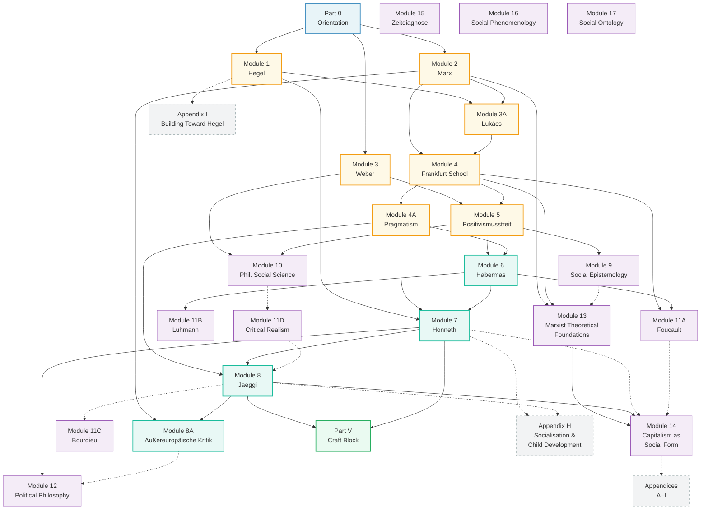

# Intellectual Dependency Graph

```mermaid
graph TD
    %% ===== PART 0 =====
    P0["Part 0<br/>Orientation"]

    %% ===== PART I =====
    M1["Module 1<br/>Hegel"]
    M2["Module 2<br/>Marx"]
    M3["Module 3<br/>Weber"]
    M3A["Module 3A<br/>Lukács"]
    M4["Module 4<br/>Frankfurt School"]
    M4A["Module 4A<br/>Pragmatism"]
    M5["Module 5<br/>Positivismusstreit"]

    P0 --> M1
    P0 --> M2
    P0 --> M3
    M1 --> M3A
    M2 --> M3A
    M3 --> M5
    M2 --> M4
    M3A --> M4
    M4 --> M4A
    M4 --> M5

    %% ===== PART II =====
    M6["Module 6<br/>Habermas"]
    M7["Module 7<br/>Honneth"]
    M8["Module 8<br/>Jaeggi"]
    M8A["Module 8A<br/>Außereuropäische Kritik"]

    M5 --> M6
    M4A --> M6
    M1 --> M7
    M4A --> M7
    M6 --> M7
    M4A --> M8
    M7 --> M8
    M2 --> M8A
    M8 --> M8A

    %% ===== PART III =====
    M9["Module 9<br/>Social Epistemology"]
    M10["Module 10<br/>Phil. Social Science"]
    M11A["Module 11A<br/>Foucault"]
    M11B["Module 11B<br/>Luhmann"]
    M11C["Module 11C<br/>Bourdieu"]
    M11D["Module 11D<br/>Critical Realism"]
    M12["Module 12<br/>Political Philosophy"]
    M13["Module 13<br/>Marxist Theoretical<br/>Foundations"]
    M14["Module 14<br/>Capitalism as<br/>Social Form"]
    M15["Module 15<br/>Zeitdiagnose"]
    M16["Module 16<br/>Social Phenomenology"]
    M17["Module 17<br/>Social Ontology"]

    %% Part III dependencies on Parts I–II
    M3 --> M10
    M5 --> M10
    M5 --> M9
    M4 --> M11A
    M6 --> M11A
    M6 --> M11B
    M8 -.-> M11C
    M10 -.-> M11D
    M7 --> M12
    M2 --> M13
    M4 --> M13
    M13 --> M14
    M8 --> M14
    M7 -.-> M14

    %% Part III internal (mostly independent)
    M9 -.-> M13
    M11A -.-> M14
    M11D -.-> M8

    %% Module 8A cross-references
    M8A -.-> M12

    %% ===== PART V =====
    PV["Part V<br/>Craft Block"]
    M8 --> PV
    M7 --> PV

    %% ===== APPENDICES =====
    APP["Appendices<br/>A–I"]
    M14 -.-> APP

    %% ===== APPENDIX H: SOCIALISATION =====
    APPI["Appendix H<br/>Socialisation &<br/>Child Development"]
    M7 -.-> APPI
    M8 -.-> APPI

    %% ===== APPENDIX I: BUILDING TOWARD HEGEL =====
    APPHEG["Appendix I<br/>Building Toward Hegel"]
    M1 -.-> APPHEG

    %% ===== STYLING =====
    classDef phase0 fill:#e8f4f8,stroke:#2980b9,stroke-width:2px
    classDef partI fill:#fef9e7,stroke:#f39c12,stroke-width:2px
    classDef partII fill:#e8f8f5,stroke:#1abc9c,stroke-width:2px
    classDef partIII fill:#f4ecf7,stroke:#8e44ad,stroke-width:1px
    classDef terminal fill:#eafaf1,stroke:#27ae60,stroke-width:2px
    classDef appendix fill:#f2f3f4,stroke:#95a5a6,stroke-width:1px,stroke-dasharray: 5 5

    class P0 phase0
    class M1,M2,M3,M3A,M4,M4A,M5 partI
    class M6,M7,M8,M8A partII
    class M9,M10,M11A,M11B,M11C,M11D,M12,M13,M14,M15,M16,M17 partIII
    class PV terminal
    class APP,APPI,APPHEG appendix
```
